# 关于12个兵兵球问题

沈学宁 陈宗泽

如何在一架没有砝码的天平秤上,通过称3次,找出12只兵兵球中惟一的一只次品球（它可能是稍重也可能是稍轻）,是一道有趣的题目。

爱动脑筋的人,只要花上一番功夫,是能够把它称出来的,其称法如下:

把12只兵兵球编成1—12号。

第一次:把1—4号放在天平左边,5—8号放在天平右边。

Ⅰ.如果天平平衡,说明1—8号都是正品；次品在9—12号中,那么,第二次:把3只正品放在天平左这,把9、10、11号放在右边。这就会有三种情况:

1.如果天平再平衡,说明次品球就是12号球。第三次只要用一只正品球去与12号称一下,就可知道次品球是偏轻还是偏重了。

2.如果9、10、11号比3只正品球重,就说明次品球一定在9、10、11号中,并且一定是偏重的。那么,第三次只要拿9号与10号对称一下,就可知道3只中哪一只是次品了。

3.同样,如果9、10、11号比3只正品球轻,我们也能用上述方法找到那只偏轻的次品。

Ⅱ.如果第一次称的时候,天平不平衡:左轻右重（也可以是左重右轻）,说明9—12号是正品,次品在1—8号中。并且,1、2、3、4号可能偏轻,5、6、7、8号可能偏重。这样,第二次称:天平的左边放3只可能是轻的1、2、3号和1只可能是重的5号；天平的右边放3只正品和1只可能是轻的4号。见下图（数字外加一圈是可能偏轻的记号,数字右下角加一点,是可能偏重的记号）。这时也有三种情况:

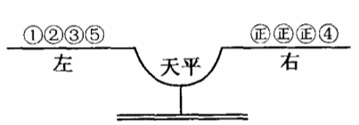

1.如果天平平衡,说明次品在⒍⒎⒏之中,并且是偏重的。这样第三次称时,只要拿⒍与⒎对称,就能找到次品。

2.如果左较右重,说明次品在①、②、③中,并且是偏轻的。同样,也能在第三次称时找出次品球。

3.如果左重右轻,那就说明次品不是5就是4,已知5是可能偏重的,4是可能偏轻的。第三次称只要拿这两只中的任一只去和一只正品对称就能鉴别出哪只是次品了。

现在,我们已通过逻辑推理,把12只兵兵球中那只次品找出来了。

上述方法虽然也是可靠的,但思路比较复杂、混乱,而且不能举一反三；在12只球中找到了次品,那么,13只呢?14只呢?......120只呢?这就又需要苦苦地思索和反复地实践了。

如果用控制论的方法来解这个题目,就显得较为全面并科学了。我们试解如下:

题目的原意是:如何在一架没有砝码的天平种上,通过称3次,找出惟一的一只（不知是偏重还是偏轻的）次品球来。

用控制论的观点来看,次品球虽然存在于12只球内,但由于不知道它是偏轻还是偏重,就使得次品球的可能性空间成了一个二元向量,它的一个分量是12,另一个分量是2（轻或重两个可能性）,总的可能性空间是12×2=24。

在本书第一章中,我们已介绍过,对一事物的控制能否成功,有控制公式:

其中M表示试事物的总的可能性空间；Q表示工具或人对事物的控制能力；mA表示事先预定的工作目标。

如果上式能够成立,那么对于这个事物的控制能够成功,否则,就不能实现。

现在我们已知总的可能性空间M=24,事先确定的目括mA=1,那天平科的选择能力（即控制能力）Q等于多少呢?

经过计算,我们得到Q=3。现将计算过程写在下面。由于计算比较复杂,读者可以跳过\[\]号中的一部分而直接看具体称法。

\[我们知道:控制力（Q=M/m）表示总的可能性空间,也就是实行控制前的可能性空间,m表示经过控制（即选择）后所剩下来的可能性空间。比值（M/m）的大小表示了选择（即控制）前后次品球的可能范围（即可能性空间）变化的程度,Q越大,选择能力就越强。

现在,我们把待称的n只球（不一定是12只,因为这一计算必须适于任意多的球）分成三组:a、b、c（使a+b+c=n）。因为次品球是可能偏轻,也可能偏重的,所以总的可能性空间的数目是2n,而其三个组的可能性空间分别是2a、2b、2c。

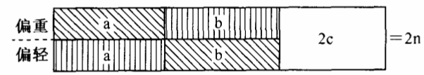

如果我们将a组放在天平的左边,b組放在天平的右边,那就存在三种可能情况:①a组重:②b组重；③a、b平衡。如图所示,如果情况①发生,就意味着次品球要么在a组中并且是偏重的；要么在b组中并且是偏轻的。所以,次品的可能性空间就从2n縮小到a+b,即图中的斜线部分。

同样,如果情况②发生,则可能性空间也从2n缩小到a+b,即图中的直线部分。

而如果情况③发生,则表明次品球在没有放上天平秤的c组中,所以可能性空间就从2n缩小到2c,即图中空白部分。

由于a、b、c三组不一定是相等的,所以我们就得到了3个不同的选择能力:

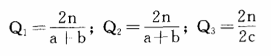

当然,这3个值的任何一个都不能作为正确的选择能力而采用的。

我们可以设想:如果做了许多次同样的实验（每次都是把n只球分成a、b、c三组,然后把a、b两组放上天平去称）,结果有几次会出现情况①,有几次会出现情况②,还有几次是③。于是我们必须在平均值的意义上,求出一个Q的值來作为代表。为此,需要先引进一个新的概念:选择率（或控制率）。选择率P=（1/Q）=（m/M）;它是选择能力的例数,它的值越小就表示选择力越大。

因此,对于前面三种情况有:

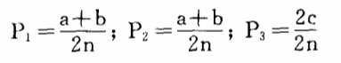

假如做了A次实验后,情况①、②、③出现的次数分别为A1、A2、A3次,那么,平均选择力\[P\]为:

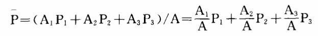

其中（A1/A）、（A2/A）、（A3/A）可以分别看作是情况①、②、③发生的频率,当A→∞时,就分别等于①、②、③发生的概率:

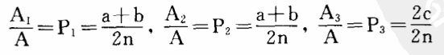

即:

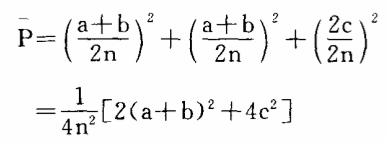

可以看出,对于不同的a、b、c数值,就有不同的P值,也就是说,我们对于兵兵球的不同编排,或不同称法,将使天平显示出不同的选择率,从而得到不同的选择能力。那么一架天平秤究竟具备多大的选择能力呢?我们怎样编排兵兵球才能最大限度地利用天平秤（指没有砝码的天平）呢?

为此,我们来计算一下\[P\]的极值。

因为a+b=n-c,所以有:

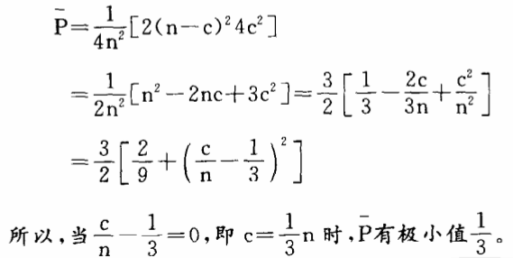

当然,\[P\]的极小值也就意味着选择能力的极大值,所以天平秤的最大选择能力是3。并且,当我们编排兵兵球时,应该尽量把a、b、c三组的数值分得一样,只有这样,才能最大限度地发挥天平秤的选择能力。\]

知道了天平秤的选择能力Q=3以后,我们就可以利用控制公式（M总/Q总）≤mA来计算一下我们能不能解决12只兵兵球问题。

因为M总=12×2=24,mA=1。

又因为Q=3,一共可以称3次,得Q总=3×3×3=27,代入控制公式,得:

（24/27）\<1

控制公式成立,所以此题能解。

具体称法计算如下:

设第一次称x只球（也就是天平的左右各放（x/2）只）,留在桌上y只球。

这时,如果天平是平衡的,那次品一定在y只球中,并且不知道次品是偏轻还是偏重的。再称二次要称出,就必须有

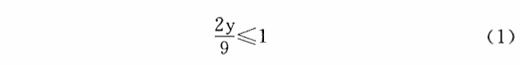

如果天平不平衡,那么,次品一定在x只球中,但已知道天平一边的（x/2）只不会是偏重,另一这的（x/2）只不会是偏轻的。

那么剩下的可能性空间就是（x/2）+（x/2）=x,再有二次要称出,就必须有

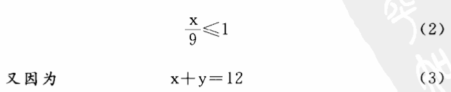

所以解方程组（1）、（2）、（3）可得:

x=8,y=4。

再计算第二次称法:根据第一次的结果,有两种可能:

A:次品在y个球中。则与第一次相同:设X1+y1=4,又（2y1/3）≤1,（x1/3）≤1,（x1/3）≤1,可得X1=3,Y1=1。

B:次品在x个球中。设我们在第二次称时,从天平上拿掉a只（换上a只正品）,动移位置（从天平左边或右边移到右边或左边）b只,不动c只。结果有三种可能:

1.如果平衡:则次品在a中。

2.天平倾向和上次一样,则次品在C中。

3.天平倾向与上次相反,则次品在b中。对于这三种情况,我们都得再称次就找到次品,因此有:

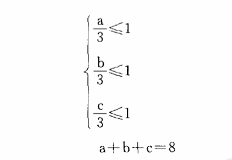

解此方程组可得三组解,这三组解都是正确的。

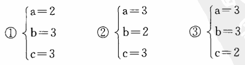

下页3个图分别表示上面的三种称法。

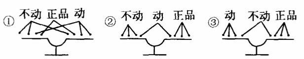

现在,我们已经解决了12只兵兵球的问题了。用这种控制论的方法,我们还可以算出13只兵兵球的称法和断定14只球是称不出的（或称出但不知道次品到底是偏重还是偏轻）。用这种方法,还可以解决更多和更复杂的问题,读者们如有兴趣,可以自己再去试试。
