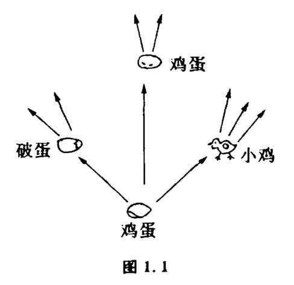
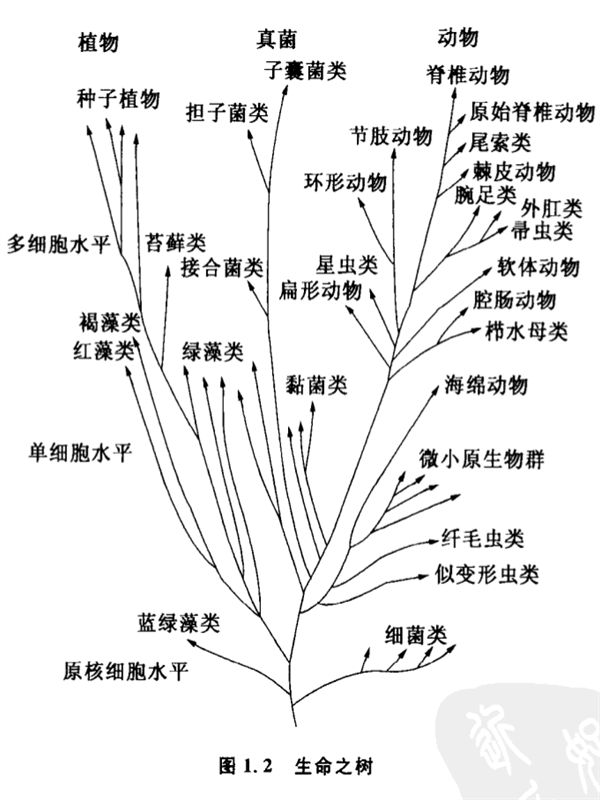

# 1.1 可能性空间

一切科学研究都必须有一个出发点。几何学的大厦是建立在公理基础上的,控制论和系统论的研究则开始于可能性空间。

什么是可能性空间呢?我们先来举一个化学方面的例子。很久以来,化学家发现有两种氨基酸分子,它们的化学组成完全相同,不同的是原子的排列方式,化学家分别把它们称为L型和D型旋光异构体。它们的化学性质是相同的,照理说它们都可能组成蛋白质。奇怪的是,人们发现今天地球上所有生物的蛋白质都是由L型氨基酸组成的,这是怎么回事儿呢?原来,D型氨基酸只能与D型氨基酸组成蛋白质,L型也A能与L型组成蛋白质,D型不能与L型组成混合的蛋白质链。同一型氨基酸组成的生物才能形成一个生命系统。这样,在生命起源的最初阶段,大自然就面临着一个重要的选择:是选择D型呢还是选择L型?看起来这有点像掷硬币游残,掷中正面还是掷中反面往往可以决定赌棍的命运。也许,后来发展出生命的那个原始的核蛋白凑巧是L型氨基酸构成的,它通过自我复制和生存竞争,繁衍出了清一色的后代。L型氨基酸具有左旋的光学性质。有人开玩笑地说,上帝在创造生物时单单选中了L型,看来上帝是个左撇子。

不过这件事给我们一个启发:世界上许多事物并不是从一开始就注定要发展成现在这个样子的,在事物发展的初期,它们往往有多种发展的可能性,由于条件或者纯粹机遇的关系,最终才沿着某一个特定的方向发展下去。既然事物的发展都是从最初的可能性开始的,就不能不使人们对它发生浓厚的兴趣,如果对它作更深一步的研究,可以发现它跟控制论中"控制"这个概念有着密切的关系。

顾名思义,控制论是关于控制的理论。"用计算机控制宇宙飞船"、"基因控制着遗传"、"这个病人的癌症已经不可控制了"……现在"控制"这个词,已成为人们习以为常的口语了。如果我们仔细地分析各种不同的控制过程,发现虽然"控制宇宙飞船"、"控制遗传"、"控制癌症"的控制对象不同,但作为控制过程,有几点却是它们共有的:

（1）被控制的对象必须存在着多种发展的可能性。如果事物的未来只有一种可能性,就无所谓控制了。比如光在真空中的传播速度是确定的,每秒299793公里,既不会高于这个速度也不会低于这个速度,只有一种可能性。因此人们不会说"控制了光在真空中传播速度"之类的话。某一事物在发展变化中的未来有哪些可能性,是由事物本身决定的。对于鸡蛋,它下一时刻面临的发展可能有鸡蛋、小鸡、碎鸡蛋等几种,而石头面临的可能性就完全不同。

（2）被控制的对象不仅必领存在多种发展的可能性,而且,人可以在这些可能性中通过一定的手段进行选择,才谈得到控制。比如一座火山,它在下一时刻面临着爆发或不爆发两种可能性,但目前人类的能力还不能在这两种可能性中选择。所以,我们也不会说"控制了火山爆发"这样的话。所谓我们不能控制,就是无法选择或不存在选择的余地。

由此可见,控制的概念与事物发展的可能性密切相关。我们将事物发展变化中面临的各种可能性集合称为这个事物的可能性空间。它是控制论中最基本的概念。

任何事物,都有它一定的可能性空间,但这仅仅是可能性而已,至于事物具体发展成为可能性空间中哪一个状态,要看条件而定。当事物变到某一状态后,它又面临着新的可能性空间。鸡蛋一旦变成小鸡,它下一时刻面临的就是活鸡、死鸡等可能性了（图1.1）。

因此,一个事物发展过程中的可能性空间就像树枝一样向无限远处伸展开去。

世界上第一个认真考虑过事物可能性空间性质的可能是中国战国时期著名的哲学家杨朱。《列子》里有一个"歧路亡羊"的故事,说有一天杨朱的邻居走失了一只羊,许多人去找也没找回来。杨朱问邻居是怎么问事儿,邻居说:"岔路太多了,而且岔路之中又有岔路,不知道它到底跑到哪条路上去了。"杨朱听了很有感触,终日沉默无言,闷闷不乐。"歧路之中,又有歧焉",这位哲学家所感叹和研究的,正是事物可能性空间这种重要的展开方式。

这方面最令人感兴趣的例子便是生物进化。如果我们不否认生命在地球上只起源过一次,我们就得承认所有的物种,包括蚊子、牡丹、企鹅、人类和酵母都有着一个共同的祖先。生命的多样性来自连续不断的进化过程,在这个过程中一个种产生几个后代种。这实际上就是生物发展和适应环境的几种可能性。

生物学家常常用生命之树（图1.2）来表达生物的进化过程,这种生命之树正是物种在其发展过程中按可能性空间展开的形象体现。

人们估计现在生存着约五百万到一千万种生物,其中每个种都跟它最近的亲族有显著的差异,每一个种内的千万个成员又有不同的遗传特征,这还不包括地球上曾经生存过但已灭绝的为数更多的物种。生物界众生纷纭变异多端的可能性空间,凭人的想像几乎难以琢磨。研究生物在一定条件下按可能性空间展开的方式,成为群体生物学的中心问题。它回答现有动物、植物、真菌的种类和数量是如何来的,什么力量作用于这些群体使它们保持现状或发生变化,以及对某些物种发展的可能性可以作出哪些预测等等。
