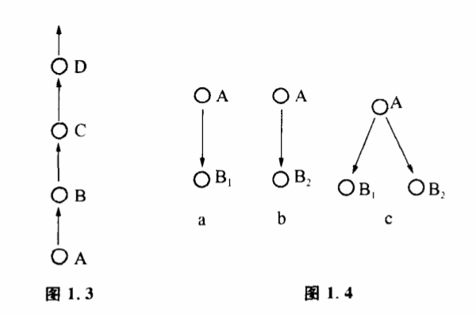

# 1.2 人通过选择改造世界

事物的可能性空间为什么总像图1.2那样是树枝状的,而不会像图1.3那样呈一条直线呢?

很明显,这是因为事物面临的可能性空间往往不止一个状态。那为什么事物的可能性空间不止一个状态呢?这是因为事物变化具有"不确定性"。

不确定性也就是事物的矛盾性。"矛盾"一词来自一个古老的寓言。一个商人夸口说,他的盾十分坚牢,什么东西也戳不穿它。过了一会儿,又吹嘘他的矛说,他的矛是最锋利的,随便什么东西,一歡就穿。有人听了,便接口问他:"如果用你的矛来戳你的盾,结果怎样呢?"这个富有哲理的故事实际上包含了事物不确定性的道理。商人先夸他的盾好,什么东西也戳不穿,就是说事物A只面临着B1（盾不穿）,这样一种可能性（图1.4a）。接着他说他的矛什么都能戳穿,也就是A只面临着B2（盾穿）这样一种可能性（图1.4b）。"以子之矛,陷子之盾"的时候,却出现了一种新的情况,A可能发展为B1,也可能发展为B2,具体变到哪一种是有条件的,不能在事先完全确定,这就是事物的不确定性（图1.4c）。那个商人面对着对立的矛盾,却不承认事物的不确定性,把话说得这么死,结果闹了一场笑话。

事物的矛盾性,使事物的可能性空间至少面临着肯定自身和否定自身两种状态。事物在发展的过程中这样分化是不断进行着的,这样终究要形成"歧路之中,又有歧焉"的结果。

从不确定性的角度来看待事物的发生和发展,是现代科学和经典决定论的一个重要区别。今大的物理学已不再仅仅处理那些必然发生的事情,而是处理那些最可能发生的事情了。今天的生物学也不再把某个物种的出现看作进化过程中必然的现象,而只把它们理解为可能发生的种族中的一员。这样一种思想从本世纪初统计物理学创立以来已经扎根于科学家的头脑。粗看之下它也许并不难于理解,但它确实是本世纪科学思想的一次革命。在经典的牛顿物理学里,宇宙被描述成一个结构严密的确定性机器,一切都是按照某种定律精确地发生的,未来的一切都是由过去的一切严格决定的。科学家意识到矛可能戳穿盾也可能截不穿盾这个简单的真理,是走过了漫长道路的。

事物发展的可能性空间,或事物的不确定性,是由事物内部的矛盾决定的。人们根据己的目的,改变条件,使事物沿着可能性空间内某种确定的方向发展,就形成控制。控制,归根结底是一个在事物可能性空间中进行有方向的选择的过程。我们不难发现,人类从衣、食、住、行到变革自然的实践活动都和选择密切相关,走路是不断选择自己在空间的位置。制造工具是选择各种材料及材料的某种组合。现代生产是更复杂更严格的选择过程。有人会问,人制造出自然界原来没有的东西,如人造纤维,这是不是选择过程呢?人类在制造人造纤维时进行的工作也仅仅是选择:选择了自然界本来有的物质（基本原料）,选择了适当的温度、压力、催化剂。正是人类选择的条件的结合才制成了自然界不存在的物质人造纤维。如果没有人的选择作用,这么多条件的适当配合在自然界出现的可能性是极小的。这种纤维的合成,只是原来物质变化的可能性空间的一种。

因此,一切控制过程,实际都是由三个基本环节构成的:（1）了解事物面临的可能性空间是什么。如一个人得了病,他可能好转、恶化、死亡。（2）在可能性空间中选择某一些状态为目标。如治病的目标是使病情好转。（3）控制条件,使事物向既定的目标转化。

对于一个复杂的过程,事物的可能性空间不仅有许多状态,而且这些状态有复杂的展开方式,影响事物发展的条件也错综复杂。与之相应的选择过程也是复杂的,需要在事物发展的不同阶段控制不同的条件,同时注意各种条件之间的配合和状态的相关作用。
