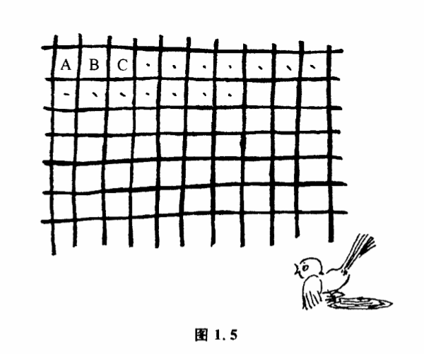
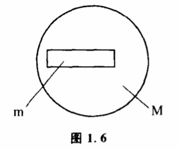

# 1.3 控制能力

最后一个天花病例发生以后,经过两年观察,人们终于在1979年宣布天花病例绝迹了。这种在几个世纪前曾经夺去无数人生命的可怕疾病,可以说已经完全地被人类控制住了。只要世界上几个保留天花病毒的研究机构不把它们逸漏出来,人类将永远保持在"没有天花病人"这样惟一的状态里。可以说这是一个非常理想的控制过程。有人也许会想,一切控制程如果都像人类控制天花那样完全就好了。是实际上这是办不到的。对于绝大多数控制过程,人们并不是把事物的可能性空间精确地缩小到某个惟一的状态,而只是把可能性空间缩小到一定的范围就达到控制的目的了。如果任何控制过程都想以某个惟一状态为目标,不但没有必要,而且还会使控制失灵。

我国古代有一个寓言,深刻地说明了控制过程的这个重要特征。有一个人看见猎人用网捕鸟,觉得很有趣。他研究了半天,发现最后把鸟卡住的不是整张网,而是一个小网眼,这使他非常惊奇,他想既然最后把鸟卡住的只是一个小网眼,那为汁么还需要一张大网呢?他决定发明一种新的工具去捕鸟。他用绳子做了一个小圆圈,用它来代替网。结果当然一只鸟儿也没抓住。为什么呢?道理非常简单,把鸟儿网住,这是一个控制过程,我们最后是把乌儿控制到可能性空间S（网）之中,S是一个比较大的范围,包括A、B、C……许多网眼（图1.5）,鸟儿随便在S内的任何一个状态,对猎人来说都算完成了控制。而那个聪明人想一下子把鸟儿控制到一个网眼这样惟一的状态里,结果反而失败了。

任何恒温箱都只能把温度控制在一个目标值附近的小区间内。虽然在这个区间温度每一时刻有一个特定的值,但是这个值究竟是多少并不是我们事先确定的,只要温度值在确定的区间之内,就算实行了控制。同样的道理,任何机械加工都必须规定出一定的误差范围。

不过,我们可以肯定,每实行一次控制后,事物发展的可能性空间缩小了。可能性空间缩得越小,标志着我们的控制能力越强。射手用步枪打靶,实际上是他用步枪对子弹飞出去的位置实行某种控制。射击前,子弹运动的可能性空间很大。一个命中8环的射手比命中5环的优秀,因力他能将子弹控制到一个比较小的范围。命中10环的射手控制能力最强,因为他将子弹的可能性空间缩小到几乎是一个点的范围。在射击这种控制中,我们用环数来表示射手水平的高低。实际上,环数也是控制能力的一种表示方法。

我们知道,有精确到0.1克、0.01克、0.001克、0.0001克的各种天平。所谓天平精确到0.1克,就是说0.1克以后的各位数字,这天平是不能确定的。精确到0.0001克的天平,它就能把可能性空间缩小到小数点后面4位。它的控制能力要比前者大得多。这里,天平的精确度,就是天平控制能力的一种表示方法。又比如吃饭过程,一个刚刚会拿勺子的小孩往往把勺子送到下巴、面颊上,弄得满脸满桌都是饭。勺子运动的可能性空间大,我们就说这个小孩对勺子的控制能力小。

更一般地,我们把实行控制前后的可能性空间之比称为控制能力。如果某一事物的可能性空间为M,实行控制后,可能性空间缩小为m,那么控制能力就是M/m。如果可能性空间状态为无限多,并且互相连续,我们可以用面积大小的比例来表示它（图1.6）。

控制能力这个概念很重要。我们所使用的一切工具实际上都只有一定的控制能力、因此在使用工具之前我们往往需要根据它的控制能力来判断是否能达到预定的控制目的。如果超过了每次使用工具的控制能力,无论我们怎样改变操作方法,都不会达到控制目的的。猎人用网来捕鸟,那个聪明人用一个小圆圏来捕鸟,相比之下,猎人只要把鸟儿控制到一个范围较大的空间就行了。也就是说,猎人要达到控制目的,需要的控制能力比那个聪明人小,因此猎人比那个聪明人更有成功的可能。

有一个智力游戏,问怎样用一架天平称出12个乒乓球中惟一的然而轻重未知的废品,只许称3次。

怎么称呢?2次行不行?4次有没有必要?我们用控制能力来分析,这个问题就变得很简单。首先我们要确定废品存在的可能性空间有多大。一共有12个球。未称之前,每个球都可能是废品,每一个球都可能是轻或重两个状态中的一个。因此,总的可能性空间大小是12×2=24个状态。其次,既然我们最终要决定哪个球是废品,那也就是经过控制后废品的状态必须是惟一的,因此整个控制过程要求的控制能力24/1=24。再来看看我们的选择工具天平每一次的控制能力有多大。天平每称一次的可能状态有3个:左边重,右边重,水平。这3个状态的含意不同,每称一次,天平的可能性空间缩小到原来的1/3,因此天平每称一次的控制能力为3。称3次的总控制能力为3X3X3-27。27\>24,这样,我们就用控制能力这个计算方法证明称3次是可以解决问题的。但是具体把称法搞出来,还要进一步分析。

设第一次称X个球,留下y个球,如果天平是平的,那废品一定在y个球中,还有两次要称出就必须有:

2y/9≤1············（1）

如果天平不平,那么废品一定在X个球中,但已知其中x/2个不会是轻的,x/2个不会是重的,所以可能性空间为x。还有两次要称出就必须有:

x/9≤1············（2）

x+y=12············（3）

解方程组（1）、（2）、（3）,得X=8,y=4。用同样的方法可获得第二次、第三次的具体称法,从而完全解决12个乒乓球的问题。

现在我们可以把问题稍微引申一下:如果兵兵球不是12个而是13个或14个,这个问题还可解吗?

13个球的可能性空间是26,因为26/27\<1,所以看来也是可解的。但在进一步分析时我们就发现像前面那样的方程组在这儿是无解了。这是否意味着13个球是称不出的呢?回头来仔细想想,题目要求我们的仅仅是找出废品,而不一定要完全弄清废品的轻重,因此我们可以利用这种情况。方程组便变为:

得x=8,y=5。继续使用这个方法,就可以确定13个乒乓球的问题是能解的。若是14个球,可能性空间是14×2=28,而28/27\>1,因此不能称出。[^1]

当然,用天平称球的问题人们常常只把它看作一种数学游戏,很少从控制能力这个角度来分析问题。实际上,我们用一定精度的仪器来观察客体,或者用某种工具来控制客体,在什么条件下我们选择什么样的仪器、工具的组合才最有利于达到我们的目的,这个问题本质上跟上面那个数学游戏是一致的。有兴趣的读者一定会找到许多其他可以用估计控制能力的方法来解决问题的例子。

讨论了有关控制的一些基本概念之后,我们再来研究一下控制的方法问题。人们在工作中采用各种方法来达到自己的目的,其中有一些方法人们经常采用,它们虽然简单,却又是基本的控制艺术,如随机控制、有记忆的控制、共扼控制、负反馈控制等。它们是一切复杂控制方法的基础。

[^1]: 有关这个问题的讨论见本书附录。
