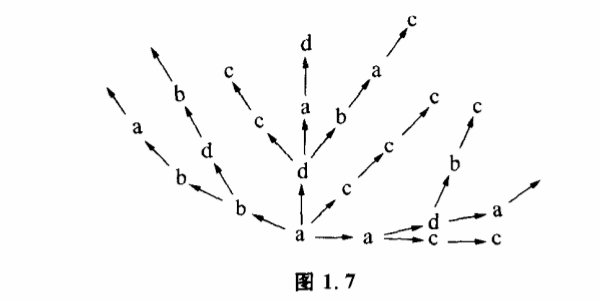

# 1.4 随机控制

世界上最省事的方法莫过于碰运气了。我们如果遇到一件棘手的事情,又想不出其他办法来解决,山穷水尽疑无路的时候,常常硬着头皮说:"那么,就碰碰运气吧。"把碰运气也称为一种方法,很多人或许会感到勉强。不过科学家可不这么看,也许是由于科学家经常跟棘手的难题打交道的缘故吧,他们对碰运气这种方法挺感兴趣,不但认真地对它进行了研究,而且还给它取了个雅号,叫"随机控制"。

我们已经讨论过,控制就是可能性空间的缩小。随机控制也是可能性空间缩小的过程,不过它有一个特点,就是在随机控制过程中,系统的可能性空间只有在达到目标值时才缩小,不达到目标值时,可能性空间不缩小。

例如,操场上许多孩子在自由地活动,杂乱无章地跑来跑去,如果我们找其中的一个孩子就只好一个一个地碰,直到碰上那个孩子为止。显然,这中间的每一次选择,如果出现的结果不是所需要的目标,那么控制仅仅表现在否决结果,把选择继续下去。一旦选择的结果是目标,就停止选择,结束控制。随机控制方法也称为寻找或探索,可用图1.7表示。

设可能性空间是a、b、c、d4个状态,目标是c。第一次选择的结果是a,因a≠c,所以否定a,第二次选择的可能性空间是a、b、c、d。如果选中了c,就肯定结果,如果选中了a、b、d,就否定结果,继续选下去。

随机控制的应用非常广泛,效果又很直观。人们遇到棘手的科学问题时,即使对解决问题所必需的条件完全不了解,对于对象的性质一无所知,仍然可以采用随机控制的方法来找到问题的答案。比如我们要进一个上了锁的房间,手里有一大串钥匙,但不知道其中哪一把钥匙能把锁打开。人们所采用的最通常的方法就是"一个一个地试试看",不行就换一把钥匙,直到把锁打开。

因此在科学发展的某些阶段,尤其当人们对某一个领域的研究刚刚开始,还不能用其他方法来控制对象时,随机控制往往就成为人们惟一可以采用的方法。

远古的时候,人们没有任何科学知识,没有仪器,对疾病的本质和药物的性质都一无所知,我们的祖先是如何对付疾病的呢?据《淮南子·修务训》记载:"神农……尝百草之滋味,水泉之甘苦,令民知所避就。当此之时,一日而遇七十毒。"这个记录生动地反映了蒙昧初开之际我们远古的祖先采用随机控制法与疾病作斗争的史实。这个记录告诉我们,药物对人体的作用,祖先们是从"尝"开始了解的。也就是说,人得了病,就用各种树皮草根、水泉矿石来试着服用。吃吃这种,没有用,吃吃那种,也没有用,吃吃另外一种,好了。这样就形成了控制,并开始了对药物治疗作用的了解。我们的中国医药学,就是在随机控制积累了无数数据的基础上发展起来的。

随机控制在现代科学中也有很多用途。生命起源的问题始终是个谜。我们知道,生命的基础是蛋白质,而蛋白质又是由氨基酸组成,在生命起源之前,氨基酸又是怎样出现的呢?是不是由于一种神秘的外力呢?要回答这个问题,必须提出有力的证据,证明在一定的条件下,氨基酸能从简单的无机物合成出来。20世纪50年代,米勒运用随机控制巧妙地解决了这个问题。他用甲烷、氨、氢和水蒸气组成一种混合气体,放进容器中,然后连续通以电火花,模拟了一个有生物前的地球环境。这样,各种无机物在容器中就开始了随机组合。经过8天时间,终于在这个无机的体系中得到5种构成蛋白质的重要氨基酸:甘氨酸、谷氨酸、丙氨酸、天门冬氨酸和丝氨酸。此后,运用同一控制原理,人们在电火花、紫外线、X射线或其他高能粒子束的参与下得到了更多的氨基酸以及组成核苷酸的嘌呤、嘧啶等物质。这些实验证明了原始地球发生氨基酸的可能性。

如果随机控制的对象可能性空间很大,就有一个选择速度的问题。我们手里的那串钥匙如果只有3把,都试一遍也不费什么事。如果有10把,就比较讨厌了。如果这串钥匙有一万把,我们就可能没有耐心把钥匙试一遍,除非每试一把的速度相当快,否则多数人情愿把锁撬开了进门。不过这件事如果交给电子计算机去干,就会干得非常漂亮。电子计算机不但有耐心去做那些最单调最没有乐趣的随机选择工作,而且选择的速度还相当地快。电子计算机可以在极短的时间内从几万个方案里选中一个最合适的方案,可以从几十万本图书里立即找到你所要索取的那本图书。为了破案,公安人员常常要核对指纹,这是件细心的活儿,很费时间,有些国家的警方用电子计算机存储了成百上千万种指纹,需要核对时,就交给电子计算机处理,用不了多少时间就可以从几百万个人里把有作案嫌疑的人找出来。因此尽管问题面临的可能性空间很大,只要选择速度快,随机控制还是相当有效的。由于随机控制在很大程度上要依赖选择速度,提高逻辑运算的速度就成为电子计算机的一个重要指标,目前最快的巨型机已达每秒1.5亿次到2.0亿次。

除了速度问题,随机控制还要注意什么呢?显然,要随机控制有效,目标必须包括在探索的范围之内。也就是说,对事物面临的可能性空间必须有充分的估计。如果开锁的钥匙不在我们手上这一串之内,我们再试也是白搭。这看来是再明确也没有了,但在处理实际问题时往往被人忽略。

有一个故事,说父子俩拿着几根竹竿去钓鱼,可是出城门的时候就遇到了麻烦。父亲把竹竿竖起来,竹竿比城门高,出不去。把竹竿横过来,竹竿比城门宽,也出不去。怎么办呢?最后还是儿子想出了一个办法,他爬到城楼上,把竹竿一根一根从城墙上面递过去,这才出了城门。做父亲的高兴得不得了,连连称道儿子聪明。这个故事就是挖苦人们在随机控制时最容易犯的那种错误。竖起来不行,横着也不行,恰恰就忽略了把竹竿直过来顺着城门送出去的可能性。如果父子俩在城门下好好考虑一下扩大随机控制的探索范围问题,就用不着爬上城楼了。

19世纪末,瑞典发明家拉瓦尔在研究改进蒸汽轮机工作时,碰到了看来几乎无法克服的困难。轮机的转速快得惊人,这样快的速度要求非常精确地保持转轮的平衡,对轴的要求是很严格的。为了达到这个目的,应采取什么办法呢?他认为,轴越硬,越粗,就越不易变形,就越好。至于要什么样的材料,需要随机控制来加以选择。这时,选择的可能性空间是:"各种金属杆,各种硬度大的金属杆"。选择目标是:"使轮子保持平衡的轴。"拉瓦尔试验了很多次,但是他发现,无论用多么硬的轴,随着转速增加,机器逐渐发生振动,轴总要变形。最后,他知道再增加轴的硬度是不行了。他决定采用相反的方法,将一个笨重的木盘子装在一根藤条上转动。他惊讶地发现,有弹性的软轴在高速转动中能自然地保持平衡,这对他的设计思想是一个很大的震动。有什么理由认为越硬的轴越好呢?这是由常识造成的一种偏见,正是这种偏见,使最初的探索范围遗漏了一部分重要的可能性空间。

因此,在随机控制中,不断地扩大和改变探索范围是很重要的。许多大理论家、大发明家之所以高人一等,往往在于思开了世俗的偏见,在一般人想不到的领域创出了奇迹。
