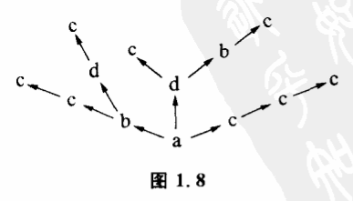

# 1.5 有记忆的控制

随机控制的缺点是如果碰得不巧,要花费很长时间才能碰上目标。这样我们就面临着改进随机控制的问题。一个常用的办法是加一个记忆装置,使随机控制成为有记忆的。

所谓一个选择者具有记忆力,就是指,凡被证明不是目标的状态就不再当作选择对象了,这些状态将从下一个可能性空间中排除出去。与无记忆的控制比较,有记忆控制的可能性空间在到达目标值之前是随着选择次数逐一缩小的。很明显,这就提高了控制的效率,可以较迅速地找到目标。例如一个人要找一封信,他一个抽屉一个抽屉地翻,直到找到这封信他才会停止自己的行动。一个粗心的人会把同一个抽展来回翻几次,这相当于前面说的随机控制。但如果是一个细心的人,凡是翻过的抽展他都记得,不再翻了,这样,他的寻找范围就可以逐步缩小,比较快地达到目标。这个过程可以用图1.8表示出来。

还是假定可能性空间力a、b、c、d四个状态,目标为c。第一次选择结果是a,a≠c,所以否定a。第二次可能性空间为b、c、d,如果选择b,那么第三次可能性空间是c、d。因为a、b已证明不是目标,把它们从以后的可能性空间中排除了,这样最多只要4次选择,就可以找到目标了。而图1.7那种无记忆的控制,最长的选择链是很长很长的。

有记忆的选择值得注意的是千万别记错,如果碰到了目标,没有认清楚,就轻易地把它否定掉,并将这种否定记忆在脑子里,就使目标不在选择范围中了。这样会落入陷阱,这是记忆控制中常犯的错误。

无论随机控制还是有记忆的控制,都必须注意事物发展的可能性空间本身是否存在着陷阱。在探索过程中,必须记住这些陷阱,避开这些陷阱。比如致病人死的药是无论如何不能用的,因为一旦进入"死"这个状’态,可能性空间就永远停留在这个状态,再也不能被我们控制了。更明确一点讲,在随机控制中,那些可能削弱我们控制能力的状态是不应该最先尝试的。有时候,这些陷阱是由控制手段造成的。例如我们要从一种溶液中把两种金属分别提纯出来,溶液中一种金属离子含量很大,另一种含量很小。一般的方法是加一种物质,使金属离子产生特定的沉淀。但是先沉淀溶液中含量大的成分好呢,还是先沉淀含量小的好?初看起来,这无关紧要,实际却有讲究。如果先沉淀含量大的那种金属离子,生成的沉淀量很大,就可能把含量小的金属离子吸附在自己身上带下来。这样,第二次沉淀时,溶液中我们要选择的对象已经部分失去了。也就是说,有时选择方法和选择得到的结果之间会发生相互作用,以致影响以后的选择余地。因此我们要适当地考虑控制的顺序。
