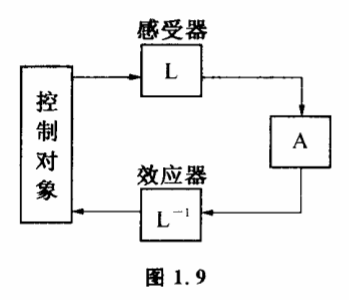

# 1.6 共轭控制

人和猿的一个基本区别是人能够制造并使用工具。通过工具,人们可以完成许多直接用双手不能完成的工作,人的控制范围扩大了。一件工具发明出来,开始的时候它的使用范围也是有限的,人们为了完成更复杂的工作,又得研究使用工具的方法以及使用工具的工具。人类在自己历史的每一个阶段,总要面临一大堆在当时拥有的控制手段无法直接完成而又需要完成的工作,也就是扩大自己的控制范围的问题。当人们要扩大控制范围的时候,通常要用到一种叫共轭控制的方法。这种方法并不涉及某一具体的工具的发明,但却包含了一切工具的控制原理。它专门研究如何将一件人们无法完成的工作变成能够完成的工作。说起来有人也许觉得有点奇怪,其实这种方法我们几乎每天都在接触,有时候连小孩子也懂得运用。好了,让我们先讲一个关于小孩子的故事吧。

三国时候,有人送了一头大象给曹操。曹操想知道大象有多重。可是当时还没有那么大的秤可以称象。他召集了群臣来问,满朝文武竟没有一个能想得出办法来。这时有一个叫曹冲的小孩,倒想出了一个主意。他建议把象引到一只大船上,在船上刻下吃水深浅的记号,再把大象换成石块,也使船沉到同一个吃水线上,只要称一下石块的重量就是大象的体重了。曹操和大臣们听了大吃一惊,想不到一个五六岁的小孩会有这么高明的方法。曹冲的这个方法实际上就是用了共扼控制的方法。

我们来分析一下。要直接称出大象是人们办不到的事,但一块块石头的重量却是可以称出来的。曹冲用大船的沉浮先把象的重量变换成石头重量,我们把这一步变换过程用L表示,再称出石头的重量,这一步用A表示。最后又将石头的重量变换成大象的重量。这一步跟L交换恰好相反,我们用L-1表示。三步连起来可以写成L-1AL,它表示先实行L,再实行A,最后实行L-1。这样就把大象重量称出来了。

数学上一般把L-1AL称作A过程的共扼过程。我们将L-1AL称为与A共轭的控制方法,它通过L变换和L-1变换,把我们原来不能控制的事变为我们可以校制的A过程去完成。A的控制范围在施行了L和L-1变换后扩大了。

这个L-1AL过程虽然简单,但它的运用极其广泛。比如为了使两种固体粉末能够完全进行化学反应,在实验室中,常常要把它们混合均匀。但无论我们怎样把两种固体放在一起搅拌或研磨,都做不到混合至分子水平的均匀地步。怎么办呢?我们知道如果是两种溶液,不难把它们充分混勾到分子水平。只要将它们倒在一起,加以搅拌,利用分子的运动和扩散就混匀了。我们设:

A——控制液体混匀的方法,

L——将固体溶于某种液体,

L-1L的反变换,将溶液蒸干。

这样一个L-1AL过程就使混合液体的方法扩大了控制范 围,可用于混匀固体。

可以说,几乎人类制造和使用的一切工具,本质上都包含有这样一个控制范围扩大的过程。最简单的杠杆中,L和L-1是通过一根有支点的棍子来实现的。现代化的自动控制设备,L和L-1分别有自己的专有名称。L通常称为感受器,通常称为效应器。感受器和效应器是怎样工作的呢?例如控制对象为某一生产过程,人坐在操作台上按电钮控制生产。人按电钮就是在进行选择,这个选择过程用A表示（图1.9）。

为了使这个选择能控制生产,必须有两套装置。一种装置把反映生产过程进行状况的各因素,如温度、压力、流速等等变成电脉冲形式,并用仪表显示出来,这就是L。人通过按电钮控制了这些电脉冲,在各种可能之中进行选择。第二套装置是L变换的反变换,把电脉冲变成生产过程中各种控制因素,这就是L-1通过这样的L-1AL过程,我们控制了生产。

任何感受器和效应器的关系在本质上都能从L-1AL的关系中得到说明。人类使用共扼控制的方法还可以追溯到数字和语言的起源。处于原始社会的人类,想到可以用小石头来计算动物。从动物变换为小石头,又从小石头变换为数的概念,人类学用抽象思维来代替形象思维。如今人们已经完全习惯于同抽象的数字打交道,不论是天上的星星,世界的人口或者原子的数目,以致我们已经难于理解把一切变换成数字来运算是怎样一个巨大的进步。同样,人类只有在把思想变换成语言和符号来交流和思维以后,才真正使大脑发达起来,成为一个有文明的物种。

甚至在我们人体内部,也存在着这样一个由共扼变换构成的控制系统。我们的感官,比如眼睛就是一个感受器,我们的四肢,比如手就是一个效应器。我们的眼睛不断把外界对象的状态变换成生物电脉冲送到大脑中去,大脑经过信息加工后,再由手执行相反的变换,把生物电脉冲信号变成对外界对象状态的控制。

共扼控制揭示了人类使用工具过程的本质。也许有人会问,把使用工具这么一件直观的事情表述成那样复杂的一种结构,有什么意义呢?其意义在于运用控制论方法后,就可以用数学语言来确切地描述这一过程了,并且可以把很多数学上关于共扼控制的成果运用到制造和使用工具的研究中去,得出许多凭直观想像不到的结论来。
