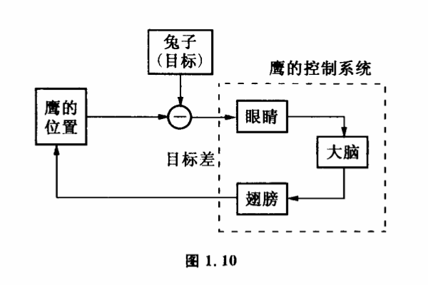

# 1.7 负反馈调节

如果我们选择了某一目标,但我们所具备的控制方法达不到所需要的控制能力又怎么办呢?例如我们向月球发射一枚火箭,火箭要击中38万公里远的月球,这就好像在10公里外用步枪瞄准一只苍蝇的眼睛一样困难。有人会以为火箭里一定装有一个非常精确的瞄准器,发射之前一定按照算好的提前量对准月球发射的,就像步枪打飞鸟那样。其实这完全办不到。火箭在运动中要飞越38万公里的路程,有许多干扰根本无法事先估计到。发射前把轨道算得再精确,把发射方向控制得再准也不行。也就是说,仅仅依靠发射时控制方向是完全达不到这么大控制能力的。那么我们是不是就束手无策了呢?当然不是。我们有一些非常巧妙的方法来增强我们的控制能力。不过要解决这个问题还要先从"负反馈"这个概念谈起。

二次大战前后,随着科学技术的发展,飞机的速度越来越快,性能越来越好,用老式高射炮来击落飞机也就越来越困难了。人们发现,无论怎样提高高射炮的准确性,总是有限的。飞机飞行的轨道因驾驶员动作的随机性儿乎是不能预先求出的,经典的思想方法暴露出一些根本的缺点。其实,这一类被工程师视为极困难的问题我们可以从自然界不少动物身上找到答案。鹰击长空,不但能准确地扑到固定目标,甚至连飞速躲避的兔子、老鼠也不能逃脱。显然,鹰没有也不可能事先计算自己和目标的运动方程。鹰不是按照事先计算好的路线飞行的。鹰发现兔子后,马上用眼睛估计一下它和兔子的大致距离和相对位置,然后选择一个大致的方向向兔子飞去。在这个过程中它的眼睛一直盯着兔子,不断向大脑报告自己的位置跟兔子之间差距。不管兔子怎么跑,大脑作出的决定都是为了缩小自己跟兔子位置的差距。这种决定通过翅膀来执行,随时改变着鹰的飞行方向和速度,调整鹰的位置,使差距越来越小,直到这个差距为零时,鹰的爪子就够着兔子了。

我们来仔细分析一下这个过程。实际上这个控制系统主要由眼睛、大脑和翅膀三部分组成（图1.10）,眼睛在盯住兔子的同时,也注意到了自己的位置,并把这两者作一个比较,图1.10中的—是一个比较符合。

经过比较以后的信号代表鹰的位置跟兔子位置的差距,通常称为目标差,眼睛主要是接收这种目标差信息,并把它传递到大脑。大脑指挥着翅膀改变鹰的位置,使鹰向目标差减小的方向运动,这个控制重复进行,就构成了鹰抓兔子的连续动作。这里最关键的一点是大脑的决定始终使鹰的位置向减小目标差的方向改变,控制论中把这类控制过程称为负反馈调节。负反馈调节的本质在于设计了一个目标差不断减少的过程,通过系统不断把自己控制后果与目标作比较,使得目标差在一次一次控制中慢慢减少,最后达到控制的目的。因此,作为一般的负反馈调节机制必定要有两个环节:

（1）系统一旦出现目标差,便自动出现某种减少目标差的反应。

（2）减少目标差的调节要一次一次地发挥作用,使得对目标的逼近能积累起来。

这两个条件如果不完全满足,就不能算完善的负反馈调节。比如一般输电线路中的保险装置,如果电流值增大到某个限度,偏离控制目标,保险丝熔断,使供电中断。高压锅的压力过分偏离所允许的限度,锅盖上的合金塞熔开放气,这些都是出现目标差时系统减少目标差的调节机制。但它们都不是完全的负反馈调节,因为它不满足第二个条件,目标差的减少不能通过一次一次调节积累起来。这一类半反馈调节在控制中广泛应用,但它们都不如负反馈调节来得完备和精确。
