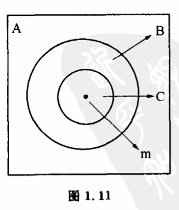
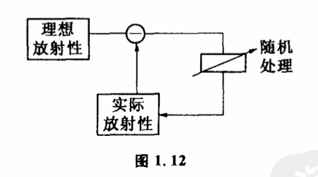

# 1.8 负反馈如何扩大了控制能力

现在我们回到那个控制能力扩大的问题上来。看看导弹和火箭专家是怎样从老鹰抓兔子那里得到启示的。

我们先把鹰的动作看成一系列俯冲的连续,每一次向目标的俯冲可以看作对自己位置的控制。鹰的控制能力是有限的,它不能一次到达目标,只能逐步向目标接近。我们把鹰位置的可能性空间表示为平面上的点（图1.11）。目标（兔子的位置）用m表示。鹰的第一次俯冲使位置的可能性空间由A缩小到B。这时鹰的控制能力为A/B。如果鹰只作这一次飞行,那么它跟炮弹没什么两样,控制能力不大能处在B范围内某一点,不能抓到兔子。如果在第一次俯冲后,马上进行第二次,将可能性空间再次缩小,由B到C,第二次俯冲的控制能力就是B/C。这样两次俯冲的控制能力就是（A/B）×（B/C）=A/C,即通过反馈,鹰扩大了自已的控制能力。如此第三次、第四次……不断地反馈选择下去,鹰的总控制能力为的总控制能力为（A/B）×（B/C）×（C/D）×···×（x/m）=（A/m）。

由于目标差每控制一次都在缩小,即:由于目标差每控制一次都在缩小,即:（A/B）,（B/C）,···,（x/m）都大于1,这样（A/m）就比（A/B）,（B/C）,···,（x/m）中任一个都大得多。也就通过负反馈,系统的控制能力是积累起来了。这样通过有限次的俯冲,可能性空间就由A缩小到m,老鹰终于抓着兔子了。当然,实际上老鹰的各次俯冲动作是连续的,在飞速运动中看来就像一下子往兔子身上扑过去似的。

鹰所使用的这套抓兔子的办法现在被人们用来控制导弹打飞机。工程师们给导弹安上了眼睛——红外线寻的装置,配上大脑——电子计算机,同时给它一付可以调节的翅膀——姿态控制装置。这样导弹就可以向着不断减少目标差的方向运动,直到把飞机击落。当然,把火箭发射到月球上去也采用了这样的办法。

显然,负反馈控制之所以应用如此广泛,如此有效,就是因为它可以把某种有限的控制能力累积起来,扩大了控制能力。每一次反馈,实际都是将上一次作为输出的可能性空间作为输入,让控制机构在这个已被缩小了的范围内进行新的选择。

用通常的话来说,负反馈调节就是"做起来看"。实际上我们要做一件没有做过的复杂事情,忌不能事先把一切都安排得周周到到的。客观事物总是在不断变化着,意外的情况随时可能发生,即使我们事先考虑得再周密,也会遇到一些不可预测的麻烦来干扰我们。因此最好的办法是干起来再说。一边干一边观察,随时修正自己的行动和方法,采取一步一步的办法逼近目标。

居里夫妇发现镭的过程就是一个很好的例子。居里夫妇发现在沥青铀矿中含有一种新元素,具有极强的放射性,除此之外,对这种未知元素的性质一无所知。怎么把它从沥青铀矿中提炼出来呢?当时,居里夫妇考虑既然这种元素的放射性比铀大得多,那么只要找到一种方法处理沥青铀矿,使得处理后的放射性比以前更强烈,新元素就一定是在富集。这实际上就是一个负反馈过程,控制着整个提纯过程向放射性提高的方向进行（图1.12）。就这样,运用反馈控制,经过几年的努力,他们把一次一次实验的控制能力积累起来,达到了一次实验看起来是不可能控制的结果,终于从以吨计的沥青铀矿中提出了1克新元素——镭。

在教学工作中,老师怎样控制自己讲课的过程以达到比较理想的状态呢?这里,有经验的教师也是利用负反馈来扩大自己控制能力的。教师讲课,向学生传递各种信息的同时,也必须开辟另一条信息通道,取得学生接受知识情况的信息。在课堂上有经验的教师都十分注意观察学生的眼色,判断他们听懂了没有,分析他们的心理活动,或者采取提问的方式,直截了当地进行试探。课外批改同学的作业以及适当地安排考试也是一些重要的了解学生听课情况的通道。通过这些教学环节,教师就能比较正确地把握自己讲课的深浅和进度了。课讲得太慢就加快些,太深就浅近些,使教学达到比较理想的目标。

从这些例子我们可以看出,负反馈调节实际上跟目的性这个概念有关。负反馈是一种趋向目的的行为。目的性是生物行为中一个重要方面,对于有意识的人类,目的性更成为社会能动性意识。控制论指出,当人的一次控制能力不能达到目的时,可以用负反馈调节放大控制能力。特别对于生物界和有机体,它们的每一次控制能力都很有限,因此,在生物界和人类行为中几乎所有的达到目的的控制过程都运用了负反馈原理。揭示出目的性与负反馈调节的内在联系是很有意义的。
