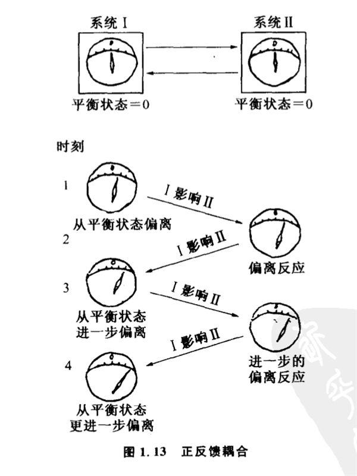

# 1.9 正反馈与恶性循环

负反馈是目标减少的过程,自然界有没有相反的过程,即目标差不断增大的过程呢?有的,这就是正反馈。

晋朝时有两个人在一起对诗,对诗规则是说一件危险的事,说得越危险越好。第一个人说了句:"矛头淅米剑头炊"。要在刀剑的尖头上淘米烧饭,可是一件危险的事儿。比这危险的该说什么呢?第二个人想了半天,说:"百岁老翁攀枯枝"。一个风烛残年的老头儿去爬枯树,这当然比刀尖上淘米做饭危险。再往下该怎么说呢?第一个人灵机一动说:"盲人骑瞎马,夜半临深池。"这可是绝妙的句子,至今人们还常常引用来形容很危险的事物。可惜这两个人没有按这个规矩继续比赛下去,否则一定会越说越玄乎,说不定会有些更好的句子比出来。这场对诗所规定的原则实际上就是正反馈。

我们可以把两个有正反馈耦合关系的系统表示为图1.13。

两个系统的状态分别用带指针的表盘来反映,第I系统的目标是平衡状态,其为0。如果第I系统由于某种原因稍微偏离了目标,那么第II系统所产生的反应是使第I系统下一次的状态更加偏离目标。这样,在互相作用中,它们各自偏离目标越来越远,这样的耦合关系就叫正反馈。

正反馈使人联想到超级大国之间的军备竞赛,每一方得知对方发明了一种新武器就立即研制一种更厉害的武器来对付。于是,原子弹、氢弹、远程导弹、逆火式轰炸机、多弹头导弹、中子弹……就这样不断地被制造出来,远远偏离了"缓和"这种平衡目标值。在电子技术中,正反馈原理被用来放大信号,如最简单的再生回路是把三极管的集电极跟基极耦合起来,集电极电流增大使基极电位偏负,基极电位偏负会使集电极电流更增大,同时使基极电位更偏负,这样的耦合使最初的信号迅速得到放大。

在许多场合,正反馈现象的名声不太好,人们常常把它叫做"恶性循环"。由于它是一个目标差不断扩大的过程,因此,它往往标志着达到预定目标的控制过程的破坏,即表示一个失去控制的过程。医学上单纯的正反馈几乎无一例外地导致疾病,因为人体的健康跟内环境的稳定状态密切相关,而单纯的正反馈会使人体状态离必须控制的稳定状态越来越远。对此中医和西医的理论是一致的。例如祖国医学认为脾和心是两个互为反馈的耦合系统,如果脾气虚,食欲不振,运化失职,就使血的来源不足,导致心血虚,产生心悸,健忘,面色不华,脉搏无力等症状。而心血虚又无以滋养于脾,进一步加重脾气虚。心血虚和脾气虚之间这样互相影响,也形成一种正反馈式的恶性循环,导致心脾两虚的征候。治疗时可以采取补脾气或者补心血的办法,也可以采用其他的措施。西医病理学认为,在某种病态下,机能代偿失调,病情向严重方向发展,也会造成这种恶性循环。如心力衰竭时,血液输出量减少,动脉血压下降。而冠状动脉血流量减少,心肌菅养不足,更使心肌收缩力减弱,相继血液输出量进一步减少,病情会迅速恶化。

这种正反馈发展到了极端,系统的状态大大超过稳定的平衡状态,就会导致组织的崩溃和事物的爆炸。例如炸药爆炸,我们可以看作化学反应和热量释放之间形成了正反馈耦合。

负反馈描述目标差减少的调节,而正反馈描述目标差越来越大的过程,从对控制目标的偏离来说,它们正好相反。我们说正反馈差不多都和恶性循环有关,这仅仅是就控制而言的,这决不是指正反馈在所有场合都是"坏"的。我们后面将谈到,对于系统结构的演化,正反馈是极为重要的。并且控制论指出,正反馈和负反馈是可以互相转化的。负反馈搞得不好会变为正反馈,正反馈的失控过程经过适当调整也可以变为负反馈。要揭示它们之间的关系和转化条件,我们必须将研究范围从"控制方法"中拓广开去,进一步探讨控制过程的传递、事物间互相作用的方式和整体结构。这就是我们在第二、第三两章要研究的内容:"信息与系统"。
