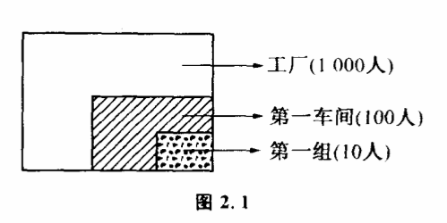

# 2.1 什么是知道

没有一个重要的概念像"知道"那样容易被人忽视的了。我们常常听人说他知道这个或者知道那个,但却难得听到有人问起什么是知道。不过,这个问题在历史上至少被人们研究过两次。一次是20世纪科学家在研究通讯理论的时候,对它的研究导致了通讯理论的突破。一次却早在两千多年以前,由中国古代的两位大哲学家庄子和惠子提出。

有一次庄子和惠子在一起观鱼,庄子看见鱼在水里游得十分自在,就对惠子说:"你看鱼多么快乐啊！"惠子立即问道:"你不是鱼,怎么知道鱼是否快乐呢?"庄子想了一下回答道:"你又不是我,怎么知道我知不知道呢?"

这个有名的哲学故事叫"庄子观鱼"。大哲学家庄子和惠子实际上在这里提出了两个非常重要的问题:"什么是知道"?"怎样才能知道"?两千年之后,在研究通讯理论的时候,这个问题又引起了人们的兴趣。不过这一回人们不再用思辨的方法,而是用严格的科学方法来对待了。人们发现,这个问题跟"信息"这个重要的概念有关。所谓"知道",是指人获得信息的过程,而怎样才能"知道",就是信息怎样传递、怎样获得信息的过程。

"我看见桌子上放着一个杯子我收到一封电报,妹妹明天来气象预报说,明天要下雨",这都是人们获得信息的过程。人们获得这些信息后,对某一个事件就知道得多了一些。如果天气预报说明天可能下雨,可能不下雨",那我们会说,预报不预报一个样,预报没有告诉你什么东西,因为你原来就知道天气变化无非就是这两种可能。所以我们也可以把"知道",或者说获得信息的过程,看作人们对事物可能性空间了解程度发生了变化的过程。你原来知道妹妹明天可能来,可能不来,在收到这封电报后,你关于妹妹是否来的可能性就缩小到一个状态——来。在你没有看桌子时,对于桌子上放了什么东西的可能性是很多的,可以是杯子、本子、钢笔、香烟、收音机······但你用眼睛看了一下,使你所知道的桌子上放了什么东西的可能性空间变小了。

实际上,我们平常所说的"知道"并不仅限于可能性空间变小这一过程。如地震队最近预报,近期内这一带可能有地震。原来我们知道这一段时间脚下地层变化可能性状态只有一个——不震"。但发了地震预报后,使知道的可能增加到两个,即"可能震"与"可能不震"。因此,我们看到,所谓"知道",实际上就是我们头脑中关于事物变化可能性空间变大或变小的过程。在绝大多数情况下,可能性空间变小。

以前人们认为信总是无法定量插述的,一篇文章,一幅绘画或者一段音乐,它们所包含的信息似乎有无限多,我们可以从各种角度来分析它们的意义。像《离骚》、《神曲》、《红楼梦》这样的不朽著作,仁者见仁,智者见智,越读意味越深远,谁也不敢说它们究竟要告诉我们多少信息。不过数学家看问题的角度不同,尽管他们也经常想入非非,但一旦他们决定建造一座坚不可摧的理论大厦,就一定要用精确的语言来奠定那些最基本的概念,并且通常习惯用定量的方法把它们表达出来。美国数学家兼工程师申农在创立信息的量的理论方面做了许多工作。

前面说过,得到信息的意思就是知道了过去所不知道的,或要进一步知道过去知道得较少的东西。但什么是不知道或知道得较少呢?如果可能性空间中每种状态实现的机会都相同,我们就说对最后结果不知道或知道得很少。例如在收到电报之前,妹妹明天可能来也可能不来,来和不来这两种可能实现的机会是相等的。收到电报之后,两种可能实现的机会就不相等了,我们可以说对丁结果如何就知道得多一些了。确定信息量的大小,就是依据这样一种思想。实际上在这里引用了一个非常重要的概念——概率。概率是用来表示各种可能性实现的机会大小的一个量,人们把必然发生的事件的概率规定为1,把绝对不可能发生的事件的概率规定为0。我们可以通过概率来严格地计算信息量的大小,不过在许多场合,我们也可以简单地根据可能性空间的变化来度量信息量。例如,有一个人到有一千个人的工厂中去找熟人。这时,他的头脑中这个"熟人"所处的可能性空间是这个工厂的一千人。传达室告诉他,"这个熟人在第一车间"。这时,他就获得了信息。但他获得的信息有多少呢?第一车间是999个人还是100个人对他很有关系。如果是999个人,那么他所了解的可能性空间并没有缩小多少,找起来同样费力。因此,我们可用可能性空间缩小到原来的几分之一来度量获得信息量的大小。如果第一车间有100人,那么他获得的信息为（100/1000）=（1/10）通常,我们不用（1/10）而用（1/10）的负对数来表示信息量,即-log（1/10）=log10。为什么要用负对数呢?这个度量方法有一个好处,就是几次获得的信息量加起来,就是获得的总信息量。比如那个人到了第一车间,人家告诉他"熟人在第一组"。那么他获得了第二个信息,如果第一组有10个人,第二个信息使可能性空间又缩小到（10/100）=（1/10）两次获得信息使他知道熟人在全厂范围的可能性空间缩小为（100/100）×（10/100）=（10/1000）显然-log（100/1000）+\[-log（10/100）\]=-log（10/1000）即只要把两次获得的信息量加起来,就是获得的总信息量,这两次信息量的和,跟传达室一下子告诉他"熟人在第一车间第一组"的信息量是相等的（图2.1）。

采用负对数还有一个好处,只要可能性空间缩小了,获得的信息量总是正的。如果可能性空间没有变化,-log1=0,获得的信息量就为0。如果可能性空间扩大了,信息量为负值,人们原来对一件事比较确定的认识变得模糊起来。

实际应用中,我们使用以2为底的负对数来计算信息量,单位称为比特。

一行文字由单个的字和标点符号组成,在拼音文字中则由字母和标点组成。在读到这行文字之前,我们对每一个单位将出现几十个字母中的哪一个是不知道的,读了之后每一个单位的可能性就确切地变为那个特定的字母。沿着这个思路我们可以算出一行文字的信息量或一整部作品的信息量。同样我们可以把一幅照片分解为平面上纵横排列的点,像报纸上的照片每个点实际只有白色和黑色两种可能,整幅照片的信息量就由所有点表示的信息量组成。这样任何一幅照片,绘画或者雕塑所包含的信息量都成为特定的,因而也就可以计算了。信息概念量化以后,人们找出了许多有关信息传递和存储的规律,使有关通讯和控制的理论变得既严密又精确,成为真正现代意义下的科学。
