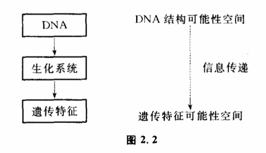

# 2.2 信息的传递

信息之所以称为信息,就是它的可传递性。传递信息有几个重要的环节,一个称为信息源,一个称为信息的接受者。在信息源和接受者之间还必须存在传递信息的通道,信息通道把信息源"发生了什么事件"传递给接受者。

所谓传递,就是信息源和接受者两个系统之间的联系,就是一事物对他事物的影响。庄子和惠子的争论本质上就是关于信息能否传递的问题。惠子认为,人不是鱼,人就不能知道鱼是否快乐。也就是说,鱼是否快乐是不能作为信息来传递的。庄子抓住了惠子的这一个观点,并将其推而广之,即如果鱼是否快乐不能作为信息传递,那将意味着任何事件都不能作为信息传递,惠子也不可能知道庄子是否知道鱼是否快乐了。信息在传递过程中的形式称为信号。不同形式的信号传递能力是大不一样的。传递途径也是大不一样的。一个茶杯放在桌上,我可以通过多种方法获得它的信息。我通过眼睛看到它的颜色、形状,通过手拿感觉它的重量。然而,这种信息传递过程只有对茶杯旁边的人才是适用的。如果电视摄影机对准了茶杯,茶杯的形状变成相应的电脉冲和无线电波,无线电波发射出去,千千万万人都能获得茶杯形状的信息。然而这样一来,信息传是传得远了,但通过这种方法获得的信息就不如在茶杯旁边的人那样多了。人的眼睛看见茶杯,是通过视神经把携带茶杯形状的光信号变成电信号,通过一系列传递过程才完成的。

那么,信息传递过程中的传递是什么意思呢?是传递物质还是传递能量呢?都不是。信息的传递是指可能性空间缩小过程的传递。信息源发生的确定性事件使它的可能性空间缩小了,经过传递,这种缩小最终导致了信息接受者可能性空间的缩小。因此,所谓信息的传递也就是可能性空间变化的传递。从这点来说,传递信息跟控制有密切的关系,我们在第一章曾经说过,所谓控制也是一种使可能性空间缩小的过程。实际上,信息的传递离不开控制,控制也离不开信息的传递。

我们常说,DNA携带着遗传信息,这是什么意思呢?大家知道,DNA是一个双螺旋结构,它含有4种不同的碱基:腺嘌吟、鸟嘌啶、胞嘧啶、胸腺嘧啶。这4种碱基可以组成不同结构的DNA。不同的碱基排列的形式控制着不同种氨基酸,不同氨基酸可以结合成不同的蛋白质,组成不同的酶,不同的酶控制着不同的细胞形态,不同的细胞形态决定了生物不同的特征,决定了这一种生物是狗,是猫,还是耗子,这里我们看到一个控制链。DNA的结构一旦确定（可能性空间缩小到某一状态）,就引起一系列可能性空间的缩小,最后决定了遗传特征可能性空间的缩小,決定了某一生物的形态。所谓DNA携带遗传信息,实际上是指DNA结构可以控制物种的形态和特征（图2.2）。

我收到一封电报,实际上这里也存在着一系列控制。妹妹到邮电局去打电报,她的选择使电报纸上出现的字的可能性空间缩小。电报纸上的不同的字选择了不同的数字组合,数字组合通过发报机选择了不同的无线电信号······一直到我收到电报,引起我头脑中可能性空间的缩小。

传递信息需要我们实行某种控制,反过来,控制过程又必须依赖信息的传递。很多时候,我们不能实现有效的控制,是没有获得足够的信息之故,生物反馈在这方面提供了一个很好的例子。

大家知道,一般人不能控制自己的心跳速度,也不能控制自己的血压高低。所谓不能控制,人们认为这是人的意志不能对它们施加影响,因此这一类内脏器官的活动通常被称作"不随意运动",跟人的意志能够自由控制的骨骼肌的随意运动相区别。实际上,人的意志之所以不能随意控制这些器官的活动,很大程度上是没有获得它们活动情况的足够的信息。一般说来,位于内脏部位的各种内感受器接受刺激并将冲动传入中枢后,虽然有时也可引起一些较模糊的感觉（如饱感、尿意等）,但常常不引起明晰的主观感觉,而主要引起某种内脏或躯体反射,使体内各器官、系统的活动自动达到平衡与协调,如使内环境理化功能相对稳定,心律血压保持相对恒定等。而肌肉、关节的运动和位置的感觉,被称为本体感觉,它们跟其他外感受器的感觉（如皮肤、视觉、听觉、嗅觉和味觉）一样,通过特异性传入系统传到大脑皮质相应的特定部位,能够引起清晰的特定的主观感觉,人的大脑每时每刻都可以清楚地接受到自己四肢位置和姿势的信息,因而也就可以有意识地控制它们。解剖学表明,人体大脑皮质的躯体感觉区中相应于手指和口唇部的区域最大,说明大脑对这些部位的信息最敏感,因此人对手指和口唇的控制也最自如,这显然跟人类的劳动和语言有关。根据以上原理,近年来发展出生物反馈疗法。这种方法认为,只要人能够时时刻刻清晰地获得自己内脏活动的信息,比如能够像感觉到手上拿了什么东西那样感到自己的血压是多少,再经过适当的训练,就可以控制自己的血压了。目前流行的生物反馈治疗仪的原理都非常简单,一般是把心律、血压、痛觉等内脏信息转换为数字、灯光、音响等显示出来,利用眼睛、耳朵等外感受器输入大脑。这方面有许寒疗效盟著的报道。据说甚至猴子、狗、牛这一类动物经过训练也可以利用反馈治疗仪来控制自己的关节疼痛和胃溃疡。由于条件反射的本领,大多数病人经过一段时间的训练之后,离开反馈治疗仪也能够获得一定的控制能力。这本质上就是利用反馈放大了自己的控制能力从而控制了自己原来没有能力控制的行为。信息论的研究指出,这种反馈之所以能够做到,关键在于构成了信息传递的新通道。

实行控制需要获得足够的信息量,这是一条重要的原理。大家也许已经观察到一些哑巴不一定是聋子,但先天性的耳聋或者在2—3岁前失去听觉,就一定是哑巴,聋哑病人多数属于这种情况。他们不能接受到语言的信息,因此也就不能控制自己的发音器官准确地发出语音。他们对别人的语言很大程度只能靠眼睛观察神色和口形,猜测別人的意思,但这样获得的信息量远远不足以使自己学会说话。这些人的发音器官大多是好的,只要恢复听力,他们中间的一些人也许还可以成为出色的歌唱家。

这个原理我国古代哲学家已有所观察。《列子》中有一段关于纪昌学箭的故事。纪昌向神箭手飞卫学箭,飞卫对他说:"你要学好箭、先要下功夫练好眼力。要牢牢地盯住一个目标,不能眨一下眼。"纪昌回家之后,就开始练习起来。他妻子织布的时候,他就躺在织布机底下睁大眼睛,注视着来来去去的梭子。这样学了两年,纪昌以力自己学得差不多了。但飞卫说你还要多练练眼力,做到把极小的东西,看成一件老大的东西,到那时候你再来见我。"纪昌记住师父的话,他用一根长头发,缚了一只虱子,吊在窗口,每天站在那里,一心一意地注视着那只虱子。练到后来,那只缚在头发上的虱子在他眼睛里一天天大起来了,大得像车轮一样。纪昌再去见飞卫,飞卫很高兴地拍拍他的肩膀说你已经成功了！"于是飞卫再教他怎样拉弓,怎样放箭。不久纪昌就成为百发百中的神箭手。这个故事一向被人解释成学本领要勤学苦练。但勤学苦练、射箭只要每天练拉弓放箭就行了,为什么要强调练习眼力呢?显然,列子的意思是要说明眼力和箭法的关系。用我们今天的话来说,就是只有获得目标的足够信息量,才能控制目标。

信息和控制的这种依存关系反映了认识论中知和行的统一,知表示获得信息,行表示实行控制。人们只有对外部世界有所认识,才可以能动地去改造它。反之,人们只有参与对外部世界的改造,才能够获得对它们的真知。传递信息和实行控制的过程都贯穿着事物可能性空间的变化,并且它们之间存在着一定的质和量的约束关系,这就深刻地揭示了知和行在本质上是统一的。
