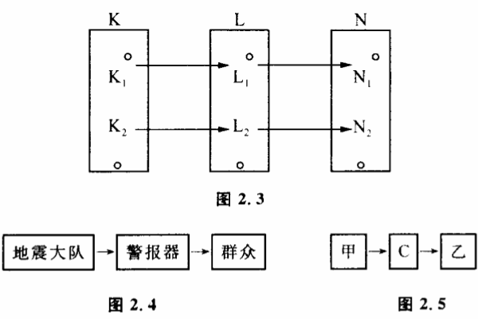
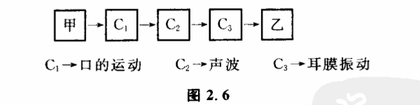

# 2.4 通道容量

正如火车要在铁轨上运行,电流要经过导体传递,信息的传递存在着通道和通道容量问题,大家一定会感到非常自然。我们还是从一些具体的例子来开始研究。

某地震大队,从仪器和各种数据分析得到结论:近期内要发生六级地震。他们怎样把这一信息传递给别人呢?一个办法是拉警报。警报器有两种可能状态:一种是警报器响,另一种是不响。这两种状态必定是要可控制的。即地震大队可根据他们所获得的信息——震还是不震——来控制警报器响还是不响。如果警报器拉不响还可由别的什么原因决定,而不是完全由地震大队决定,那么就不能由它来传递关于地震预报的信息。这常称为信息传递受到了干扰。此外,仅仅是警报响还不够,还必须向群众讲明,在这段时间警报响表示什么意思。用控制论的术语说,就是通过L（警报器,它有两个状态L1、L2）,建立起地震大队关于地震可能性空间K（有两个状态K1、K2）与群众关于地震预报的了解N（也有两个状态N1、N2）的一种联系（图2.3）。这种联系建立后,一旦K的可能性空间缩小了,就会引起N的可能性空间缩小。这种建立起联系的方式,称为信息传递的通道。在警报器例子中,信息传递通道如图2.4。任何人与人之间信息传递过程都可以表示为图2.5。

在电报中,C的各可能性状态是用不同长短的电码组合起来的。在信件中,C的可能性空间是词组。当然,整个传递通道中C可以不止一个。通常一个人用声音把信息传给别人时,信息传递就经过如图2.6所示的通道。

一条通道,在单位时间内,可以传递的最大信息量称力这一通道的通道容量。我们来看,通道容量是由哪些因素决定的。在警报器的例子中,通道容量由如下几个因素决定:（1）人拉警报的速度和控制能力。如果警报器经常坏掉,有时为了使警报器响起来,要摆弄警报器好几天。那么这架警报器通道容量就小,它只能传播以几天、十几天时间为单位变化的信息。而不能用来做紧急情况传递的通道。

(2)警报器有几个可辨状态——即警报器可能性空间有多大。因为人头脑中关于地震可能性空间的缩小是要通过警报器的可能性空间缩小来传递的。因此，警报器可能性空间（可辨状态）越大，其可传递的信息量也越大。当警报器只有"响"、"不响"两个可辨状态时，如果我们要传递"近期有六级地震"这样的信息就会觉得困难。因为人们从警报器中只能辨别震还是不震这两种状态，不能辨别出可能有几级地震。为了做到这一点，必须用警报器的信号组合来传递信息。警报器可以发出两种不同的声音，利用短响、长响和不响三种情况的配合来组成各种信号，像打电报一样。这样警报器的可辨状态增大了，虽然所需要的时间相应长一些，但总的信息量可以大大地增加。

有一次,晋平公做了一把琴，琴的大弦与小弦完全一样。晋平公让一个有名的音乐家师旷来调，师旷调了整整一天，没有调好。晋平公怪师旷没有本事。师旷回答说："任何一把琴，都必须有大弦和小弦，它们的功能不一样，组合起来，才能成为音乐，现在大小弦一个样，叫我怎么调？"师旷在这里实际上就是讲出了通道容量的大小对于信息传递的重要性。如果琴可发出声音的种类很少，即通道的可辨状态很少,任凭艺术家心中有多少崇高美妙的音乐形象，这种信息也是传递不出去的。

(3)警报传给人的速度和对人的控制能力（人对它的信任了解程度）。

在第一次世界大战时，当时最大的客轮"露齐泰尼亚号"被德国潜水艇击沉的消息是以两种不同的通道传入非洲中部地区的,一条通道是报纸和无线电,另一条通道是非洲人用鼓声组成的鼓语。初看起来,报纸的可辨状态比鼓语可辨状态大得多了,无线电波传播速度比声波快得多。但实际上,由鼓语传递的信息却很快到达了非洲的中部,其速度甚至和欧洲用报纸和无线电传递信息一样快。为什么呢?因为通道容量是由上述三个因素决定的,对于当时的非洲各部落,鼓语对人们耳朵的控制能力比报纸和电报大。也就是第三个环节非常有力。而当时的非洲人对报纸却不注意。

这三个因素结合起来决定了通道容量的大小。其中每一个环节受到限制,都会影响通道容量的大小。同样的失火事件,一般人看见了用高声呼救的办法把信息传递出去,一个哑巴看见了只能用手势、神态来表达。照理说哑巴的手势、神态是通过光波传递的,比声波传递的呼救声要快,但实际上人们总先听到呼救的声音。显然语言的可辨状态比手语要多,而且对一般人的控制能力也比手语要强。

用仪器来观察自然现象可以看作是人通过仪器来获得自然界信息的过程。仪器可以看作信息传递的通道。人们总有一个普遍心理,那就是仪器越精密越好。仪器精密,虽然仪器的可辨状态是增加了,但人控制仪器、调整仪器所花的时间也增加了。所以在单位时间内仪器可传递的信息量不一定随仪器精密度增加而增加,有时反而减少了。因此在一个粗糙的实验中使用过分精密的仪器是有害的。

控制论中有一条原理:在单位时间里要传递集一数量信息时,选择的通道容量不要太大,也不要太小,最好等于你所要传递的信息量。为什么呢?通道容量太小,信息就不能及时地传出去,这是显易见的。那么通道容量太大了又有什么坏处呢?一是没有必要,并且可能造成浪费。二是随着通道容量的增大,信息受到的干扰也会增加,搞得不好会得不偿失。十字路口,告诉驾驶员车能否通行的信息是黄、绿、红三种颜色的灯。对于汽车能否通行这个信息的传递,用一个红灯、一个黄灯、一个绿灯组成的通道已经够用了,如果不用这样的通道,而用容量大的通道:如几百个黄绿灯和别种颜色如粉红、紫、白等等颜色组成的系统来传递汽车是否可以通过路口的信息,司机反而会弄得晕头转向,增加交通事故。

当信息传递时,可辨状态的控制能力减弱或失去控制能力时,我们说,信息的传递受到了干扰。

古时候,烽火台是用来传递敌人是否来犯的重要信息的。因而,烽火台在平时是严禁使用的,因为烽火台是否起火要牢牢受敌人来还是不来这两个状态控制。周幽王平时为了玩就把烽火台点了起来,结果使这一通道受到致命的干扰。以致最后敌人来到的信息根本传不出去。

根据信息传递过程的三个基本环节可以把干扰分为三类:

（1）干扰发生在人控制通道的可辨状态过程中,这称为控制干扰。

（2）干扰发生在信号自然传递中,或某些外来因素彰响了通道的可辨状态,这称为自然干扰或噪音。

（3）干扰发生在人接受信号过程中,这通常称为主观干扰。

干扰使信息崎变、失真,使人们的认识不能正确地反映客观世界的本来面目。人类意识的能动性不仅在于对客观世界的改造作用,而且还贯穿在整个认识过程的始终。人类从开始传递信息的第一天起,就在和干扰作斗争了,这在控制论中称为"滤波"。它反映了人类能动地认识世界的一个重要方面,使人类的观察力区别于镜子的反射。因此,研究有关滤波的理论,不仅是通讯工程的任务,也是认识论的一项重要课题。
