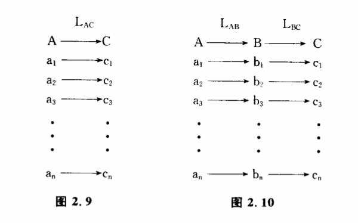

# 2.6 信息的储存

信息的另一个重要特征是它能够储存起来。我们已经熟悉了物质的储存,我们知道,保存物质往往极其困难。一个橘子,放不了多久就要烂掉；一批钢材,长期不用就会锈蚀。保存信息当然也会遇到同样的麻烦,但跟单纯保存物质有许多不同的地方。古代秦王朝本身早在地球上消失了,可是关于秦王朝的大量信息仍然保存在历史书籍和各种文物之中。每一个生物个体的寿命都不长,但作为一个物种,可以延续成百上千万年,现在仍然生存的一些蓝绿藻甚至在几十亿年中没有发生显著的形态上的进化。显然,在期的世代交替中被保存下来的不是生物的个体,而是物种遗传物质中的信息。

信息储存的含义究竟是什么呢?我们可以从控制的角度进行一些研究。以秦王朝的信息保存为例,我们用A表示信息源,B表示信息的保存方式,C表示信息的接受者,它们分别包含以下一些可辨状态:

A={a1、a2、a3、…、an}其中a1、a2、a3、…、an。表示秦王朝发生的各种事件。

B={b1、b2、b3、…、bn},其中b1、b2、b3、…、bn表示史书和各种文物的可辨状态。

C={c1、c2、c3、…、cn},其中c1、c2、c3、…、cn表示今天一位历史学家头脑中关于秦王朝的知识。

假定这位历史学家生活在秦王朝时代,他可以通过A→C信息传递过程获得关于秦王朝各种事件的知识,建立如下的对应关系,我们把这个过程表示为变换LAC（图2.9）:

如果这位历史学家生活在今天,秦王朝A已经不存在了,他要通过LAC过程来直接获得信息显然已不可能。但存在着另一种的过程,也就是存在着另一种可辨状态B,它跟A曾经有着某种对应关系。B可能是史书、铁器,也可能是一只陶罐或者一枚刀币。A虽然消失了,但B却一直保存下来。这样,如果建立B和C之间的对应关系,这位历史学家也能获得关于A的知识。这个过程可以表示力变换LAB和LBC两个阶段（图2.10）:

我们把B看作对信息源A的信息的保存。一切信息保存可以归结为这样一种变换过程。如果仔细研究一下,可以发现信息保存还有几个共同的特点。

（1）B本身不一走是以是跟A完全不同的东西,但B的可辨状态一定要具有稳定性,能保存得比A时间更长。照镜子的过程也包含着LAB和LBC变换,但镜子中的映像不能被用来保存实物的信息,因为映像的辨状态跟实物同时产生同时消失。照片就不同,它可以在实物的可辨状态发生变化以后仍然存在,因此可以用来保存信息。化石为什么能保存古生物的遗迹呢?原来,古生物的茎、叶、贝壳、骨骼等坚硬部分,经过矿物质的填充和交替作用,形成保存原来形状、结构以至印模的钙化、炭化、硅化、矿化的生物遗体和印迹。这些石化了的物质,当然比生物遗体具有更长的寿命。从这个意义上来说,信息的保存实际上也是一种传递性变换,把不稳定的可辨状态变换成一种稳定的可辨状态。

（2）B通常反映了A的某一个侧面。假定A是一个橘子,它有一定的形状、颜色、味道、气味、化学组成等等,实际上它的可辨状态可能含有无穷个变量,它处于一个极为巨大可辨状态空间中。但B往往只包含这极为巨大可辨状态中的几个有限状态。例如一张橘子的彩色照片只能储存橘子的颜色和二维形状,它不能保存橘子的气味、味道、细胞形态等信息。B的可辨状态的多少决定着所储存的信息量的大小。比如我们问一个问题,今天进化而来的生物,会不会把自己进化历史的信息储存在组成生物的电子之中?回答是明确的,一个电子中不可能含有生物过去历史的信息,因为世界上任何两个电子都是一样的,它的可辨状态太小,不能保存信息。实际上,真正像图2.10那样的——对应情况并不多。所谓一一对应,就是A有一个a1,B一定有一个b1与之对应,B有一个b1,A也一定有一个a1,与之对应。橘子与照片之间显然没有这种一一对应关系,橘子的酸味甜味在照片上就反映不出来。在很多情况下,A和B之间是多一对应关系,假如在十亿分之一的世界地图上,八达岭和十三陵只能用同一个点表示,在百万分之一地图上这两个地方就很容易区分,当然再要分辨出定陵和长陵的位置还有困难。分辨率高的地图相应储存的信息量就大些。其实,我们也可以把信息的储存看作一种特殊的信息传递过程,它也遵守信息量衰减的规律。生物体能如此精确地保持成千上万代不改变性状,可以想像,遗传物质所储存的信息量一定相当可观,生物的性状和基因密码之间必定有相当精确的一一对应关系,任何照片和地图都无法与之媲美。

（3）要使储存下来的信息可以被利用,我们必须具体地了解对应关系LAB和LBC。说起来也奇怪,有些学科看起来所研究的对象完全不同,例如考古学、犯罪侦破学和分子遗传学,但它们本质上都是研究A、B、C可辨状态之间的对应关系的。保存信息的环节B往往成为这些学科研究的中心。考古学家会把一堆断简残片或者一幅破烂的帛画跟两千年前发生的一场战争联系起来,侦探感兴趣的也许是现场的一点血迹或者一个指纹,他会由此联想到罪犯作案的情节和动机。相比之下,分子遗传学家的任务就更艰巨一些,他们不但要把遗传密码翻译出来,还试图通过改变密码创造出一些新的物种。

我们最熟悉的信息储存无疑是我们人类自己的记忆过程,它几乎每时每刻都在进行着。"记忆"这个词本身就包含着"记"和"忆"两个部分,前者意味着LAB,后者意味着LBC。这种把生活中发生的事件记下来并且能够在日后清晰地加以追忆的过程使我们把现在的行为与过去的行为联成一气,使我们具有学习和积累经验的能力,也使我们具有高度控制,调节与适应的能力。不过大脑中LAB与LBC过程发生的机制还远远没有弄清楚,人们对记忆过程中可辨状态的物质基础知道得还是太少了。

通过以上的分析,读者或许可以从行为和结构的观点来了解,储存物质和储存信息有一个明显的差别。储存实物时,实际上我们要保存无穷大的信息。比如一个橘子,要计算它究竟包含了多少信息几乎是不可能的。而当我们储存信息时,信息量总是有限的,它只储存了实物信息的极小一部分,对我们的认识来说是有用的一部分。
