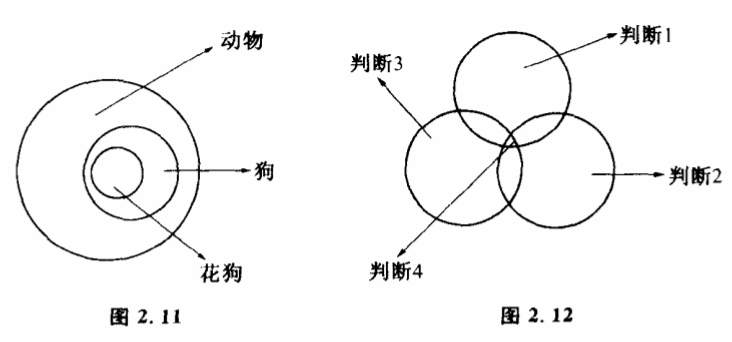
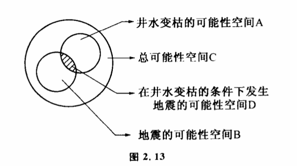
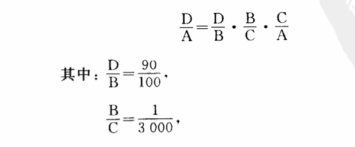
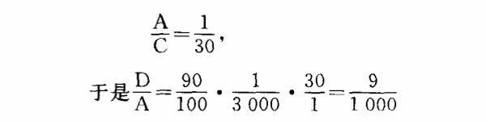
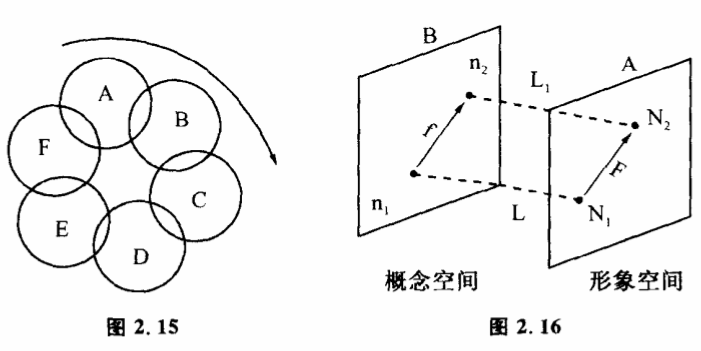

# 2.7 信息加工和思维

我们的大脑跟体内其他器官有一个显著的区别,它的主要职能不是加工物质,也不是加工能量,而是加工信息的。大脑也不同于感官,单纯起一种传递信息的通道作用。我们通过感官获得客观世界的信息,在大脑中经过思维这一复杂的过程被加工成新的信息。我们在这里讨论几种最简单的信息加工形式。

逻辑思维中最简单的推理形式是三段论。三段论包括三个简单判断,每个判断都含有一定的信息量。三段论的实质是把大前提和小前提的信息加工成结论的信息。这种加工方式通常可以用可能性空间来表示。例如"狗是动物,花狗是狗,则花狗是动物"。动物、狗、花狗这三个概念分别表示三种可能性空间（图2.11）,大前提说"狗是动物",显然,狗的可能性空间包含在动物这种可能性空间之中,小前提说"花狗是狗",花狗的可能性空间又包含在狗这种可能性空间之中。那么花狗的可能性空间当然也就包含在动物可能性空间之中了。判断句的肯定联项"是",实际上指可能性空间的包含关系。这对数理逻辑有着决定性的意义。因为,这样一来,逻辑思维可以归为一种数学运算,用集合来表示可能性空间,用包含关系来描述判断。逻辑推理的重要内容是从一些已知判断求出新的判断。比如,我们知道判断1、判断2、判断3是正确的,就可推出其相交部分（见图2.12）判断4也是正确的。推理的过程是信息加工的一种方式,它告诉我们可能性空间怎样缩小是合理的。

有时候我们所获得的信息并不反映一些确定性的事件,我们经常要跟一些概率性的事件打交道。这种情况下就不能通过直观来进行判断了,我们经常要借助数学方法来进行思维,从一些信息求出另一些信息。

我们来看一个例子。某一地区所有的深水并变枯了,地震大队通过观察获得了这一信息,从这一信息来预报地震,实质上就是从井水变枯这一信息来推导地震是否将发生的问题。我们问:井水变枯了这一信息中含有多少关于地震的信息?这实际上就是说:在井水变枯条件下,不久将发生地震的可能性有多大,或者是说:地震这种可能性占井水变枯这一事件可能性空间的百分之几。

我们把关于地震是否发生和井水是否变枯的总可能性空间用C表示,A表示并水变枯这一事件,B表示发生地震这一事件,A和B的共同部分D表示弁水变枯和地震一起发生的可能性空间。地震大队已经获得井水变枯的信息,这就是说,可能性空间已由C缩小到A范围。在A范围中B事件的可能性有多大呢?这就是我们提的问题——井水变枯时地震的可能性有多大?我们可以用（D/A）表示（图2.13）。

假定我们从这个地区统计资料中发现:

（1）这个地区发生五级以上地震平均是3000年一次。

（2）这个地区井水变枯平均为30年一次。

（3）地震发生前90%的并水要变枯。

现在井水变枯了,是不是90%以上要地震呢?我们来算一下（D/A）的数目:

 

也就是在井水变枯的情况下,地震的可能性还不到1%,这就得出比直观判断更正确的结论。

如果说逻辑思维主要是研究概念、判新和推理的,那么自由联想就完全不同。我们由木买想到树,由树想到春天,由春天想到花,由花想到蜜蜂,思想像插上翅膀一样可以飞得很远很远。自由联想通常先由一个信息A变到和它有共同部分的另一个信息B,再由B变到和它有共同部分（但和A并不一定有共同部分）的C过程等（见图2.14）。

有时,自由联想构成一个封闭的循环,当人陷入到某一种情绪中去时,信息运动常取这种形式（图2.15）。通常这种思维方式是有害的,它使人老围着几个念头打转转,形成一种封闭的思路,无法解脱出来,它与自由联想正好相反,走到思想被束缚住的极端。我们思索一个问题如果出现了这种循环,就打不开新的思路,必须设法从中跳出来。失眠病人晚上睡不着觉。大脑中的信息就常常以这种方式运动。严重的情况下,这种思维方式还会导致精神错乱。

我们在第一章讲过的共扼控制在思维过程中是十分重要的。从控制论角度看,人的思维空间可以分为两个部分,一个称为形象空间,一个称为概念空间。人在进行形象思维时,形象思维就是形象空间中信息的运动。而概念空间代表抽象思维时信息运动范围。实际上,人在进行最简单的推理时,都必须牵涉到这两个空间的协调。在这种协调中,共轭控制是十分重要的。比如我们听说一个人服了敌敌畏,马上想到:这个人要死了。这个结论怎么推出来的?显然,光靠形象空间的信息运动是解决不了这个问题的。因为如果你看见过一个人服敌敌畏后的全过程,你还有可能想像,服了以后会出现什么症状,这个人躺在床上,很痛苦,最后死了,要从形象空间推出这一结论必须从前提N1（图2.16）推到结论N2,在形象空间A中,走过一段较长的连续曲线F。实际上任何人作推论都不是这样的。一旦你知道这个人服了敌敌畏,形象空间出现信息N1,N1马上通过一个变换L映射到概念空间n1,n1代表一个人服了敌敌畏这样一个抽象概念,没有任何形象,n1根据逻辑关系f推出n2,n2表示一个人要死了。然后n2再经过L1（逆变换）映射到N2,即这个人要死了。死这一状态也是形象的,喝敌敌畏这一状态也是形象的,但中间的推导过程并不是形象的。这就是人在思维过程中运用共轭控制LfL1表示替F的过程。这种思维过程人每天都在千百次地运用着,它有一个很大的特点——即既有形象,也有概念。

我们初步讨论了思维过程一些比较简单的形式,如记忆、逻辑思维、自由联想等。思维中有一些更高级的信息运动形式,如创造性和自我意识等,还有待大家去进一步研究探索。
