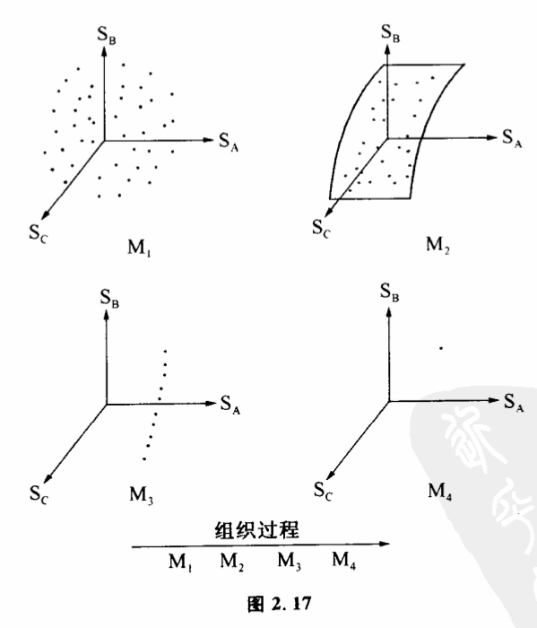

# 2.8 信息和组织

人们常说,信息这一概念跟一个系统组织的程度有关,为什么呢?在回答这一问题前,首先我们来问一个问题:什么是组织?组织是怎样形成的?

生物体有自己的组织,社会集团和银河系也有自己的组织。人们早已熟悉组织这一概念,并且不断运用着。但组织究竟是什么,并不是每个人都说得清。组织产生的过程实际上是一个系统从无联系的状态,排除了许多別的可能联系方式,只取’某一种或几种联系方式的过程。比如很多小的氨基酸分子形成某一有固定结构的蛋白质,我们说分子组织起来,这无非是说,原来很多氨基酸分子之间的关系与位置是任意的,要形成一个大分子蛋白质,这些氨基酸必须排列在一些固定的位置上,不能再取任何别的位置,如果位置发生新的变动,就会引起蛋白质的解体。把混乱的人群排成队,也是一种组织过程,这个过程的意义无非是原来每个人都可任意处在空间各点,而一旦排起了队,可取位置的能性就比原来大大地缩小了。一个组织的确定意味着只能发生这种或那种联系,而不能任意发生别种联系。因此,所谓组织过程是事物之间联系的能性空间从大变小的过程。或者说是从混乱无序发展到有秩序的过程,是一个建立联系的过程。

我们可以把组织过程用可能性空间形象地表示出来。以三个人排队为例。如果A、B、C三个人在操场上自管自走来走去,我们就说由这三个人组成的人群是混乱的,没有组织的。我们用坐标轴SA表示A在操场上各点的位置,用SB和SC表示B和C的位置,由SA、SB、SC三根轴组成一个三维可能性空问。三个人的每一种位置组合都可以表示为这个空间的一个点。在没有组织的情况下,这群人位置的组合状态可以是这个空间中的任意一点（图2.17M1）。如果有人下达了一个命令,规定"A、B、C三个人的位置必须呈一个正三角形",那么他们的行动就受到一定程度的约束,不过这种约束比较松散,第一个人和第二个人仍然可以自由地走来走去,只是第三个人必须按前两个人的位置确定自己的行动。学过解析几何的读者知道,这三个人的位置组织状态在三维可能性空间中只能取一个平面上的点（图2.17M2）。如果这三个人又接到一个命令,规定"A、B、C所呈的正三角形必须以操场中间的旗杆为中心"。他们的行动就进一步受到约束。不过第一个人还可以自由地走动,第二个人和第三个人都必须按第一个人的位置确定自己的行动。这时他们的位置组合状态限于可能性空间中一条直线上的点（图2.17M3）。如果进一步规定在这个以旗杆为中心的正三角形中,"A必须位于旗杆正北5米,B、C必须分别位于旗杆西南方和东南方"。那么这三个人就受到一种最强的约束,他们都不能自由行动,在可能性空间中的状态只能取惟一的一个点（图2.17M4）。

图2、17中由M1到M4的过程就是一个组织过程,A、B、C三个人受到越来越强的约束,在这个过程中,他们位置的不确定性逐步减少,最后形成一个有高度组织性的系统。如果SA、SB、SC不代表三个人的位置,而代表不同原子的位置,那么对这个可能性空间的约束就可能意味着一个分子的组织过程。

那么组织跟信息有什么关系呢?我们马上会想到,控制、信息和组织都可以表述为可能性空间的缩小。差别在于可能性空间的状态不同。在组织中可能性空间的状态不是一般的可辨状态,而是代表事物相互联系的方式,一个状态代表一种联系方式。因此,组织起来的过程实际上是事物间建立某些确定的联系,排除了其他种联系的可能,从而也就排除了联系的混乱性和随机性。

实际上,组织过程与获得信息是密不可分的。控制论指出,一个系统必须获得一定量的信息才能组织起来。在上面操场上排队的那个例子中,A、B、C三个人之所以能一步步组织起来,是因力他们接到了命令,命令就是信息。生物体之所以能组织成一个协调的整体,是因为生物体内各个细胞、器官之间能够通过神经、体液、经络以及其他各种通道互相传递信息,也能够与环境互相传递信息。现代社会的组织程度是古代社会无法相比的,通讯及其他信息传递技术的发展在组织社会中起了很大作用。可以设想,今天如果没有电报、电话、电视、报纸、广播、报纸、火车和其他传递信息的工具,整个社会就会迅速地发生解体。因此在控制论中,一个系统组织程度的度量跟信息量是一致的。

读者可能已经发现,我们在考虑组织的时候,实际上是碰到了一个更为广阔的领域。研究控制和信息的传递,我们是把一个复杂组织的各个部分互相孤立起来、考虑局部的时候得出的基本概;其实,就拿信息的传递来说,除了极其个别的场合,没有一个东西单纯是信息源、通道或者接受者。事物在信息的交流中结合成一个整体。人类社会中每一个人都是信息源,又是信息的接受者,同时又是一个社会信息通道组成的要素。我们必须把一个事物的整个控制、反馈和信息传递过程综合起来考察。不仅要考虑单向传递,而且要考虑相互影响及相互影响的综合效果。这就是系统理论。如果把控制和信息概念作为大厦的基本砖块,那么系统理论就是研究这些砖块是怎样构成大厦的。
