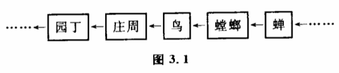

# 3.1 系统研究方法中的因果联系

所谓因果联系,大家都比较熟悉。人们遇到一种现象,总习惯于考察它发生的原因是什么以及它所要引起的结果。例如水结冰,温度下降是水结冰的原因；物质的组成和结构不同是物质具有不同性质的原因；导线周围有磁场是导线中有电流的结果；等等。

这种研究方法是有效的,特别是在剖析事物某一具体的、局部联系的时候,它是整体研究的基础。但当我们了解了局部关系后企图来把握整体时,特别是碰到自然界错综复杂的大系统时,这种方法就无效了。在研究大系统时,人们不得不跟许多新的有趣的因果联系形式打交道,我们在这里研究其中的几种。

## （1）因果长链

这在科学研究中是时常会遇到的。人们不但要知道某一现象发生的原因,而且往往还要知道原因的原因是什么。如果有可能的话,还要一直追索下去,直到发掘出一长条有因果联系的链来。

早在两千多年前,我国大哲学家庄周就对这种因果长链进行了研究,记载在《庄子》里。一天,庄周到雕陵栗园去游玩,看见一只怪鸟,他紧跟过去,架起弹弓准备打鸟。这时一只蝉正躲在枝叶中叫,没想到已被螳螂发现了,螳螂伸出长臂抓住了蝉,正要咬,却又被那只怪鸟发现了,怪乌一啄,就把螳螂连同蝉一道吞掉。庄周把弹弓丢在地下,十分感叹地走出园去,园丁见了,以为他是偷栗子的,狠狠骂了他一顿0庄子通过这个有趣而寓意深刻的故事说明世界上事物之间的关系是复杂的,事物的原因后面还有原因的原因,一环扣一环。如果考察下去,可以追索得很远。如果只看到眼前局部的环节,就要犯错误。螳螂只看到蜂,没顾到背后的鸟,所以被吃掉了。鸟只看到螳螂和蜂,差一点被庄周的弹弓打中,园丁只看到庄周进了园子,就以为他是偷栗子的。实际上,整个过程中各个环节的因果联系应该是一条长链（图3.1）。园丁的行为离开了蝉是难以解释的。要了解园丁当时的行为,必须把蝉、螳螂、鸟、庄子和园丁作为一个系统来研究。

这种研究因果长链的方法在现代科学中有重要的地位。追索原因的原因以及结果的结果,使许多学科的研究工作越出了自己经典的领域。人们经常发现构成本学科疑点的课题,其解决方法在过去认为毫不相干的科学领域内。这就促进近几十年来边缘科学及新的学科分支纠纷问世。这种研究因果长链的方法也造成了科学史上另一个有趣的现象,就是人们对自然界一些终极问题越来越感到兴趣,它们构成了著名的三大起源问题。人们发现,许多学科的疑点如果按原因的原因或结果的结果追索下去,都会不约而同地涉及天体起源、生命起源、人类起源这样一些根本问题。

那么,是不是一切化学问题和生物学问题都必须归结为基本粒子或夸克的发现,是不是一切有关人类的意识和社会问题都有待弄清人类起源甚至生命起源才能解决呢?追溯因果长链有助于我们从整体上来把握一个事物,但如果无限地追溯下去,会有一个终结吗?不会的。任何一个科学家如果被一条无限的因果长链缠住,他就无法脱身。因果长链的无限性使人们再一次提出了所谓终极原因问题,只不过把终点放到了一个无穷远的地方如果把目前科学所遇到的一切问题都归结为那个无穷远处的原因,实际上也就把科学放逐到一个不可知的世界中去了。因此研究因果长链又必须有一个适当的限度。

这样就出现了一个方法论的难题。一方面为了考虑整体性,人们不得不考虑越来越多的因素,不得不把越来越长的链包含到研究的对象中来。另一方面,自然界的因果长链又是没有终点的,科学必须为自己规定适当的限度。那么,当我们研究一个具体问题时,追溯到哪一个因果环节可以认为是适当的呢?

这正是系统理论所研究的基本问题。对它的研究导致了"系统"这个概念本身的提出。为了对此有所了解,我们还必须对系统方法作更深入的研究,探讨其他几种因果联系。

## （2）概率因果

经典的因果论认为任何原因都必然导致一定的结果。"如果考虑到偶然性和不确定性,这种说法就有欠妥之处。问题在于原因和结果之间的联系,常常不能由"必然"和"一定"来归结。事实上,自然界许多事物之间的联系是有随机性的,原因A不一定会引起结果B,结果B也不一定是由原因A引起的。我们可以借用数学上描述不确定性的术语"概率",把这类因果称为概率因果·它也是现代科学中常见的因果联系方式。

我们假设上面那个庄周游雕陵栗园是公元前300年发生的一个事件:螳螂捕蝉,鸟啄螳螂,庄周打鸟,园丁骂庄周。如果反过来问:是不是栗园里只要有了一只蝉,就一定会惹起园丁破口大骂,或者只要园丁破口大骂,就一定是某只蝉的缘故呢?显然不是。我们设栗园中蝉被螳螂捕获的概率平均为百分之一,螳螂被鸟啄的概率也为百分之一,余者类推,那么整个事件发生的概率实际上只有10-6。也就是说,园丁和蝉之间的因果联系实际是非常微弱的,从数学上来说完全可以忽略不计。

这对我们有什么启发呢?不难看出,当我们按长链笔直地追索原因的原因的原因的时候,虽然可以把问题联系到很远,但那些遥远的原因往往只是一些实际上不起作用的原因,并不是什么"终极原因",更不是"根本原因’实际上科学家在处理这一类问题时,当事件之间的概率因果相关小到一定程度,就可以认为事件之间是无关的了。

## （3）互为因果和自为因果

如果我们去考察大尺度的气象现象,比如问为什么南极会有冰山。固然,太阳辐射能较少是寒冷的原因,但南极的冰山反射掉大量阳光本身也构成冷的原因。虽然冰山是冷的结果,但这一结果反过来又会影响原因。这种互为因果的现象,当我们把某一个复杂系统作为一个整体来考虑特别是沿着因果长链追溯时,是必然要碰到的。在第一章讨论反馈时,我们已经分析过,互为因果的反馈作用使结果对自身的原因产生影响,所以也可以看作自为因果现象。例如我们分析经济结构时发现,缺电、缺煤是钢铁厂和机械厂生产不出 钢铁和机械的原因,但再看煤矿,又发现,采煤机械不足是煤产量上不去的原因之一,而采煤机械之所以不足,又是和钢铁厂、机械厂开工不足有关。

在分析互为因果或自为因果的关系使各种因素的相互作用形成一个环,环是一种无端的结构,所以如果要追索终极原因的话,我们可以发现它的无限性就存在于系统的内部。在这样的系统中,事物发展的终极原因从根本上来说可以不必追溯到系统以外的因素,事物内部相互作用就决定了事物的发展变化。实际上,我们在研究因果长链时,总会发现因果链的闭合现象。不发生闭合的因果链在自然界几乎是不存在的。

## （4）因果网络

科学中许多问题的复杂性还体现在众多变量之间的交叉作用上。在因果链中会出现一些结构复杂的交点。这些交点意味着某一事件可能是许多原因共同作用的结果,而这一事件也可能造成或参与造成许多结果。由许多这种交点构成的复杂系统,变量之间纵横交错的关系会使整个系统的因果链像一张大网一样张开来。人们在研究生态学、国民经济、生物组织、大脑神经生理等复杂的特大系统时,就经常要跟这种因果网络打交道,就拿一块洋白菜地来说,与它有关的生物构成一个互为因果的生态网。实际上有210个种群与它有关,即使如此,地下的生物及微生物都没有考虑在内。在以后的章节里我们将研究另外一些因果网络,不过从这个例子中我们已经可以看出问题的复杂性。要考察任何两种生物之间的关系可不是件容易的事。实际上人们研究的系 统都是复杂的因果网络,系统任何一处发生的变化,都会波及整个网络。
