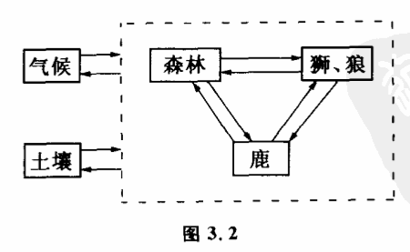

# 3.2 相对孤立系统

根据以上对几种特殊的因果关系的分析,我们就可以理解为什么系统理论在处理现代科学种种复杂问题时,一方面不厌其烦地考虑到所有跟所发生问题密切相关的一大批变量,详尽周到地研究这些变量之间的相互作用和变化趋势；另一方面又把那些关系不大的变量眼睁睁地忽略掉,或者至少是暂时地忽略掉。

这种方法就是系统理论中经常采用的建立"相对孤立体系"的方法。系统理论中的"系统",一般就是指相对孤立体系,那么什么是相对孤立体系,它是怎样划分的呢?首先,我们沿着因果长链追溯时,忽略那些影响概率足够小的因素,把它看作系统所受的干扰和系统之外的。其次,一个相对孤立体系尽可能是自相闭合的互为因果网络。第三,根据我们研究的目的和系统变化的时间尺度,抓住主要的互为因果变量,构造出系统模型。

下面我们举一个例子。

假定在一个生态环境中存在着鹿、森林、狮子、狼、气候、土壤等因素。显然,这里面有许多互为因果的关系。其中影响鹿的数量的因素很多,有捕食者狮子和狼的数目,森林供给鹿的食物多少等等。鹿的数目本身又对森林的茂密程度以及狼、狮子的数目等发生影响。它们三者形成一个闭合的互为因果网络。在研究这个整体时,我们发现,如果研究的时问尺度不很长,那么我们可以把鹿群、森林、捕食者三个作为一个系统来研究。即主要的互为因果过程是在它们三者之间发生的。当然,土壤、气候对它们都会有影响,严格说来这种影响也是互为因果的。因为土壤的肥力和气候影响森林的状态,而森林可以影响土壤肥力,也可以影响气候。但当我们只考虑短期作用时,土壤和气候的影响相对比较稳定,较少变化,我们可以把鹿、森林、捕食者这三者看作一个系统来研究（图3.2）。而土壤和气候对它们的影响暂时忽略不计,或者当作不变的条件来考察。必须注意,这种对系统的划分是相对的,是根据我们研究的对象、要求来决定的。如果我们研究大范围生态变化,如几十年、几百年,那么这个生态系统跟土壤、气候的相互影响就不能忽略,这时互为因果是一个包括土壤、气候在内的更大系统。

由此可见,系统理论在定义一个系统时,对于系统内究竟应包含哪些变量是根据客观情况和主观目的来决定的。严格地讲,系统并不是指一个客观存在的实体,而是人们的一种规定。人们把一组相互耦合并且相关程度较强的变量规定为一个系统。这种规定一方面考虑到各种变量之间的因果联系形式,尤其是那些互为因果的联系形式。另一方面也考虑到各变量之间因果联系的紧密程度,即相关性。当某些变量与我们所要考察的那些变量的相关性小到一定程度,就不再把它们作为系统的组成部分。实际上,我们采用规定系统的方法,也就是对客观事物之间错综复杂关系的一种科学抽象。通过对一个系统的规定,把一些无限的问题变换成了有限的问题来考察。当然,这种有限是相对的,因此系统又被称为"相对孤立系统"。

将系统规定好后,怎么来研究呢?我们知道,传统的对复杂事物的研究办法是:当影响事物因素很多时,常常固定其他因素,分别考察一个个因素变化对事物的影响,然后再综合研究。比如影响催化剂效率的有温度、压力、湿度等因素,常用的方法是:固定其他因素,去研究温度和催化剂效率的关系,再固定别的变量,研究压力等等。但系统中的各部分是互为因果的,因此,通常固定其他因素不变,考察其中一个因素变化而造成的影响这种传统办法就不灵了。著名的开巴鹿的故事就是一个例子。1907年,美国开巴高原七十万亩的范围中,约有四千只鹿生活在那里,同时生存着不少狼、狮子等捕食者。起先人们用固定其他因素不变的办法来研究这个系统,显然,为了增加鹿的数量,人们就得人量捕捉猛兽。到1924年,狼和狮子等捕食者基本捕捉殆尽,鹿的数量一下子增加到10万头。但同时当地的森林几乎被大量繁殖的鹿吃光,结果森林被破坏,大量鹿很快饿死。最后,鹿的数量大大减少,甚至比原来还少。为什么会出现这种错误?因为人们忘了系统中存在着互力因果的作用。固然,狼和狮子等的存在是鹿数量减少的原因,但森林能供给的食物是鹿数量的另一个条件。鹿本身的大量繁 殖却有可能破坏它本来得以存在的条件。

因此,在系统的研究中,传统的研究局部单向因果关系的一些方法暴露出很大的弱点。我们必须从整体的角度来处理系统内互相关联的各个部分。这方面,人们不得不更多地借用数学工具来研究问题。可惜,当19世纪末奥地利著名的物理学家兼哲学家马赫提出用数学函数概念代替因果概念来研究现象的相互依存关系时,他的观点并没有引起足够的重视。固然,企图用函数来代替并否定因果性,是马赫哲学的一个缺陷。但马赫的观点也包含了批判形而上学因果中不完整性、不精确性和片面性的合理内核。现代系统理论并不否定因果性,相反,非常重视对各种复杂因果联系的分析研究。同时,系统理论还充分认识到采用数学工具研究因果联系对避免形而上学的重要性。
