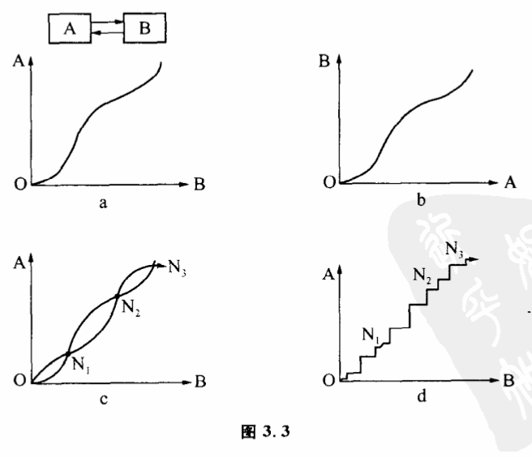
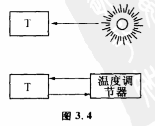
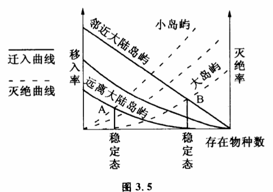

# 3.3 系统的稳态结构

既然互为因果的系统是不能用单向因果决定论和寻找主要因素这种古典方法来研究的,那么怎么分析它呢?系统论控制论有着十分独到的思路。

我们先来举一个最简单的互为因果的反馈系统,即只有二个子系统互相作用（图3.3）。A可以假定为一种生物的数量,它的数量受另一种生物B的限制,限制条件用图3.3a函数关系来表示（即B数量决定A数量）,而反过来B的存在也 受到A数量的限制。限制条件用图3.3b函数关系表示。在这两个系统互相作用之中,A、B数量怎样变化呢?我们先来看,当A、B各处于哪些量时,它们各自在相互作用中不被改变。显然,求不变的平衡态只要把两张图重叠起来,看两条曲线有哪些交点即可。假定两条曲线有三个交点:N1、N2、N3。即当A、B二个子系統分别处于N1、N2、N3点时,系统的相作用使A、B都处于不变状态。不过,N1、N2、N3三个平衡态中只有N2是真正稳定不变的。N1状态和N3状态虽然是平衡状态,但只要系统受到微小的干扰,就会变化。比如N3点,当系统B值稍许有一点偏离,会使A、B都离开N3点。如果B值比N3点稍大,那么A、B的互相作用就会使A、B值不断增加。B值比N3稍小,那么A、B的相互作用就会使A、B值都趋向N2状态。同样,状态随干扰不同可趋向O点,也可变到N2状态。这种简单的分析告诉我们,这样一个高度简化的系统有几种能性:（1）当A、B值处于N1与N3点之间时,系统最后都要变化到不变状态、N2去。（2）当在A、B值人于N3时,系统的值是不断增加的。（3）当A、B值小于N1点时,系统值要变到O点去。随A、B二个子系统作用方式不同,两条函数曲线可以没有交点,也可以有一个、二个、三个或多个交但系统变化都不外这三种可能性。

这三种可能性实际上揭示了互为因果系统变化规律的最基本特征。第一种表示系统处于一种稳态结构。第二种表示系统发生了震荡或崩溃。第三种表示系统从一种稳态结构向另一种稳态结构的演化。一个复杂系统包含的变量当然要比上面这个简化了的反馈系统多得多,但总的发展趋势基本还是这三种形式或这三种形式的交替出现。对于系统变化的后两种可能性我们在后面还要加以讨论,我们这里先来研究第一种可能性:稳态结构。

显然,当系统处于N2状态时,有一个有趣的特点,这就是如果干扰使系统偏离这一状态,系统内的互相作用仍可以使它回到这一状态。这种状态、称为稳定态、。在稳定态附近,系统的两个变量都保持在不变的数量上。它告诉我们,一个互力因果的体系可以因自身的相互作用而处于一种不变的稳定的状态,一般干扰都不会破坏这种状态。在研究系统时,这是一个十分重要的结论。自然界许多互为因果的系统由于系统各部分的相互作用而使各部分都处于一种稳定的平衡状态之中,我们将其称为稳态结构。整个系统处于稳态结构的条件是系统的每一个子系统都处于稳定态。它们的互相作用保持着各自的稳定。生态系统各生物群由于互相抑制而保持各自数量稳定是最常见的例子。

就上一节所谈到的开巴鹿生态系统,很明显,鹿、森林、捕食兽组成一种稳态结构。离开这种稳态结构、系统不可能存在,想单个地改变某一子系统数量也是不可能的。实际上,我们在第一章所谈的负反馈调节是一种最简单.的稳态结构。负反馈是系统趋向稳定的过程,正反馈是系统偏离旧稳态向新稳态过渡的过程（我们在后面研究质变量变时还要讨论）。人们常说,系统理论是从反馈开始的,这确实不错。正是反馈的发现,人们开始自觉地研究互为因果过程,把目的性与系统变化联系起来考察。以温度自动调节为例,如果是一个单向的因果关系,即室内温度取决于火炉和外界能源,那么,室内温度是否稳定不取决于自身,而取决于外界温度和能源放热的变化。如果有一个温度自动调节器,使火炉放出的热量是室内温度高低的原因,火炉放出热量的多少直接受室内温度的影响,即室内温度高低是火炉放热的原因。温度低,放热多；温度高,放热少。这就构成了互为因果。它可以保持室内温度的稳定（图3.4）。

对于复杂的互为因果系统,也是类似的。在生态学中有一种奇怪的岛均衡现象。生态学家发现,如果岛大致的生态环境一致,那么离大陆最近的大岛屿上物种数目最多,而在小的远离大陆的岛上物种数目最小,对于一定的岛屿物种数目基本不变。为什么一定岛屿上物种数目一定呢?从系统处于稳态结构的角度很容易理解。我们知道,物种在一个岛上的灭绝率和大陆的迁移率是物种数目的函数,据一些生态学家计算,函数关系如图3.5所示。

岛上物种数越多,大陆上的物种越难迁入,但对于临近大陆和远离大陆的岛屿,迁入曲线是不一样的,临近大陆的岛屿要比远离大陆的岛迁入率高（实线所示）。同样,物种数越多,岛上的物种越容易灭绝,但对于大岛屿和小岛屿灭绝曲线是不一样的,小岛屿比大岛屿灭绝率高（虚线所示两组曲线的交点表示系统物种数处于稳定平衡的状态。即A表示远离大陆的小岛的稳定的物种数,B表示邻近大陆的大岛稳定物种数。也就是说,只要系统处于稳态平衡中,岛上的物种数不是随意的。如果太多,会绝灭；太少,大陆上新来的将进行补充。系统必然处于这种稳定的平衡态中,这跟系统的状态一开始怎样无关。事实证明了这一结果。生态学家发现,在最后一次冰河期,有些岛是和大陆相连的,因此物种数与大陆相同。但大约距今一万年前,冰河时代结束时,由于水从冰川释放使海平面升高而形成这些岛屿。结果原有岛上的物种减少,并达到这些岛上应该有的稳定数目。生物地理学家对不列颠岛、阿鲁群岛、特里尼达德岛和日本的分析都证明了这一结论。

实际上,如果不从整个系统互相作用的观点出发,很难理解为什么物种数会保持某一稳定态。在这里没有一个原因是终极原因。
