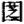

# 3.4 稳态结构和预言

利用稳态结构我们可以预见那些看来极为复杂的系统将怎样发展变化。复杂系统的可能结构很多,并且发展方向像树枝一样纵横交错。如果我们能判断系统未来可能结构中哪些稳定,哪些不稳定,我们就可以期望那些稳定的结构将是事物最可能趋向的目标。这对需要作出预言的科学家尤为重要。

地质学家就是运用"稳态结构"这一概念来找石油的。石油的生成要有一定的古地理条件,如适当的气候,周围有大量生物繁殖,陆上经常输入大量泥沙等等。但仅有生油条件是不够的,因为生成的石油往往是分散的,只有这些分散的点滴石油集中起来,才能形成油田。在漫长的地质年代中,地壳结构在变化,石油也在不断地流动。如果地质学家要确定生油地质系统的具体演化过程,那到目前为止,还是做不到的。但却可以用稳定结构来预见系统最终的状态。比如说,油田要满足一个重要的条件——储油条件.即形成一个空间,油可以从四面八方聚集到这里,并旦一旦进入了这一地区,就流不到别的地方去了。显然,所谓储油条件就是说,油田对于石油流动来说是一个稳态结构。石油不断富集的过程就是石油流向稳定区的过程。地质学家指出了维持这一稳态结构的条件,如它必须是一个广阔的低洼地它在慢慢下降,周围在逐渐上升等等。

天上的月亮尽管或圆或缺,但我们从地球上始终只能看到它固定的半面。多少年来,人们对它背面的景观猜测纷纭,在宇宙飞行时代之前,人们始终未能看到一眼。我们知道,这是因为月球的自转速度跟它绕地球公转速度一致的缘故。那么,为什么月亮自转速度恰恰会和它绕地球公转速度相一致呢?这是巧合吗?以后月的自转速度会小会快一点或者慢一点,使它的背面能够转过来朝向地球呢?原来,由于月球跟地球之间存在着潮汐摩擦,不管月球原来的自转速度比它的公转速度快还是慢,最后总会趋向一致,也就是说,月球永远把同定的一面朝向地球是一种稳态结构,不大会发生改变。根据同样的道理,人们预言地球的自转速度也将逐渐缓慢下来,最终将跟月球的公转速度一致。1754年康德写了《关于地球自转问题的研究》一文,他认为,只有当地球表面和月球表面处于相对静止的时候,潮汐摩擦才会终结。那时候只有半个地球上的人才能看到月亮,另外半个地球上的人想看一眼月亮,得漂洋过海跑到地球的另一端左。

利用稳态结构研究事物变化趋势的方法,使我们可以省略考虑许多中间步骤,当只需要知道最后结果的时候尤其是这样。

碳氢化合物可能进行哪些化学反应,可能分解或化合为哪些中间产物?是一个非常复杂的问题。但稍有一点化学知识的人都知道碳氢化合物在燃烧以后最后必定形成水和二氧化碳。因为在高温和氧充分的条件下,只有水和二氧化碳这两种产物才是稳定的。一群蜜蜂在田野里飞着,假设要对它们两小时后的位置进行估计。如果我们把蜜蜂飞行的路线及到达空间各点的时间都一一记下来,像研究行星轨道一样来研究它,那也许是一件十分艰巨的工作。谁知道每一只蜜蜂下一时刻会非到空间哪一点去呢?不过我们只要看一看附近田野里哪儿有较丰盛的花草,并估计一下两小时内蜜蜂所能行的距离,断言蜜蜂会出现在那些花草多的地方,总是不会错的。因为,蜜蜂停在花上,这对于系统的各种可能状态（结构）来说是一种稳态结构。

用稳态结构来预测事物发展方向时,必须注意,要把可能结构中一切稳定态都找出来,进行分析比较,看哪一个更稳定些。古时候洪水泛滥,大禹的爸爸鲧用"堙"法治水,治了九年不见效,结果被舜处死了。大禹改用"导"法,经过长期努力终于征服了洪水。力什么"导"法比"堙"法好昵?"堙"就是填塞,鲧企图用筑堤堆土的方法堵住洪水的去路。从暂时的局部的范围来看,洪水稍微稳定了一些,这种方法可能有点用处。但从整体来看,洪水仍处于高势位,这里不泛滥了,必然要在別处泛滥,整个系统依然是极不稳定的。大禹采用"导"法疏通河川,让洪水东流归海。"归海"是洪水最稳定的状态,大禹总结了他父亲的经验教训,选择这个最稳定状态为治水的标,所以取得了成功。

系统总是自动趋于稳态结构,这是不是总是好的、有用的呢?不见得。有时候,系统的稳态结构会给我们带来很大的麻烦。仪表的指针如果在某一位置或角度上是稳定的,比如总是不动或者总往某个刻度偏,那可是很糟糕的事。我们会说,这种仪表太不灵敏了。系统对外界反应的灵敏性跟稳态结构常常会发生矛盾。

很久以来人们对一种名叫北鳟的鱼一直感到困惑。北鳟平时生活在海里,它的身体是流线形的。交尾时沿着江河逆流而上,但不知为什么,体形发生了很大的变化,一到江河口,它的脊背上就长出了一个又高又扁的大包。后来人们发现,北鳟的这种变化是为了在江河中运动能够具有更大的灵敏性。在海里,北鳟的体形适于作稳定的高速运动,但江河里地形复杂,这种稳定性就有害了。运动速度总是很快,随机应变地控制转弯就会困难。为了适应环境,北鳟就改变了体形,使得重心尽可能靠近动压力作用点。这样,运动的稳定性差了,但灵敏度提高了。

了解系统变化中的稳态结构,就是为了我们在控制系统时更好地利用它、改造它,促使事物向有利的方向发展。

如果自然的稳态结构不利于我们达到所需要的目的,我们就必须实行控制改变系统,选择适当的条件,破坏自然的稳态结构,建立对我们有利的稳态结构。古时候有两个人,一个叫,一个叫囫。他们不大会种田,田里杂草长得很茂盛。想了一个办法,用一把火将田里的草和稻子都烧得干干净净。结果稻子倒没长,杂草又很快茂盛起来。囫采用了另一个办法,他任草和稻子一块儿生长,结果稻子不但没长好,反而退化了,稻子变成稗子。长杂草,这是农田的稳态结构。只有实行控制,比如经常除草等等,才能使不长杂草成为新的稳态结构。
