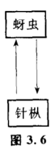
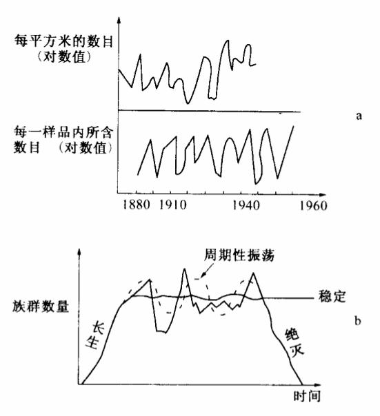
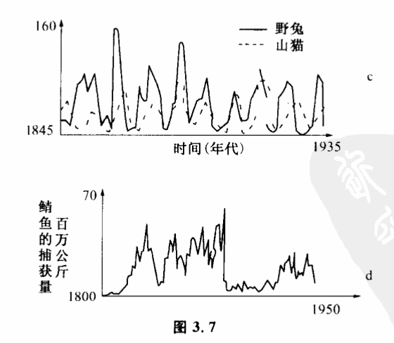
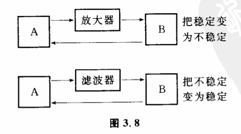
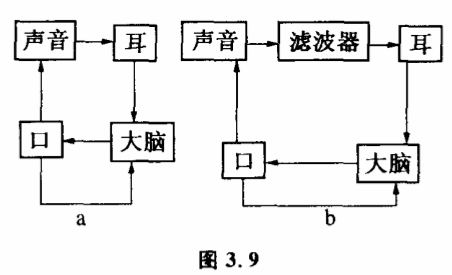

# 3.6 不稳定和周期性振荡

系统由于其子系统互相作用处于不稳定状态,也是常见的。这种不稳定状态可以分为两种基本情况,一种是慢慢趋向稳定结构,另一种是处于周期性的振荡之中。我们在这里谈谈周期性振荡。先看一个例子:北美的秋蚜虫和它的寄主针枞、香叶枞组成一个互为因果系统（图3.6）。

枞蚜虫可将针枞等毬果类植物的芽吃掉,甚至还去吃花与叶子。这两个子系统的相互作用可以成为稳定结构,如蚜虫数量保持一定,针枞的数量也保持一定。但在某些条件下,这一系统内的相互作用使它们各子系统数量都处于一种振荡状态。该蚜虫寿命可达5年之久,若其族群数量增多了,就会导致该地区针叶枞叶子过多地掉落,当叶落尽时,蚜虫食物减少,而使大量蚜虫缺乏食物死亡。但蚜虫一少,枞树出芽时损失相对减少,枞树又多起来。这样二者交互地作用,形成蚜虫族群和枞树数都会发生振荡。图3.7表明一些生态系统处于周期性振荡的情况。

 

系统处于不稳或周期性振荡状态是作为系统处于稳定结构的一种补充而存在的。几乎所有的稳定系统,在一定条件下都可以转化为不稳和振荡。果树有大小年,气候会出现周期性冰河,这些都和系统的振荡有关。

当振荡频率一定时,可以用这种振荡来构成计时系统。实际上,生物种就是靠生命系统中这些周期性振荡来实现的。

什么条件下,系统处于稳定结构,什么时候出现不稳和振荡,这在系统研究中十分重要。系统在结构基本不变的条件下,系统的初始状态往往有很大作用。在上一节第一个例子中,系统的初始值大于N3,点时,系统就进入不断增值的不稳定状态。小于N1值时,就进人不断减少的不稳状态。只有在N1和N3之间时才会稳定。对于我们后面将要讨论到的自繁殖系统,N1和N3;就是两个临界值,N3是自繁殖爆炸的临界值,N1是灭绝的临界值。对于生态系统,系统的初始值是十分重要的。比如,美国的黑格母鸡,以往值是稳定的,但一旦它的数量降到临界点以下,就开始不稳定。如1916年,黑格母鸡还有2000只,但经过一场大火、大风和一个难度的冬天,仅余下50对。以后,系統即使条件不变,因初始值小,其数目也不能稳定。到1927年,只有20只。1937年,只有最后一只了。

当然,主要决定系统振荡的还是系统内各子系统的相互作用方式。我们前面已经讨论过正反馈耦合使系统偏离平衡的现象。子系统以正反馈这种方式相互作用,就会使系统不稳定。而负反馈则是使系统趋向稳定的作用方式。子系统之间的作用方式在控制论中用各种数学关系式来表示。人们通过精确的计算来确定一个系统是趋于稳定或不稳定。一般说来,那些相互作用过分强烈的子系统往往会发生振荡。根据这个道理,人们可以通过改变系统结构的办法来控制系统的稳定性。

通常,在一个反馈回路中加一个放大器,在一定条件下可以将原来趋向稳定的相互作用变成不稳定的,而在反馈回路中加一个滤波器,则可以使原来不稳定的相互作用变成稳定（图3.8）。所请放大器就是增大A对B的作用。比如人对自己说话的控制如图3.9a。这里有两个反馈回路。一个是大脑→口→大脑,即大脑神经通过对嘴的动作的自我感觉来控制嘴说话。还有另一反馈回路,即大脑→口→声音→耳朵→大脑,大脑通过耳朵听到声音,反馈回来纠正自己发音的准确性。对于一般人这一系统是稳定的,但对于口吃的人这一系统是不稳定的,尤其第二条反馈回路的作用常常过分强烈。口吃的人听到自己的发音,不但不能帮助他控制自己的发音准确,反而引起他神经的过分紧张。他对自己的声音太注意了,越口吃得重,心越慌;心越慌,越口吃,形成了恶性循环。怎样使这一系统由不稳定变成稳定呢?一般加一个滤波器就可以做到这一点,使其相互作用变为图3.9b。滤波器是这样工作的:当人一说话,一个发音器立即发出嗡嗡声,以减弱声音→耳→大脑之间的作用。这是纠正口吃的一种较有效的办法。

有时干脆把某一影响完全切断（如果可能的话）,也可使一系统由不稳定变为稳定。比如我们用手端着盛得很满的一碗水,如果眼睛盯着它,小心地走着,反而容易晃出来。这是因为我们的脑→手→脑这一控制系统上又加上一个从眼脑的反馈回路,正是这回路作用,使系统反而不稳定了。这时,只要眼睛不看水,这一条影响通道切断了,系统就稳定了。同样,如果要使稳定变为不稳定,可加上新的影响（当然要看具体情况是香可能）。很多时候,改变结构和改变初始条件的方法是同时运用的,比如在纠正口吃的例子中,系统不稳时,加上滤波器,改变了系统的结构,待系统在新结构中得到稳定后,重新把滤波器去掉,使结构恢复到原来状态。这就是两种办法并用的例子。对于复杂系统,上述研究反馈过程中碰到的振荡和稳定转化的条件常常也是适用的。
