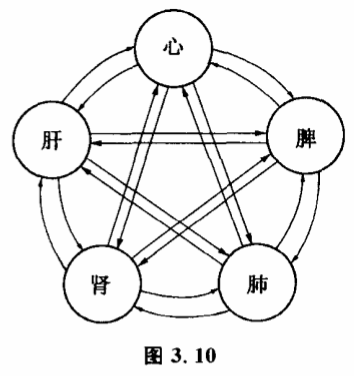

# 3.7 超稳定系统

我们知道,当系统中各子系统之间相互作用方式和子系统本身不变时,一般整个系统保持在稳态结构之中。这种稳态结构有某种抗干扰能力,能保持一个时期不变。但是,实际上任一系统内部的子系统总在变,并且从长时期来看,其相互作用也在变,还要受到外界的影响。系统原先的稳态结构总要破坏的。有没有一种特殊的系统可以抗拒这种变化趋势,而保持高度的稳定性呢?有的,这就是超稳定系统。超稳定系统有一个重要特点,就是靠不稳定来维持稳定。

为什么只有靠不稳定才能维持超稳定呢?因为系统本身的变化往往是一种不可抗拒的趋势。实际上要维持系统长期不变是做不到的,惟一的办法是当系统本身变化了,不稳定出现时,重新修复系统。比如一架温度控制器,使室内温度保持不变,这是一个一般的稳定结构。但时间长了,温度控制器的零件总会损坏,零件一坏,整个系统就坏了。我们可以把被破坏的系统看作一个新系统,对于这种系统,它可能产生新的稳定结构。因此,一般的系统由于本身系统变化会演变到其他的稳定结构。但是,如果我们另外加上一个控制机制,比如安置一个维修工人,看到恒温器坏了,系统稳定性破坏时,能够给温度控制器换零件,使系统恢复。这样,系统一经破坏,不久又恢复到原来的稳定结构,这就是一个超稳定系统。为什么叫超稳定,因为它比一般的稳定结构更多了一层,这一超稳定是通过对不稳定的修复来实现的。刚才的例子因为有修复者存在,使人们觉得这种系统太平常,并没有专门研究的必要。实际上,可以存在一类系统,当它不稳定时,开动修复机制不是由人来做的,而由系统本身完成,这就很有趣了。自然界能保持长期不变的系统都是超稳定系统,它们都有这种修复机制存在。因此,超稳定系统有一种特殊的现象,那就是周期性地出现稳定——不稳定——稳定现象。不稳定时,新的机制发生作用,使系统回到原有的稳定结构,而不是新的稳定结构。这种超稳定系统应用在社会科学中,非常有趣地说明中国封建社会长期停滞的原因。中国封建社会有两个明显特点,一个是几千年来社会结构基本保持不变,另一个是几百年出现一次周期性的大动荡。这明显地表现出超稳定系统的特点,并暗示了中国封建社会停滞原因在于它是一个超稳定系统。

超稳定机制是一种重新寻找稳定的机制,一直到找到原有的稳态结构,系统才回到不变状态。所以,有时人们也把超稳定系统称为自稳定系统。自稳定系统最早由著名控制论专家艾什比提出。在《大脑设计》一书中,他详细地描述了一种叫内稳定器的特点。这种机器被用来模拟那些结构复杂而又能自动保持稳定的系统。内稳定器有两个非常有趣的特点。第一,如果某一子系统对稳定态有着不大的偏移,这时其他子系统对它的相互反馈作用可以帮助它回到原稳定态。但一旦这个偏移充分大,在短时间内,其他子系统的相互作用不能使它回到稳定态,那么由于它的影响,别的一个或几个子系统也可能偏离稳定态。第二,如果系统只有一个稳定态,那么不管系统开始处于什么状态,由子系统之间的相互作用,系统最终总会达到这个稳定态。只要系统处于非稳定态,机器就会不断运转,好像在寻找稳定态。

在自然界中,最妙的内稳定器或许就是人体本身。内稳定器的一些重要性质在人体内是广泛存在的。在各种关于人体的生理病理模型中,中医的脏象学说别树一帜。在某种意义上说,脏象学说正是人体内稳定器的一个简化模型。脏象学说把人体结构分为5个主要的子系统:心脏、脾脏、肺脏、肾脏、肝脏。每个脏与其余四脏都有反馈作用（图3.10）。这个模型反映了人体各部分生理功能的相互滋养、生化和相互约束、克制作用。也反映了病理状态下疾病的转变方式以及机体各部分抗病功能的协调方式。

脏象学说中稳定的观是十分基本的。各子系统的变量之间,由各种正反馈回路和负反馈回路交织成复杂的调节关系,使人体的各种生命运动、各种功能维持在稳定状态。在一般情况下,这种稳定的维持是强有力的。如果机体受到接连不断的内外因素干扰,一些子系统的变化可能越出某个阔值,我们就说人得病了,这时人体的功能处于一种不稳定状态。—般情况下,人体具有极强的恢复功能,借助各子系统之间的调节作用,整个系统仍然回到原来的健康状态。只有当致病作用十分强烈,而人体的抵抗能力不足时,才会形成病态稳定态。这时可能要借助一定的外部输入,使系统脱离病态,回到正常状态。脏腑模型提供了各种正气的协调方式,也提供了各种致病干扰的传递方式,因此根据这个模型还可以有效地指导对许多疾病的调节和控制。

中医提出的脏腕模型跟内稳定器极其类似,这绝非偶然巧合。这是祖国医学在长期实践中把握了人体各部分互相调节趋于稳定特性的结果。在控制论产生之前两千年,我国人民就开始运用这样一个内稳定器模型来调节人体,是非常了不起的。
