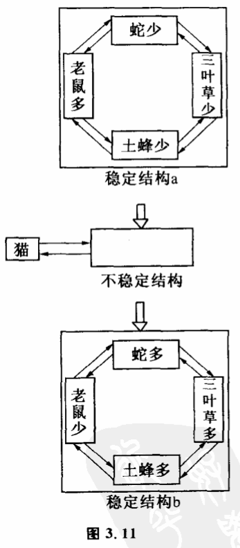
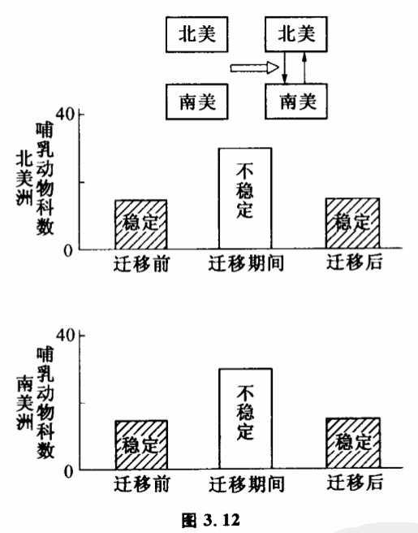
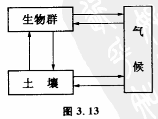
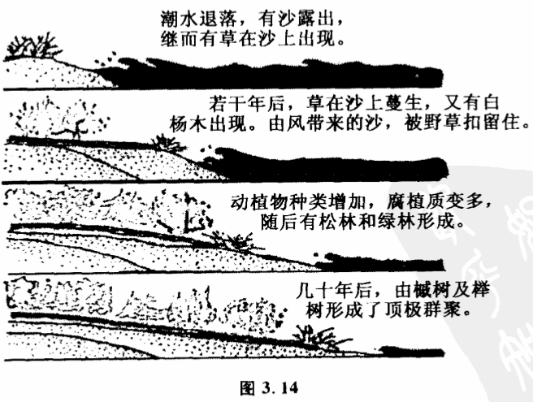
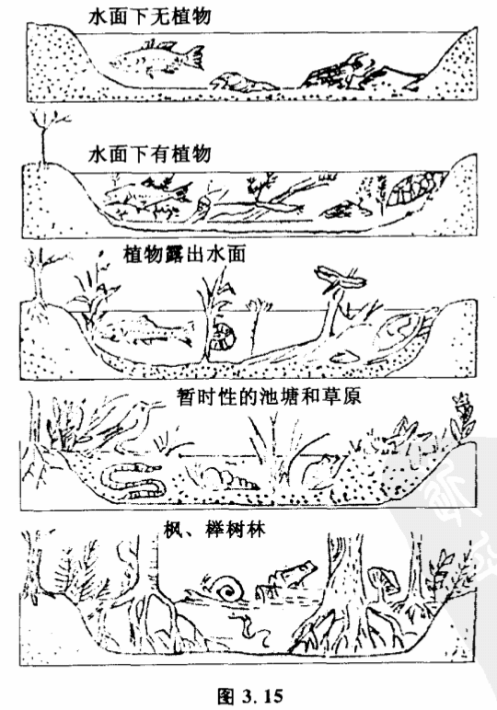
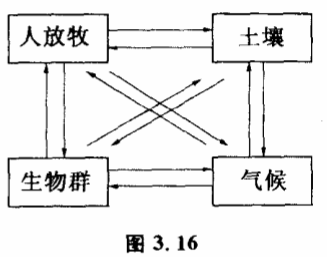
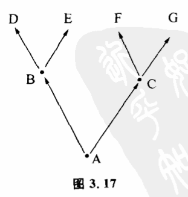

# 3.8 系统的演化

系统旧有稳定性破坏后,在新的作用方式下,一般又有新的稳定结构。当系统没有变到这种新的稳定结构中去时,它将处于不稳定状态之中,它的各个子系统都在变。但只要它一进入新结构所规定的范围之内,就会形成新的稳定性。我们先分析一个由老鼠、蛇、三叶草和土蜂组成的生态系统。假定一开始,这个生态系统处于老鼠多、土蜂少、三叶草少、蛇少这样一个状态（图3.11a）。老鼠多,大量的土蜂窝被破坏,造成土蜂少。土蜂少不能传播三叶草花粉,造成三叶草少。三叶草少使蛇得不到生息的环境,造成蛇少。蛇是老鼠的天敌,蛇少对老鼠不会构成威胁。显然,由于各子系统的相互作用,结构a是稳定的。各个子系统如果偏离了原来的状态,都会被子系统之间的这种相互作用拉回来。但如果有大量猫被引入这个系统,因为猫大量吃老鼠,系统的稳定结构被破坏。老鼠数量的变化造成整个系统发生一连串的变化。老鼠变少则被破坏的土蜂窝变少,土蜂变多使三叶草和蛇增多,而蛇变多又使老鼠数量更加减少。这样,整个系统都处于不断改变中。最后变到新的结构:老鼠少,土蜂多,三叶草多,蛇多（图3.11b）。新结构也是一种稳定结构。为什么是一种稳定结构呢?因为即使在新结构中猫变少了,老鼠也不见得能增加。因为蛇很多,蛇大量捕食老鼠使老鼠数量受到抑制。从这个例子我们可以看到,尽管系统中各子系统互相影响很复杂,系统在不稳定时具体会怎样变也很复杂,可能通过非常曲折的途径,但稳定结构之间却可以转化,这种转化是可以从系统中各子系统的互相作用方式来分析的。这一结论对研究复杂系统的变化很有意义。因力对于复杂系统,虽然其中不稳定结构的变化过程非常复杂,一时难以预测,但有哪些稳定结构,却是可以把握的。这就为研究复杂系统的变化提供了方便。

二百万年前的更新世,北美洲和南美洲的巴拿马陆桥形成之前,南美洲与北美洲是两个孤立的大系统。从大范围看它们各自哺乳动物数目处于稳定状态。巴拿马陆桥形成后,两个系统发生了互相影响,物种在两个大陆中进行迁移。这时两个系统原先物种稳定结构打破了。固然,迁移过程物种变化是十分复杂的,但最后两个系统都进入新的稳定状态,哺乳动物物种数量又重新稳定下来（图3.12）。一个生态系统本身可以允许多少物种稳定地存在,可以从系统中各子系统的互相作用来预测。但在迁移过程中物种具体怎么变化极为复杂,并且具有很大的随机性。

现代生态学在研究大生态系统几千年中演变时,使用这种方法,获得了有意义的结果,这就是生态消长理论。研究大时间尺度上生态系统的变化,一般把生态系统分成三个互相作用的子系统:生物群落、土壤和气候（图3.13）。这个系统有两种稳定态。一种是不毛状态,即没有生物群,但当气候适宜和附近有生物群落时,这种不毛状态会慢慢变化。假定某地一开始是沙漠和岩石,慢慢由于地衣的生长,会有薄薄的土层出现。随着土壤中生物有机质的增加,生态系统进入苔期,土壤加厚二三公分,保水力加强。保水力加强的后果有利生态、系统进一步改变,生态系统进入杂草期,有早熟禾、车前草、狗牙根、蒲公英出现。随着杂草丛生,土壤中有机质进一步增加,生态系统进入了灌木期,土层越来越厚,保水力也越来越强。最后树木茂盛到一定程度,地面蒸发减少,使微生物在其间繁衍,地面上地衣、苔藓及草丛逐渐减少。最后,生态系统达到盛林期,各种树木竞争,达到稳定,土壤有机质达到动态平衡。生态系统把这一整个系统的

平衡态称为顶极状态。到这一状态,生态消长不再变化。并且森林对气候也有一定调节能力。整个系统达到新的稳定（图3.14,图3.15）。生态消长理论指出,如果一开始原始环境的不毛状态不是沙漠而是水域,生态系统的消长经过和上述过程完全不同的道路,称为水生消长。但最后达到的结果都是同一稳定态。变化总趋势是,由于土壤有机质渐渐增多,使水域面积随时间变小,深度随之变浅。

从系统理论看来,系统结构不同,互相作用方式不同,它们的演化过程也不同。就拿生态消长过程来看,在系统中没有别的因素（如人）的干扰时,演化后果趋向顶极群聚。但在美国东部的温带区,有一个牧草受损群聚的例证,原因是人类大量放牧（图3,16）。如果没有人的活动,本区将会产生落叶性灌木、葡萄树等植物,最后演变成顶极群聚。但因为有人类活动,系统将稳定在受损群聚。又比如台湾的高山地带,季风时火灾频繁,使消长停滞在草原期,若火灾可制止,则此种高山草原可继续演化,在短期内发展为森林,到达顶极群聚。

如果系统的演化可以归为由一种稳定结构向另一种稳定结构的过渡,那么演化过程可以用两种不同的基本模式来表示,一种是分叉,一种是汇流。分叉是这样一种现象,系统原来具有稳定结构A,由于系统内子系统及其相互作用方式的改变,原有稳定结构不再稳定,在新的作用方式下,系统有一些新的稳定结构,但稳定结构很可能不止一种,而有两种。这时系统演化到新的稳定结构就有两种可能B和C,而系统一旦演化到B或C,系统就出现较大的差别。内部和外部条件改变时,它们又不能进一步稳定,可能孕育出新的稳定结构（图3.17）。我们在谈可能性空间时就谈到过这一点。实际上,分叉现象是可能性空问一种特殊的展开形式。它的特点是可能性空间各元素都代表稳定态结构。生物的进化可以看作生物和环境组成的系统的演化。物种适应于环境就是两个子系统在相互作用中保持稳定结构。同一种原始物种如犀牛祖先,进化到犀牛,头上长出角来是有利于适应环境的,这是稳定结构。但同一犀牛祖先,对环境有两种适应办法种是头上长出两只角（如非洲犀牛）,一种是只长一只角（印度犀牛）,这是同一系统的两种稳定结构。生物系统适应环境的稳定结构可用适应空间的适应峰（也可用洼）来表示。或者说同一个问题有两个答案。这时,系统到底演化到两种稳定结构的哪一种去,就或多或少带有一点偶然性。我们没有理由说非洲犀牛必定是两只角,而印度犀牛注定只可能有一只角,当系统演化面临分叉现象时,单纯的决定论是不适用的。很多时候,初始条件微小的差异,可以导致系统演化到有巨大差异的不同系统。

汇流和分叉现象相反,它表明开始系统可以有许许多多不同的稳定结构,但这些稳定结构打破后,系统都面临着一些共同的稳定结构。

系统在什么条件下的演化是分叉,什么条件是汇流呢?这要具体问题具体分析。一般说来,一个孤立的系统在演变时常出现分叉的现象。而许许多多原先孤立但后来发生了密切互相影响和联系的系统往往出现汇流现象。生物的进化就是分叉。在人类历史的早期,各民族之间交往影响较小时,社会形态变化也基本是分叉。但随着技术的进步,各民族之间交往的增多,汇流现象渐渐占主要地位。复杂系统的演化,也常常取分叉和汇流的中问形态,即演化为复奈的网状结构。
