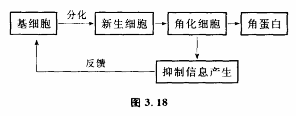

# 3.9 系统的崩溃:自繁殖现象

我们有必要专门讨论一下系统演化过程中旧结构瓦解时发生的一种特殊情况,这就是繁殖。自繁殖现象往往标志着系统原有稳态结构迅速打破,发生崩溃,造成系统旧稳态结构急骤瓦解,系统以暴风骤雨般的力量向新稳态过渡。

核爆炸、激光、细菌繁殖、癌的生长、传染病的流行等现象,表面看去,它们之间毫无共同之处,但控制论却给它们一个统一的名字:自繁殖系统。它们是系统从一种稳态结构向另一种结构演化过程中出现的现象,它们有一个共同的特征:在一定条件下,某变量值越大,变量值增加越快。比如核爆炸,在一定条件下,核反应速度随着核物质质量的增加而迅速地增快,即参与核反应的原子越多,放出的中子就越多,核反应也进行得越快。这样一来,参与反应的原子以几何级数增加着,直到核燃料全部参加反应力止,在极短的时间里释放出巨大的能量。自繁殖系统一旦存在,那么不管开始它对周围的影响是多么小,最后将产生巨大的不可忽视的影响。一个光量子放出的能量是很小的,可一旦具有同一频率的光量子自繁殖起来,就会产生巨大能量的激光。个别分化不良的细胞对整个人体来说没有什么影响,但大量的癌细胞以自繁殖的速度增长起来,却可以危害一个人的生命。

自繁殖过程有什么共同性呢?

（1）任何自繁殖过程往往存在一个临界值,只有当一个系统变量大于这一临界值,才会有自繁殖发生。一般说来,这个临界值取决十系统结构的稳定程度,系统越稳定,抗干扰的能力越大,相应的临界值就越高。

如果铀235的质量小于一定值,并且达不到一定纯度的话,核爆炸是不会发生的,这个值被称为铀235的临界质量。为什么必须大于临界质量才会发生核爆炸呢?当中子引起铀235核裂变时,每个铀235原子核平均放出2.5个中子。新放出的中子叫做二次中子或第二代中子,它们和原来的中子一样,又能使别的铀235裂变,产生第三代中子。裂变过程这样继续下去,就会产生第四代、第五代等等许多代中子。照理这种反应按几何级数增长,核爆炸会迅速发生。但实际上,不是全部裂变产生的中子都能继续参加裂变反应。有些中子会飞到铀块外面去,有的要被设备中袖以外的材料所吸收。通常把链式反应中下一代中子数对上一代中子数的比例叫做中子增殖系数。中子增殖系数大于1时,链式反应的规模越来越大,称作中子的增殖,又叫自持式链式反应。中子增殖系数小于1时,链式反应的规模越来越小,最后就中断了。中子增殖系数跟铀块的质量有关,在临界质量以上,中子增殖系数大于1,核爆炸才会发生。

生物界也存在若类似的情况。任何一种生物照理都可以构成一个自繁殖系统,如果生物所有的后代都能存活并继续产生后代,数量就会以几何级数增长。但这一自繁殖过程并不总是出现,原因在于生物和环境密切作用,它们的数量受到食物、天敌、气候等制约。要使一个物种的实际增殖系数大于1,这个物种的数量必须要大于一定的值。

（2）自繁殖系统内部存在着一条有因果关系的自动增长链。

在积雪很厚的陆坡上,开始由于偶然的原因可能有一些雪下落,这些雪下落过程中又冲击着更多的雪下落,这样下落的雪越来越多,奔腾直下,造成大规模的雪崩,会把位于山谷中的房屋道路都给埋没。这也是一个自繁殖过程。我们看到,在一定条件下,雪下落的事实本身就成为更多雪下落的原因,系统内形成一条自我因果的链,造成系统繁殖的原因来自系统内部。核反应中铀235放出的第一代中子引起其他铀235核裂变,成为第二代中子产生的原因。而第二代中子放出的结果又成为第三代中子产生的原因。生物世代交替,子代所承袭的不仅是父代的形体,也承袭了父代繁殖的本领。正因为系统内存在着这样一条自我增长链,自繁殖过程也常常被称为链式反应。

（3）很多自繁殖系统的形成是由于负反馈控制机制破坏引起的。

自然界许多具有自繁殖能力的系统不是孤立存在的,它们跟周围环境有相互反馈的制约作用,在一般情形下,自繁殖现象被这种反馈作用有效地控制着,一旦反馈控制机制破坏,自繁殖现象就出现了。

一个突出的例子是癌产生的原因问题。有的生理学家认为,人体很多细胞的繁殖是通过如下机构（图3.18）控制的。

这一过程一般是正常的。即可以生出一些适量的新细胞来补充旧细胞的老化和死亡,维持新陈代谢的进行。新细胞的产生又受到一定的抑制不会无限增生。如果抑制机构失灵了,在一定条件下,就会使新生细胞的产生不可遏制,成为一个自繁殖系统,这就产生了癌。比如一些理论家认为,一般细胞繁殖之所以不以几何级数增长,构成一个自繁殖系统,其原因是有这种反馈抑制系统存在。即当新生细胞生长成熟到一定程度就有一种抑制生长的因子放出来,这一抑制生长因子反馈回来阻止着细胞进一步分化。但如果这一反馈过程受到破坏,比如当新生细胞尚未成熟就死亡了,而一般抑制因子是在新生细胞完全成熟后才产生的,这样,这一反馈过程就被减弱,抑制因数量大大减少,以至于幼稚细胞大量繁殖,造成了癌。新生细胞之所以在未成熟之前就死亡,原因可能是由于某些酶的缺乏,造成了新生细胞不能维持正常寿命,从而使反馈中断,形成一个自繁殖系统。如将卵巢用手术移植至动物的脾脏,使得反馈中断,垂体得不到反馈信息而分泌大量促性腺激素而造成卵巢癌。

关于癌的研究,可以说,控制论是一个新的并且看来是很有希望的方法。目前用控制论建立了不少癌症病理模型,基本思想是把癌看作一个控制系统失调而引起的自繁殖过程。

不仅是癌,自然界许多自繁殖系统的发生与反馈抑制的失调有关。比如20世纪60年代,在意大利,毒蛇猛增,以致 危害到居民住宅的安全,这在历史上从未有过。原因是由于以往蛇的天敌如刺猬等存在,它们的数量有效地抑制着蛇的数量。但由于近年来环境的变化,使调节着各生物之间数量平衡的反馈受到破坏,使蛇的天敌数量减少,造成蛇的自繁殖。

研究自繁殖系统究竟有什么用处呢?有了这种研究,就可以指导我们去抑制我们不需要的自繁殖过程,引发对我们有利的自繁殖过程。

这方面最有趣的例子是消灭蜼蝇的试验。为了消灭蜼蝇,除了用化学杀虫剂以外,是否有更有效、更简单的办法呢?通过自繁殖过程的分析知道,如果我们将蜼蝇的数量制到一定数量以下,则由于自然原因,它繁殖不起来,就会自然消亡。而分析蜼蝇的自繁殖过程发现,蜼蝇一生只交配一次。因此,人们放出一定数量的受过放射性照射的雄蝇,这些雄蝇和雌蝇交配后所产的卵是不能孵化的,和受过放射性处理过的雄蝇交配过的蜼蝇再也不会和其他雄蝇交配了。这样只要受到放射性照射的雄蝇超过一定数量。就可将子代蜼蝇的数量控制在临界值以下,从而使蜼蝇的自繁殖链受到抑制,造成蜼蝇死亡。第一次试验是在加勒比海的某海岛进行的。由飞机低空撒下经过处理的雄蝇,每周每平方公里100只。三个月后,100%的卵都不能孵化了。第二次试验是在面积为170平方公里的古拉克岛,4个月后,岛上便再也找不到一只蜼蝇了。在这一控制中撒雄蝇数量很重要,在一定数量以下,就会没有作用。多于一定数量,又是没有必要的。

此外人们还想出了许多遏制自繁殖过程的方法,如化学中的防爆剂,游离基吸收剂,某些胶溶液中的稳定剂等等。在核子反应堆中,最重要的问题就是控制链式反应,使它不发生像 核爆炸那样的自繁殖过程。科学家找到了各种中子慢化剂和中子吸收剂,把反应堆内的中子增殖系数控制在1.007以下。由于反应堆实际参加链式反应的是寿命较长的慢中子,因此即使有事故发生,也最多是厂房受到破坏,放射性物质外逸出来。像原子弹那样的猛烈爆炸是绝对不会有的。

在另一方面,人们又想尽方法创造条件来引发自繁殖过程,利用它达到人们的某种目的。激光器的发明就是一个很 好的例子。激光器与寻常的光源大不相同,它的性质是很奇特的。它发出激光,具有很高的方向性,非常纯净单一的颜色以及极强的功率,因此在现代科学技术中占有十分重要的地位。什么激光跟普通的光线不同呢?原来,普通充气灯的发光都属于原子的自发发射过程,处于激发能极E1的原子自发地跃迁到基能极E0上,同时发射出一个光子来。每一个发光的原子都是独立的爱光体,它们彼.此之间没有联系。而激光的基础是原子的受激发射过程,处于激发能级E1的原子受到一个光子的激发,跃迁到基能级E0上同时发射出一个光子,这样一来,就有了两个光子了。我们注意到,受激发射的结果正是产生受激发射的原因。这个宝贵的性质使受激发射有可能成为一个有自动因果链的自繁殖系统。但是要具体构造一个激光器,使自繁殖过程能顺利进行,还要为它创造许多条件。首先,如果工作物质的原子大多处于基能级E0,它们有可能将受激发射出的光子都吸收掉,使那条因果链中断掉。科学家在激光器中使用了气体放电等方法,使处于高能级的原子数目超过处于低能级E0的原子数目,造成所谓"反分布状态"。其次,为使这条自动因果链能够产生数量巨大的光子,科学家用两个面对面的反射镜构成一个谐振腔,在光学中被人们称为法布里一珀罗干涉仪,它的主要作用是把被放大了的光的一部分作为反馈来进一步地将光放大。沿着轴线方向的光子在两个反射面之间不断往返运行,不断地刺激处于激发态、的原子,使它们发射出更多的光子来。通过这种受激发射作用,沿轴线方向的光子数目就会不断增加,形成一个自繁殖系统,在腔里逐渐积聚起很强的光来,并从部分反射镜那一端透射出去,这就是激光。

自繁殖系统内变量发生迅速增长的现象。但实际上,任何自繁殖系统这种变量增长的现象不会无限延伸下去。系统演化经过自繁殖过程一般会发生系统的崩溃。原有的变量耦合关系将发生变化,还会出现一些新的变量。自繁殖是系统演化过程中的一个不稳定阶段,这种不稳定迅速把系统由原有的稳定结构推向另一稳态结构,产生一个新系统。
