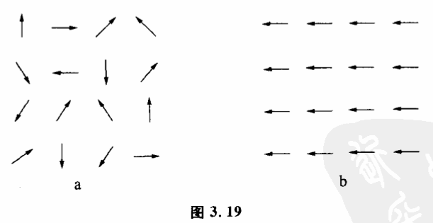

# 3.10 自组织系统

最后,我们谈谈系统的起源。

人们经常跟各种各样的系统打交道。在各种系统中,变量之间都有自己独特的耦合方式和变化趋势。既然系统是指一组相互耦合互为因果而旦相关程度较强的变量,那么就必然会有一个问题:这些事物,或者说是变量,最初是怎么开始耦合起来的?也就是一个内部有一定组织程度的相对孤立系统是如何形成的?

读者们一定记得我们在2.8节曾经讨论过组织。组织是事物或一组变量从无联系的状态进化到某些特定状态的过程。因此,系统的形成过程也就是一个组织过程。

自然界有各种各样的组织过程,其中有一种极其重要而又非常有趣的组织过程,这种过程是在一组事物或变量之间自动发生的,不需要这组事物或变量以外的力量进行干预。这样形成的系统被称为自组织系统。

我们为了在自然界和人类社会中建立某种秩序,往往不得不跟无组织的混乱状态打交道。这种努力常常是艰苦的。有的系统是如此难以组织,有的刚被建立起来的秩序又是如此执拗甚至近乎本能地回复到当初的无组织状态,使我们很少想到系统内部的组织力量。我们已经习惯于使自己成力各种各样系统的外来组织者,习惯于想像,如果没有人的干预,整个世界的秩序将会多么糟糕。自组织系统提供了例外,它能从无组织的混乱状态中自动产生,并且不断发展和完善自己的秩序。研究这类系统变化的规律性,有助于我们充分地利用被控制对象的内在因素,把我们所要达到的目标跟系统固有的建立秩序的能力协调起来。

我们先来看一个简单例子。将一批磁针任意排在一起,如果地球和其他外来磁场不存在,那么开始这批磁针的方向是混乱的,并且可以自由地来回摆动,这就是开始的无组织状态（图3.19a）。这时,每一个磁针都是一个相对独立系统。这许许多多小系统是互相独立的,它们没有结合成一个有组织的大系统。但在这批磁针自由摆动的过程中,某几个磁针有可能偶然地方向一致。只要这种状态一发生,那么这几个磁针马上就会在空间产生一较强的较为一致的磁场,这一磁场又会使其他相邻的磁针朝同一方向摆动。这样用不了多久,所有磁针的方向都将变为一致（图3.19b）。原来方向混乱无组织的磁针经过一段时间后自动地形成了自己的组织。即这些小的相对孤立系统结合成一个有结构的整体:大的磁针系统。类似过程在生命起源、人类思维、国家组织等复杂系统中也同样存在,它反映了事物从低级向高级展的辩证规律。

自组织系统存在着如下5个特点:

（1）先有一个组织核心。从磁针的自组织例子我们可以看到,是方向一致的几个磁针的取向具有关键作用,它可以大致确定发展起来的组织（在这里是磁针取向）的形式。比如化学中大晶体的培养是一个自组织过程,在晶体形成之前,溶液内晶体物质的分子处于无规则的分布与运动状态。而晶体形成的过程,就是晶体物质形成组织的过程。在这一过程中,最后形成的晶体组织形式究竟是一个有规则的大晶体,还是很多乱七八糟的小晶体,这完全决定于开始形成的组织核心一一即晶核。如果晶核只有一个并且是很规则的单晶,那么自组织系统的发展最后可形成一个在光学上具有很高价值的大单晶。如果晶核很多,并且有的晶核是几个单晶结合在一起,那就生成形状乱七八糟的很多小晶体。

（2）自组织系统是一个不稳定系统,或者是一个亚稳定系统。什么样的小系统集合可以成为一个自组织系统呢?这个问题肯定是人们所关心的。因为一个小系统集合一旦是自组织系统,它就可以自动地组织起来,而不需要我们过多地干预这个过程。构成自组织系统的小系统集合必须是不稳定的或亚稳定的,因为只有一个不稳定的或亚稳定的小系统集合才具有向各种不同组织形式发展的可能性。如果它们过于稳定,改变它的结构需要外界施加很大的影响才行,它的组织过程很难自动进行。也就是说,一个稳定的小系统集合本身已形成某种牢固的组织,改变它的结构就不那么容易了。

比如说结晶过程,可以看作是结晶物质的自组织过程。供结晶的母液必须是一个不稳定和亚稳定系统,即需要过饱和溶液。如果是一般的不饱和溶液就不行,因为不饱和溶液是稳定的系统,溶液浓度可以长期不发生变化。如果分子间存在着过分强烈作用,比如是一块固体结晶物质,它太稳定,不能成为自组织系统。

（3）自组织系统内部存在着一条有因果关系的自动选择链。我们曾经讨论过,所谓形成组织实际上是系统内部联系的可能性空间缩小的过程。自组织实际上只是说,这一缩小是自动进行的。它之所以会自动进行,是因为存在着一条有因果关系的自动选择链。在磁针的例子中,开始的几个磁针选择的方向使这几个磁针的可能性空间缩小,这种缩小又导致其他磁针的可能性空间缩小,从而也形成一条由核心开始的自动选择链。因此,自组织过程中,使可能性空间缩小的选择因素是可能性空间前一次缩小带来的,自组织的动力来自系统内各部分的相互作用。

（4）自组织过程是不可逆的。自组织系统的发展过程一般都有不可逆性的特点。一旦形成了一种组织,再要改变,使其形成别种组织形式就很难了。比如磁针自组织的例子中,开始要取得任意一个方向都很容易,但一旦混乱的磁针已经朝着某一固定方向排列起来形成一种组织,再要改变磁针的排列,形成另一种方向就很困难。因为大多数磁针的朝向已形成一个固定磁场。生物由低级向高级进化,也是一个自组织过程。现有的一些较高等物种都是由一些共同的较低等的生物进化而来的。显而易见,这一过程是不可逆的。现有的高等物种不但不会退化为低等物种,而且也不可能从一个现有的物种转化为另一个。生物类型这种不走回头路的特点有深远的进化意义。它使生物所获得的适应可以得到稳定,不致消失,并且在这基础上继续发展。同时,由于性状分歧形成的不同生物类型,可以各自更好地利用周围多样性的生活条件,对生物的发展有利。

（5）自组织系统第五个重要特征是差之毫厘,失之千里。即自组织核心微小的差别,可以导致最后形成大组织的巨大差别。

这一重要特征在药理学中十分重要。1932年,德国化学家格哈德多马克发现,一种叫百浪多息的染料能治疗小白鼠的很多由细菌感染的病。1935年,百浪多息成为一种"神药"。百浪多息为什么能治病?原来它在体内分解为两部分,其中一,部分是对氨基苯磺酰胺,它对细菌有抑制能力。对氨基苯磺酰胺之所以能治病,其原因就和自组织系统这一重要特点有关。大家知道,有的细菌需要叶酸,叶酸是合成核酸所必需的,有了核酸细菌才可以生长繁殖。细菌可以从几种简单的化合物中制造叶酸,其中有一种原料是对第基苯甲酸。对氨基苯甲酸的分子很像对氨基苯磺酰胺。细菌不能区别这两种化合物,但对于细菌繁殖的一系列组织过程来说,含有对氨基苯磺酰胺分子的叶酸就不能发挥应有的作用,这样就遏制了细菌的繁殖。许多药物都是利用了这一原理,如:链霉素分子中,有一个糖很像葡萄糖,抗维生素通常与维生素很相像。这一原理在药理学中称为竞争性抑制。

这方面最有趣的例子也许是春秋战国时的一个故事。据说,有一次齐桓公和管仲视察马厩,齐桓公问管理人员说:"马厩的工作哪一件最难?"管理人员答不上来。管仲回答说我以前当过马夫,知道缚马线最难,如果先固定曲木,那第二根、第三根等也要用弯曲的木头,直木就没有用了。如果第一根用直木,那以后都要用笔直的木头,曲木就没有用了。"第一次选曲木决定了第二次选曲木,第二次选曲木决定第三次选曲木。显然,这是一个组织过程。第一根木头是直木还是曲木,对整个马厩的结构有着决定性的影响。管子机智地用这个例子说出一个道理,就是上梁不正下梁歪,说明国家组织在很大程度上要取决于国家的核心领导班子,特别是最高统冶者。

学习过程也可以看作一个自组织过程。一个人在学习某一门知识前,他对这门知识的基本概念和内容处于无组织状态。他不知道这些概念和内容之间有什么联系,更不知道哪些联系是正确的,是客观规律的反映。通过学习人们使各种概念和内容建立一种正确的联系。学习过程具有自组织系统的几个特征。首先学习过程有相对的不可逆性。例如一个人在学习过程中建立了一种错误的概念,以后要改变它就比较困难,甚至比一点也没有学过还要困难。在学习过程中,有些基础的、关键性的概念建立起来后,学习过程就可以大大加快。这些关键性概念就相当于组织核心。此外,如果一个人不善于把各种概念相互比较、联系,即各种知识处于孤立与隔离状态,这样学习就很困难。但如果一个人把各种概念之间的关系看得太紧密,那么他接受新的观念也很困难。目前已用计算机来模拟学习过程,这就是学习机。这种学习机可以根据外界条件来进行学习,从中找出控制某一体系的最佳条件。显然,这些学习机的设计要用到自组织系统的一些基本原理。

如果要促使一个小系统的集合成为我们所需的自组织系统,我们又该怎么做呢?第一,我们可以控制组织核心使系统形成我们所需要的组织。人工降雨本质上也是一种促进自组织的过程。天空中的大量水蒸气结起来成为水滴,对水蒸气来说,是一种自组织过程。但在有些时候,因为缺乏组织核心,即雨滴形不成核心,使这个组织系统条件不完备而不能自组织。这时,我们就需要飞机在天空人为地散布一些组织核心,或促使组织核心形成的物质碘化银,使这一自组织过程能够完成。第二,我们可以人为地改变一个系统,使其成为不稳定或者亚稳定的。如果原来系统各部分相互作用过于强烈,应适当减弱其相互作用。如果原来系统各部分相互作用太小,则应适当地增加其相互作用。比如制晶体的母液,我们可以通过凋节溶液的浓度和温度来使它成为亚稳定的过饱和状态,也就是将系统调节到最适合产生新组织的那个状态。第三,因为自组织过程有不可逆性,我们必须密切注意和观察自组织过程的发展,不失时机地对其加以控制。
