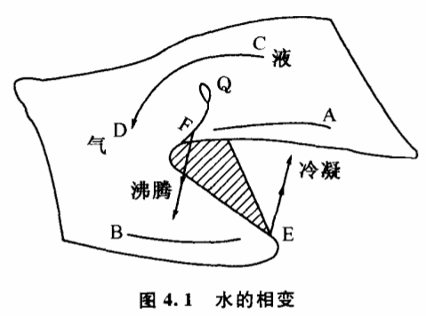

# 4.2 质变可以通过飞跃和渐变两种方式实现

从某种特定的观察条件出发枚举个别的例子来说明实现质变要经历飞跃或者要经历渐变都不困难。历史上的飞跃论和渐变论哲学家实际都是采用了这样的方法来论证自己的观点的。慷慨的大自然多彩多姿,变化万千,要举出一些特殊条件下的例子总是容易的。这使每一种观点都显得言出有据。

物质相变是大家比较熟悉的,自古以来沸腾和凝固现象一直吸引着人们的兴趣,不少哲学家在讨论质变问题时喜欢引述这方面的例于。黑格尔在阐明质变量变规律时,就举了水结成冰的例子。他认为,"水经过冷却并不是逐渐变成坚硬的,并不是先成为胶状,然后再逐渐坚硬到冰的硬度,而是一下子便坚硬了"。他又说当水改变其温度时,不仅热因而少了,而且经历了固体、液体和气体的状态,这些不同的状态不是逐渐出现的；而正是在交错点上,温度改变的单纯渐进过程突然中断了,遏止了,另一状态的出现就是一个飞跃。一切生和死,不都是连续的渐进,倒是渐进的中断,是从量变到质变的飞跃。"从黑格尔所举的这个例子可以看出,他所说的飞跃,正是质变所经历的方式。水在冰点"一下子便坚硬了"确实是一个非常漂亮的例子,说明事物的质变是可以通过飞跃来实现的。这对于当时流行的"自然界中没有飞跃"的观点是相当有力的批判。

那么,人们是不是据此就可以得出"一切质变都必须经过飞跃才能实现"的结论呢?

正如我们不赞同"自然界没有飞跃"的渐变论一样,我们也不赞同质变必须经过飞跃才能实现的飞跃论。黑格尔只举了冰点时水的例子,事实上,自然界许多非晶体,例如玻璃、石蜡、沥青等物质,它们的液态在冷却过程中正是逐渐变硬的,正是先变成胶状,然后再逐渐坚硬到一定的硬度,而不存在一下子变硬的飞跃过程。甚至在日常生活中,人们也可以发现,与空气接触的一杯水（物理、化学上称为双组分体系）,可以不经过沸腾那样的飞跃方式,而经过逐渐挥发的渐变方式变成水蒸气。

就以黑格尔所举的水的相变为例。他在大谈飞跃的时候,忽略了一个重要的条件:大气压力。他所说的沸腾、凝固、沸点、冰点,都只是在1个大气压的普通条件下而言的。大约一个世纪以后,人们发现了相律。根据相律,水经过沸腾飞跃为汽的现象只发生在一定的温度压力条件下。温度压力超过了一定的临界点,就不存在沸腾现象。突变理论为物态变化提供了比相律更为精确的数学拓扑模型,这些模型不但形象、有趣,对于我们研究质变量变规律也是非常重要的。

根据突变理论,水的气液相变过程可以表示为图4.1的曲面,这个曲面被称为尖点型突变模型。曲面上的每一个点表示一定温度压力条件下水的密度状态。曲面总的趋势是由高往低倾斜,说明随着温度增高及压力降低,水由高密度的液态变为低密度的气态。这个曲面奇特的地方在于它有一个平滑的折叠,折叠越向后越窄,最后消失在三层汇合起来的那一点Q,Q就是临界点所对应的密度。除了折叠的中间那一叶,整个曲面都表示密度的稳定状态。折叠的中间叶是密度的不稳定状态。

根据这个突变模型,我们可以看到,水由液态变为气态的过程可以通过两种截然不同的方式来进行。第一种方式是当条件温度压力沿着AFB方向变化。常压下水加热到100℃沸腾,变为水蒸气就属于这种情况。起初在AF阶段,随着温度升高压力降低,水的密度在曲面的上方沿着斜坡连续下降,但还保持在高密度液态区,这相当于常压下水加热到100℃之前的阶段,虽然密度有所降低,还保持是液态的水。但到了折叠的边缘F,曲面的上叶突然中断了,密度值一下子跌到曲面下叶的气态区域,发生了不连续变化。这相当于常压下水加热到100℃时发生沸腾的现象。它是一次飞跃,一次突变。

除了采用沸腾的飞跃方式,水由液态变为气态还可以通过第二种方式渐变来实现,这种情况发生在条件温度压力沿着CD方向变化的时候。从图4.1可以看到,当温度和压力沿CD方向绕过了临界点,从曲面折叠后面的斜坡变化时,水的密度的变化就是连续的。液态的水的密度值是逐渐降低的,它经由一系列似水非水,似气非气的中间状态连续地变化为气态。整个液气转化过程中不发生飞跃,不发生突变,不存在沸腾现象,找不到一个可以称之为沸点的关节点（或称交错点）可以把水的液态和气态区分开来。

同样的两种方式也适用于气态变为液态的过程。从图4.1可以看出,气态变为液态可以分别通过BEA的飞跃方式和DC的渐变方式来进行。不过,以飞跃方式进行时,飞跃的关节点不是F,而是E。密度值在E点一下子由气态区上升到液态区,这就是冷凝现象。

突变理论考虑问题的角度跟以往的一些理论不同,它不但关系事物在某种特定条件下的质变方式,而且更注重研究当条件发生变化时事物质变方式的改变。可以说,托姆的突变理论的本质就是揭示事物质变方式是如何依赖条件变化的。他不是凭经验、凭猜测,而是通过极其严格的数学推导建立了他的理论。这使他的理论有一个坚实的科学基础,能够站在一个新的高度洞察事物质变的全过程,克服以往一些理论的偏颇。

艾思奇同志在《大众哲学》中曾经举过一个雷峰塔倒塌的例子,来通俗地说明质量互变规律。他说,塔的倒塌经过了两个阶段,第一个阶段是愚民把砖一块块地偷走,塔身的支持力渐渐减弱,但塔始终是塔,表面上看不出有什么变化。这个时期是量变,是渐变。第二阶段是在倒塌时的变化,砖的减少已达到最高限度,塔已不能支持原来的形状,于是哗啦一声,倒塌下去。这时的变化很明显,因此这一时期的变化是质变,是突变。艾思奇先生的这个例子代表了一种典型的质量转化观点,形象地说明质变阶段雷峰塔是如何"哗啦一声,倒塌下去",突变为一堆废墟的。但是,除了以这样一种突变或飞跃的方式质变之外,就没有其他的方式了吗?如果我们设想那些愚民们每天不是从塔底把砖一块块偷走,而是从塔顶开始把砖一块块偷走（我们暂且假设他们克服了种种技术上的困难）,那会发生什么情况呢?显然,从塔顶一块块一层层地偷砖,直到偷光为止,也不会发生"哗啦一声,倒塌下去"的突变现象,也不会有飞跃出现。整座塔完全可能逐渐地被毁掉,以渐进方式完成质变。

突变理论的基本思想是深刻的,然而并不复杂。它是从稳态结构的研究开始的。1972年托姆出版了一本系统阐述突变理论的著作,书名就叫《结构稳定性和形态发生学》。突变理论通过对稳态结构的研究,广义地回答了为什么有的事物不变,有的渐变,有的则是突变。一种对事物的变化有深知灼见的理论却来源于对事物不变性的洞察,这是一个意外的出发点。对它的研究有助于我们了解突变理论:的深刻思想,了解这个理论的意义不仅仅在于给出了种种形状古怪的模型而已。
