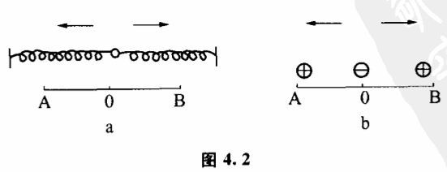
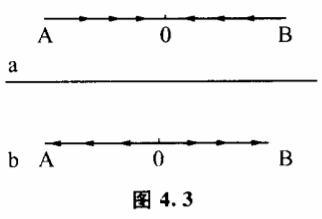
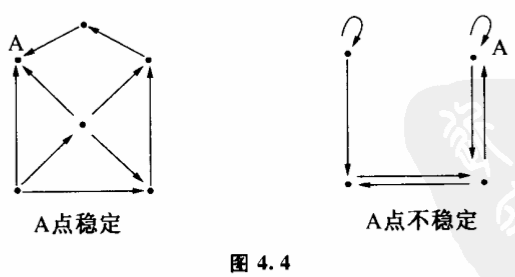
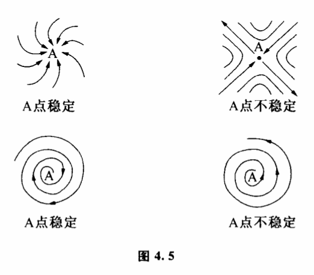
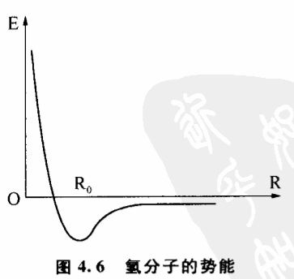
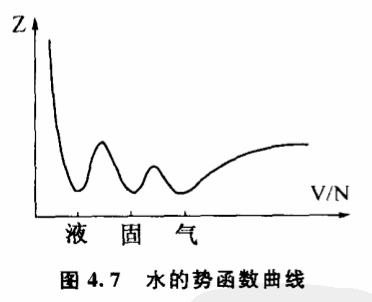
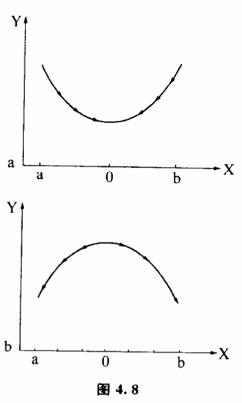
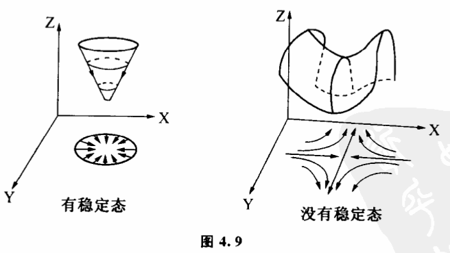

# 4.4 稳定机制:稳态结构的数学表达

一旦我们把事物某一种性质的稳定性与稳态结构联系起来考察。认为事物任何存在的质或多或少都具有稳态结构所刻画的稳定性,这就为我们深入研究质变方式找到一个关键的突破口。因为对于任何一种稳态结构,系统内各子系统的互相作用与调节是保持它稳定的机制。那么对于事物任何一种确定的质,我们也都能发现保持这一质的稳定性的稳定机制。没有这种稳定机制,事物是不会具有相应质态的。什么叫稳定机制呢?我们来举一个例子。

我们知道,一个坑中的小球,就其位置而言,是稳定的。因为小球不管受到哪一方向的外力干扰使它偏离了稳定位置,只要干扰消失,小球都可以滚回到坑的底部。而一个放在物体尖端上的小球,它的位置是不稳定的。因为一旦外力干扰使它发生偏移,就回不到原来的状态了。坑中小球的位置为什么稳定?因为有坑的存在,坑和重力拘成了保持小球位置稳定的稳定机制。

那么对于其他物质的各种性质,如化学、物理性质,有没有类似现象呢?有的。任何一种物质要保持其某一性质的稳定,必定有一种相应的稳定机制。这种稳定机制或者是事物内部结构中各部分相互作用造成的,或者是在人参与控制的条件下形成的。不论是哪一种稳定机制、我们都可以用动态图和可能性空间势函数洼的形式表示出来。这里所说的洼并不是坑中小球那种现实空间的洼,而是一种表示物质性质的抽象空间的法。这一节我们就要着重研究一下这个问题。

让我们先来比较两个实验。图4.2a表示相同的两根弹簧,分别把它们的一端同定起来,另一端在自由的情况下分別处于A、B两点。现在把它们都挂在一个小球上,我们可以看到,由于两根弹簧相反的拉力,不管小球开始处于什么状态,最后都会弹回AB的中点。这是稳定态。如果我们在A、B两点分别放两个带正电荷的小球（图4.2b）,在它们中间放一个带负电荷的小球,那么负电小球也受到方向相反的引力作用。不过跟弹簧实验相反,我们发现负电荷小球在AB之间的任何位置都是不稳定的。即使在AB的中点0,只要稍微受到一点干扰,它要么往A跑,要么往B跑,不会呆着不动。这说明它在AB之间没有稳定态。显然,在第一个例子中,弹簧构成保持0点稳定的机制,而在第二个例子中没有。

如果我们把AB之间小球各点的运动趋势都用箭头标出来,就得到图4.3。我们看到,弹簧实验中小球各点的运动方向都指向0（图4.3a）,而电荷实验中小球在AB之间没有一个共同的归宿（图4.3b）。

图4.3这种表示方法被称为某种变换的动态图,图上按箭头方向移动的点称为示象点,它们表示变换所经历的各个状态。大多数城市的公共汽车站牌上,用动态图向乘客指示汽车行驶的方向。在我们的讨论中,动态图可以用来指示一系列变化中稳定态的位置。图4.4的两个动态图,分别表示A点是稳定的和不稳定的两种情况。有稳定态的动态图在行为上刻画了稳定机制。

如果各个状态的变化是连续的,我们可以用空间连续的箭头来表示状态之间的变化关系。图4.5就是几种连续的稳定和不稳定情况。

除了动态图,人们还经常用势函数曲线来表示稳定机制。

物理学认为,自然界存在的任何物质从能量上讲必须具有稳定性。比如两个氢原子组成一个氢分子,两个氢原子之同的距离必定是势能最小的距离R（图4.6）。这样的结构是氢分子结构中最稳定的结构。为什么呢?

因为干扰是无处不在的,如果氢分子的能量（由原子之间的距离R决定）比邻近结构高,那么任何一点外界干扰都会使氢分子发生变化,放出能量,原有的结构也就不能稳定地存在。氢原子之间的距离最终将趋于势能曲线洼的最低部,达到稳定态。

图4.6这条曲线又被称为氢原子距离的势函数曲线。势函数具有广泛的意义。对自然界不同的过程,势函数的物理意义是不同的。对于水的物相,势函数是自由能Z,它的势函数曲线如图4.7。这条势函数曲线上分布着三个洼。由于事物的状态总是自动趋向势函数值较小的位置,因此势数曲线的洼底就一定是事物的稳定态。不管干扰使状态如何变动,事物最终将回到洼底这个位置上。势函数洼的这种性质被人们用来描述事物的稳定性。每一个洼都表示事物的一个稳定态,洼底的位置就是稳定态的位置,洼越深意味着相应的稳定态越稳定。图4.6曲线只有一个洼,意味着氢分子只有一种稳定的结构。图4.7曲线有三个洼,它们分别代表水的固、液、气三种稳定的物态。

在弹簧实验和电荷实验中,如果分别用虎克定律和库仑定律计算一下,就可以看到原来弹簧小球位置的势函数有一个洼,所以它有稳定态（图4.8a）,而电荷小球位置的势函数没有洼,所以没有稳定态（图4.8b）。

当事物的状态空间不是一维的时候,也可以用洼来表示稳定机制。二维状态空间的洼不是由一条曲线组成的,而是由一个曲面围成的。图4.9中一个势函数曲面有洼,另一个没有洼,它们分别表示有稳定态和没有稳定态的情况。

细心的读者或许已经发现,如果把图4.8的势函数曲线投影到底边上,ab之间的箭头方向跟图4.3是一致的。如果把图4.9的势函数曲面投影到底平面上,就得到跟图4.5相似的箭头。这说明用动态图来表示事物的稳定机制跟用势函数来表示是一致的。

人们一定会问,这种表示稳定机制和稳定结构的方法普遍性如何?实际上,虽然事物性质千差万别,但其丰富的质的规定性都相应着各层次存在着这样那样的稳定机制。比如地面上任一个不动的物体,在力学上是稳定的。地心引力、摩擦力、地面反作用力一起构成保持其位置不变的稳定机制,这一机制可用势能函数曲线洼表示。同时这一物体之所以有一定的化学和物理性质,是由于在分子层次原子间的作用能是保持它具有确定物质结构的稳定机制。它可以表示为化学能量曲面的法。即使到了基本粒子层次,原子核之所以能稳定存在,也存在着相应的稳定机制,这种机制又能表示为势函数洼的形式。

利用势函数洼来表示稳定机制不但形象,而且有许多奇妙的用处。最有意义的,就是利用它可以非常清晰有力地阐明事物质变过程中出现飞跃或渐变的原因。
