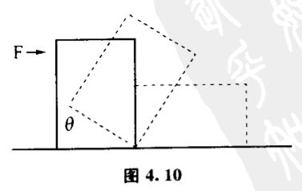
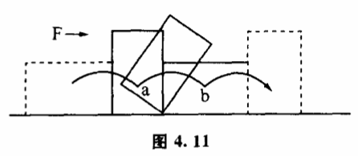
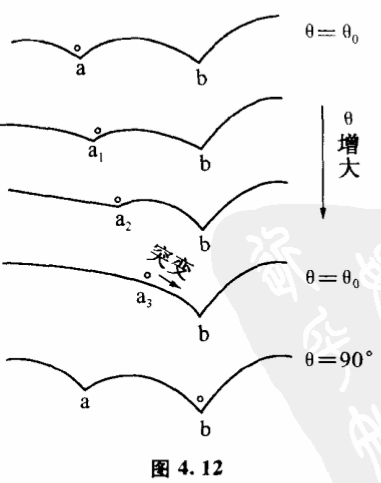
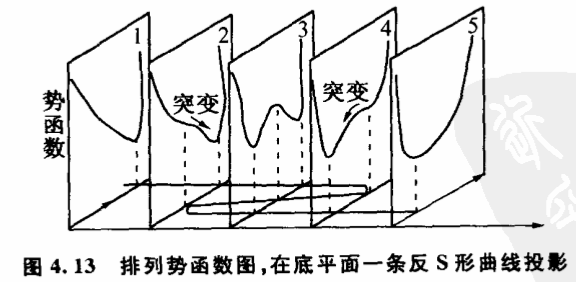

# 4.5 事物性质的不变、渐变和突变

事物在发生变化的时候,势函数曲线以及它的洼是怎样变化的呢?我们先来分析一个简单的例子。对一块直立的长方形木块施加一个推力F,假定木块的支点因摩擦作用不动,那么随着F的增大,木块逐渐倾斜,木块底边与地面的夹角ϴ逐渐增大。当木块倾斜到某一个角度ϴ0时,渐变过程就中断,木块突然翻倒,夹角ϴ下子从ϴ0飞跃到90°。这是一个在推力F作用下木块的稳定性被破坏的过程（图4.10）。

木块在没有F的情况下,只可能处于直立或横立两个稳定的状态。也就是说,ϴ角的稳定态只有ϴ0和90°无论木块开始时倾斜成什么角度,最后要么直立,要么横立,别无选择。如果我们画出木块在前面几次翻倒运动中重心的轨迹,得到图4.11中那一条曲线,它由几条圆弧组成。这条曲线也就是木块的势函数曲线。它有两个洼,洼底的位置a和b对应着木块直立和横立两个稳定态。

在推力F的作用下,木块的势函数曲线就逐渐发生了变化（图4.12）。可以看到,随着a1、a2、a3,这个阶段由于a洼没有消失,木块还处于稳定态中,ϴ角是逐渐由0°大到ϴ0的。到ϴ0时,木块重心到a3位置,这时a洼消失,势函数曲线只剩下b洼,这意味着木块由第一个稳定态过渡到第二个稳定态,重心由a3飞跃到b,夹角相应由ϴ0翻到90°,突变发生。

这个过程虽然比较简单,却很典型。它说明了几个问题:（1）当势函数的洼不变时,事物处于稳定不变的状态。（2）当条件的改变引起势函数洼的移动变浅时,事物发生渐变。势函数洼越浅,事物越不稳定。（3）当条件的改变使势函数旧有的桂消失,状态经历不稳定态往新洼过渡时,事物发生突变。旧洼消失的那一点,就是飞跃的关节点。

从势函数曲线洼的变化,可以解释为什么尖点型模型的前面会出现一个折叠。当然,突变理论严格的数学推导较为复杂,但对它作直观的说明却并不困难。我们看图4.13,垂直排列的一些平面表示有两个洼的势函数曲线的顺序变化,它们对应着事物两个稳定态的相互转化过程。底平面的一个变量表示条件的变化。如果我们把垂直平面中两个洼的位置投影到底平面上,就得到一条S形的曲线,它表示随着条件的变化,两个稳定态的转化过程。实际上,图4.1突变模型中的折叠面,就是由一系列这样的S形曲线连续地组合起来的。

由此,我们不难理解为什么说突变理论是以结构稳定性的研究为基本出发点的了。
