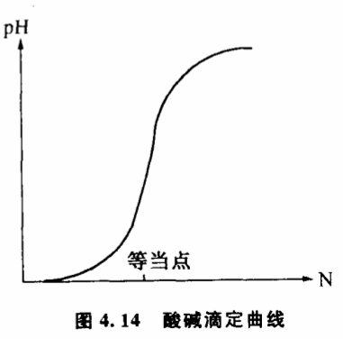

# 4.6 怎样判别飞跃

那些主张"自然界没有飞跃"的人绝大多数场合都是基于这样一种信念:在任何两种质态之间总能找到一系列中间状态把它们联系起来,这些中间状态是任何转化过程必须要经历的。因此,不管转化的快慢如何,它们总是连续的、渐进的。比如水在常压下100℃沸腾成为水蒸气,我们说水从液态密度一下子变为气态密度,这是一个飞跃过程。但从渐变论的角度来说,水的密度变化也一定经历了液态密度到气态密度之间的那些中间密度过程,无非是时间极短而已,所以他们认为不能说其中出现了飞跃和中断。木块在外力作用下从直立状态翻倒为横立状态。开始在外力的作用下木块是逐渐倾斜的,当夹角到达某一个角度ϴ0时,木块突然倒下,夹角从ϴ0一下子变为90°,我们说这是一个飞跃。但渐变论者认为,不管木块翻转的速度如何,它都必须连续地经历0°到90°之间的一切角度,因此也不能说中间有什么飞跃阶段。这种观点尤其容易被生物学家接受。在研究生物进化时,随着大量具有中间性状的古生物化石被发现,物种之间的鸿沟逐渐被填平了,进化在大多数场合可以被理解为一种千百万年间发生的渐进的过渡,很难用"渐进的中断"、"不连续"、"突然发生"之类飞跃的模式来套用物种的转化。

这种观点具有相当的说服力,对那些坚持"自然界充满了飞跃"的说法是一种挑战。这个问题的提出,正暴露出经典的飞跃论的一个严重缺点。经典的理论在确定一个过程是否是飞跃时,缺乏明确的判定原则,一般只简单地把飞跃说成是一个突然地、迅速地发生的过程,把飞跃和非飞跃归结为变化速度的区别。事实上这种判定原则并不总是适用的。它无法排除那些迅速地发生的渐进过程,无法理解那些花费时间较长的飞跃过程,也不能解释变化速度和关节点上的不连续性的关系。它经不起仔细推敲,反而为根本否定飞跃的存在提供了机会。两种飞跃论企图用"爆发式飞跃"和"非爆发式飞跃"来解释质变过程中存在的不同转化方式,但他们提出的判定爆发和非爆发的原则仍旧没有越出变化速度、渐进的中断、变化的突然性之类框框,因此不但没有解决经典飞跃论原有的困难,相反还带来了新的逻辑混乱。

根据突变理论和系统稳态结构分析,我们可以提出一条新的判别飞跃的原则:如果质变中经历的中间过渡态是不稳定的,那么它就是一个飞跃过程,如果中间过渡是稳定的,那么它就是一个渐变过程。

为什么不用中间过渡态是否存在或变化速度是否快慢来判定飞跃,而用中间过渡态是否稳定来判定飞跃呢?因为这样不但更科学更精确了,而且把握了飞跃过程和渐变过程本质上的差别。根据这条判定原则,我们说水在常压下100℃沸腾是一个飞跃,因为在这样的条件下,液态和气态密度之间的那些中间密度状态都是一些不稳定态,水的沸腾的本质是从液态稳定态向气态稳定态的过渡,它不能停留在不稳定的中间密度状态中。相反,如果按图4.1CD曲线控制条件,绕过了临界点,那么,液态和气态之间的中间密度状态都是稳定的,水可以不经过沸腾,而经过逐渐变稀薄,变成似水非水似气非气的一系列稳定的中间状态,采用一种渐变的方式。木块从直立状态翻倒的过程中,我们承认木块循序经历了从0°到90°之间的一切角度,但从ϴ0角度开始,木块的重心超出了支点,它经历了一个不稳定的过渡阶段翻倒下来,因此它是一个飞跃。

分析化学中,强酸强碱的滴定在等当点附近的pH行为历来被飞跃论者认为是一个飞跃。图4.14的滴定曲线显示出等当点附近的陡直变化,它表示滴定进行到等当点附近时pH发生迅速的改变。实际上,整个滴定过程中溶液在滴定剂的控制下都是稳定的。即使在等当点附近,在严格滴定的条件下pH值还是受控的。即只要加入碱的量很少,总可以使溶液的pH变化充分小,曲线总是可微的。如果pH有不稳定的区间就无法用于定量分析。因此这是一个渐变过程。

对于我们以前讨论过的那些有复杂反馈联系的系统、自繁殖系统和自组织系统,用稳态结构来判别飞跃具有特殊的意义。影响这类系统变化的因素往往很多,通常我们一时找不到简单的突变模型来描述它们。它们的变化不但取决于其他控制条件,还取决于系统变化本身。研究这类系统的飞跃是很有意思的。我们知道,燃料可以通过自然氧化的方式释放热量,也可以通过爆炸的方式释放热量,为什么有这种差别呢?原来,在爆炸的情况下,一部分燃料氧化后释放的热量不能及时散发掉,使周围温度迅速提高,加速了周围燃料的氧化并使温度进一步提高。这样,就形成了一个正反馈系统。只要有一小部分点燃,整块燃料就立即处于一种不稳定状态之中,以爆炸的方式一下子全部氧化。这是一个以飞跃完成的质变过程。而在自然氧化的情况下,由于热量能及时散发开去,一部分燃料的氧化并不影响整块燃料的稳定性,燃料可以通过稳定的氧化反应过程,不形成正反馈系统,因此这是一个以渐变完成的质变过程。同样的道理,我们可以把雪崩称为飞跃,而把滚雪球称为渐变,是因为雪堆在两种情况下稳定性不同的缘故。黑格尔在《逻辑学》中曾经举过从头上拔走一根头发是否会成为秃子和从谷堆里取走一粒谷是否还会有谷堆的例子,借以说明量变如何导致了质变。对于我们来说,要确定一个质变是由飞跃方式进行还是渐变方式进行,就不但要研究质变,而且要研究质变发生时事物的稳定性如何。显然,我们从头上拔走一根头发,剩下的头发还是稳定地长在头上的。我们取走一粒谷子,剩下的谷堆仍然可以保持着稳定性。因此秃子形成和谷堆取完的过程都是以渐变的方式实现的。如果是一副多米诺骨牌,情况就大不一样了。游戏的规则决定一旦倒了其中的一块,就会影响到其余骨牌的稳定性,相继跟着倒下来,这就是一个飞跃。因此,问题不在于变化的速度如何,而在于稳定性。无论我们怎样加快取谷粒的速度或者减慢多米诺骨牌倒下的速度,都不能改变它们各自渐变和飞跃的本质。

我们也可以由此来分析雷峰塔的倒塌过程。愚人们从塔底把砖一块块偷走,从根本上动摇了雷峰塔的稳定性,到了一定的关节点,雷峰塔的稳定性被破坏,它哗啦一声倒塌下来。经历了一个不稳定的阶段,因此被判定为一个飞跃。如果愚人们从塔顶把砖一块块偷走,雷峰塔直到完全拆掉为止,都是稳定地过渡的,中间没有不稳定的阶段出现,这个质变就是渐变。所以问题也不在于愚人们偷砖的速度和塔倒塌的速度,而在于偷砖的方式,因为从塔底偷砖跟从塔顶偷砖对于整座塔稳定性的影响是不同的。

与某些物理、化学过程相比,生物界的情况就要复杂得多。物种进化过程究竟是渐变还是飞跃,历来是有重大争议的课题。突变理论提示我们,要确定物种之间的演化是渐变还是飞跃,不但要证明各种过渡类型和中间类型是否存在,而且要研究这些过渡类型和中间类型的性状是否稳定。不能单凭过渡类型和中间类型的存在就判定一个进化过程为渐变。此外,生物的情况比较复杂,标志进化的特征性性状可能有多个,需要由多维状态变量来描述。根据突变理论,可能其中某些性状具有稳定的中间状态,而某些性状不具备稳定性。以古猿进化到人为例,四足爬行和直立行走之间的过渡性状从力学的角度来说是不稳定的,而制造工具、语言、能动性等等都完全可能有稳定的中间状态。考虑到各种性状的相关性（相关变异）,用数学方法建立多维状态变量的进化模型可能相当复杂,但这是一个新的出发点,开展这方面的工作或许会导致我们对进化的本质有更深刻的了解。

用稳定性来判别飞跃的原则也同样适用于研究社会科学问题。过去,我们把一切社会变革都说成是飞跃,看来是值得商榷的。分析一场社会变革以什么方式进行,主要不在于这场变革的发生是否突然,进行的速度是否迅速以及是否采用了暴力手段等等,而主要在于分析变革进行的过程中社会是不是基本处于一种稳定状态之中,整个社会的政治、经济、军事、人民的生活是否经历了大破坏、大动荡的不稳定时期。同样是封建社会向资本主义社会过渡,法国大革命就与日本的明治维新有显著的区别。明治维新之时,虽然倒幕派也曾与幕府以暴力相见,但明治政府实行的一系列改革,是在整个社会生活基本稳定的条件下进行的。而法国革命进行之时,整个社会生活都经历激烈的动荡。
