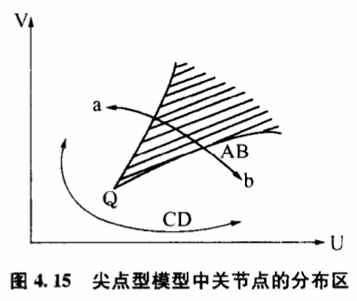
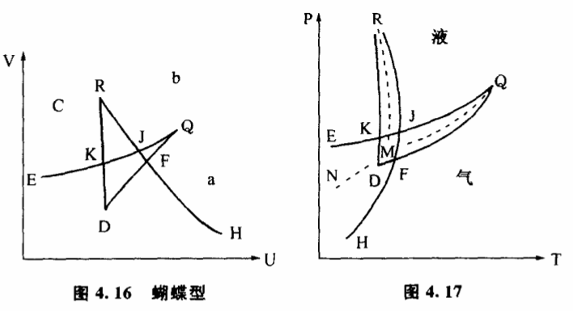
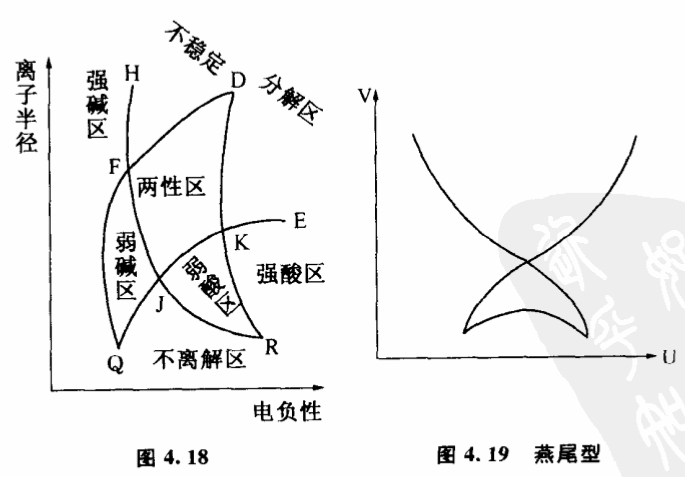
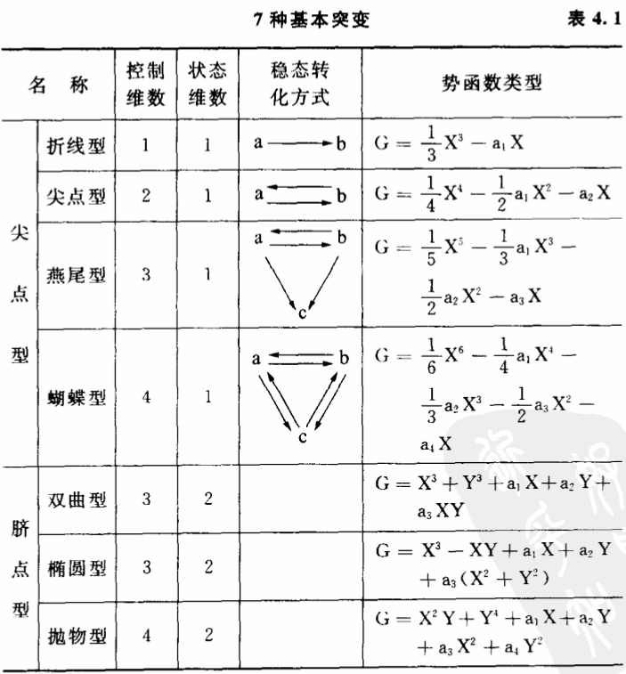
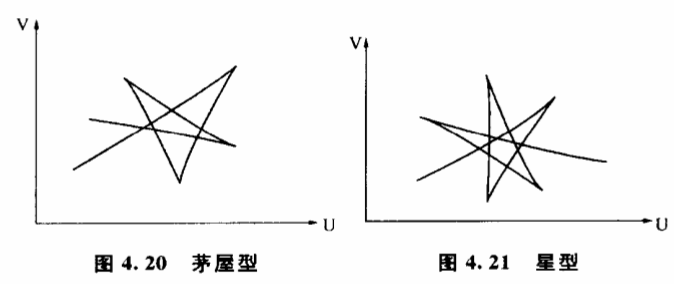

# 4.8 关节点:蝴蝶、燕尾及其他

事物的质变都发生在关节点上吗?事物的不同质态是不是都可以找到关节点互相区别?关节点的位置随条件变化吗?是怎样变化的?

经典的飞跃论确定了飞跃在质变过程中的绝对地位的同时,也确定了关节点的地位。他们认为事物的不同质态之间都存在着这样一些点,在这些点上,事物渐进的量变中止,出现飞跃,发生了质变。从历史上来看,飞跃论指出关节点的存在和性质,对根本不承认事物质态变化有限度的渐变论是一个有力的批判。但是,经典的飞跃论由于历史上科学技术背景的局限,只能模糊地感觉到关节点的存在,未能进一步研究关节点存在和变化的条件性。

突变理论严格、全面地研究了关节点对条件变化的依赖关系,因而能够比较科学地描述关节点的存在和性质。根据突变理论,两种相互转化的质态之间的关节点并不是一个固定的点,而是随着条件变化有规律分布的一个区域。这种分布规律可以用图4.15表示。图中U与V两个变量分别表示两个控制事物质态变化的条件,在我们前面举过的例子中,它们是分别跟温度与压力有关。区域a和区域b分別表示a、b两种质态存在的范围,在我们讨论过的例子中它们分别表示水的液态和气态。图中的阴影区域就是关节点分布的范围,它的顶点Q是尖角形的,因此这个突变模型又叫尖点型。随着U、V变量的增大,阴影不断向前扩展。细心的读者或许已经想到,4.15实际上就是图4.1在底平面上的投影,其中尖点角的阴影区,实际就是图4.1的折叠区的投影。

从图4.15可以看出,质态a和质态b之间可以通过许多条途径互相过渡,但总的来说,只有两种情况。一种是穿过阴影区,以AB线为代表的飞跃方式；一种是不穿过阴影区,以CD线为代表的渐变方式。

质态沿AB由a往b转化的过程中,只要条件的变化一进入阴影区（折叠区）就意味着有飞跃为b的可能。阴影区内的每一个点都可以成为飞跃的关节点。因此我们说,关节点不是一个固定的点,而是随条件变化有规律分布的一个区域,这个区域在两种质态相互转变时必然是图中阴影区那样的一个尖点角形。根据突变理论,质变进行时具体在哪一点发生飞跃,取决于外界干扰的大小,干扰越大,飞跃发生得越早,关节点分布在AB线进入阴影区的部位。干扰越小,飞跃发生得越迟,关节点分布在AB线脱离阴影区的部位。

如果沿CD线绕过了尖点角,质态a和质态b之间的过渡就以渐进的方式进行。从图中我们看到,在阴影区的左下方,区域a和区域b之间没有明确的分界,相应的行为曲面部分是连续的、稳定的,CD线经过一系列似a非a,似b非b的稳定中间状态过渡。由于没有穿过阴影区,因此在这种质变过程中找不到一个可以明确地把a态和b态明确区分开来的点,找不到一个"由量转化为质"的点,找不到一个会发生飞跃的点。一句话,这种质变过程不存在关节点。事物在由a往b过渡时,a态的成分逐渐减小,b态的成分逐渐增大,每走一步都比以前更接近b态,最后完全变为b态。

在不同的突变模型中,关节点对条件变化有不同的依赖关系,它们有各自的分布范围。实际上,突变理论专家们都是用关节点在条件变量组成的空间中的分布图形来表达突变模型的。

以上我们介绍的突变模型是尖点型,它是一种比较简单而又比较基本的模型,它刻画了两种稳定的质态相互转化的过程。如果有三种稳定的质态,并且它们能互相可逆地转化,那么就要用蝴蝶型突变来描述。例如水及其他物质常有固、液、气三种不同的物态,它们可以相互转化,相应的模型就是蝴蝶型的。尖点型突变实际上只是蝴蝶型的一种特殊情况。蝴蝶型的行为更复杂些,要用五维空间（一维状态变量,四维控制变量）才能完全表达出来。对于我们这个三维空间的世界,只能用固定某些变量的方法观察它的一些局部。如果我们固定两个控制变量,可以得到图4.16。其中U、V是控制变量,a、b、c分别表示三种不同的质态。除了三个单值区外,JQF是a、b两态共存的双值区,JRK是b、c两态共存的双值区,KE曲线与FH曲线之间是a、c两态共存的双值区。中间有一个口袋形的JFDK,它是a、b、c三态共存区,又叫三值区。整个图像如一只飞起的蝴蝶,蝴蝶型因以得名。

上述结果最直接的证据就是水的相图。在温度压力构成的控制平面上,相关实际是蝴蝶型的（图4.1的尖角型是其中一部分）。图4.17中JQF为气液共存区,JRK为固液共存区,KE和FH之间为固气共存区,其余部分是固液气三个单值区。一般情况下由于大量干扰的存在,这些双值区、三值区都被掩盖了。气液共存区缩小为MQ相平衡曲线,固液共存区缩小为MR相平衡曲线,固气共存区缩小为MN相平衡曲线,口袋形的三态共存区缩小为一个点M,这点称为三相点。这里,突变理论揭示的固、液、气三态转化规律比相律更为深刻。它不仅能解释过热、过饱和等现象,还能指出这些现象发生的范围。相律无法解释为什么MQ不能在平面上无限延伸,MN却可以延伸到绝对零度附近,而这些对于突变理论是很自然的结论。糊蝶型突变在自然界广泛存在着,它描述了三种不同质态互相转化时关节点构成的几何形状。这些理论在化学中特别有用,例如研究周期表中各元素的氢氧化物的酸碱性。氢氧化物的水溶液有三种基本的性质:（1）电离出H+,溶液呈强酸性；（2）电离出OH-,溶液呈强碱性；（3）不电离。显然,只要选择适当的控制变量,主控制平面上这些性质的分布应当是蝴蝶型的。上述论断被证实了。我们选择某些关键参数如离子半径和电负性建立控制平面,发现这三种性质的分布确实是蝴蝶型的。图4.18中JQF是强碱性与不电离两种性质共存区,从统计上看,这类氢氧化物呈弱碱性。JRK是强酸性与不电离两种性质共存区,氢氧化物呈弱酸性。KE和FH曲线之间是强碱与强酸两种性质共存区,H+和0H-结合成水,氢氧化物不稳定,分解为氧化物。口袋形JFDK是强碱、强酸、不电离三种性质共存区,氢氧化物在这个区域呈酸碱两性。

尖点型和蝴蝶型是几种质态之间能够可逆转化的模型。自然界有些过程是不可逆的,比如死亡是一种突变,活人状态可以突变到死人状态,反过来却不行。这一类过程可以用折线型、燕尾型等势函数最高为奇次的模型来描述。图4.19为燕尾型突变中关节点的分布图。它像一只飞起的燕子尾巴。燕尾型和折叠型突变在几何光学上很有用处,它们成功地解释了彩虹的形状和一系列奇妙的光学现象。

表4.1给出了控制变量不多于4个,状态变量不多于2个时的7种模型。这7种模型是最基本的。如果稳定的质态增加到4个,描述它们之间变化的模型称为茅屋型（图4.20）和星型（图4.21）。随着控制变量增加,突变模型变得越来越复杂。数学上已经证明,当影响突变的控制变量多于5个时,突变模型有无限多种类型,这深刻地说明自然界质变形式的丰富性。

