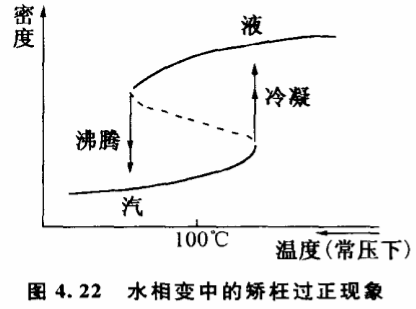
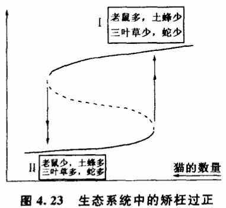

# 4.9 矫枉必须过正吗

我国有句"矫枉必须过正,不过正不能矫枉"的成语。指的是有些事物在一定的条件作用下造成了一定的结果,但当这个条件消失后,结果并不消失,事物不能立即恢复原状,要等条件往相反方面变化到一定程度,出现很大的相反作用时事物才能恢复原状。用科学的术语来讲,这类矫枉过正的现象叫做滞后。例如我们对一段直的铁丝施加一定的作用力,它会产生弯曲现象,如果我们取消作用力,铁丝不会马上变直,它往往需要我们施加相当程度的相反作用才会变直。无论在自然科学还是在社会科学中,都经常可以遇到这类滞后现象。

那么矫枉过正是不是一个普遍的规律?在任何情况下矫枉都必须过正吗?滞后现象的出现有什么规律性?这些问题也跟关节点出现的规律性问题一样,从前人们只是凭经验有一些模糊的笼统的认识,未能用科学的方法加以深人探讨。甚至在一段时期里,有人盲目地把矫枉过正现象绝对化了,在实际工作中事必过正,造成了许多不应有的损失。

突变理论第一次发现了矫枉过正现象和飞跃现象之问的联系,揭示出这两种历来被人们孤立研究的现象具有同一的本质,从而为我们深入探讨矫枉过正问题提供了线索。

突变理论指出,矫枉过正现象是有严格的条件的,只有当质变以飞跃方式进行时才可能发生。水的汽液相变过程中就常有矫枉过正现象发生,那就是水的过热现象和水蒸气的过冷现象。水在常压下的沸点是100℃,但是大家知道,如果用纯净的水做实验,并且充分排除掉振动等干扰,水加热到100℃往往还不沸腾,要稍高于100℃才通过沸腾变为水蒸气。相反,水蒸气照理在常压下100℃应当冷凝,但往往要稍低于100℃才通过冷凝变为水。这样就在100℃附近形成一个水的过热区和水蒸气的过冷区,也就是说,由水变为汽的关节点跟由汽变为水的关节点不是同一个,双方有一个滞后的差距,双方的质变都要过正才能恢复原状。这种现象我们可以用图4,22来表示。图4.22实际是图4.1尖点型模型的一个截面,图中水的密度曲线呈弯曲的折叠状,而通常所说水在常压下的沸点为100℃,只是有干扰情况下一个统计的数值。如果温度压力条件的变化绕过了折叠区,水汽不以沸腾和冷凝的方式质变,而以渐变的方式质变,就不存在关节点,也不会发生矫枉过正现象。

上一章我们曾经研究过一个由老鼠、土蜂、三叶草和蛇组成的生态系统,它们之间有如下关系:老鼠破坏土蜂窝,土蜂传播三叶草花粉,三叶草养蛇,蛇吃老鼠。这个生态系统有两个稳定态。第一个稳定态是:老鼠多,土蜂少,三叶草少,蛇少。第二个稳定态正好相反:老鼠少,土蜂多,三叶草多,蛇多。假定这个生态系统一开始处于第一个稳定态,田野附近的居民逐渐形成养猫的习惯,猫的数量增加,这个外加的条件对生态系统有什么影响呢?开始不会有什么变化,但猫多到一定程度就打破了原有的生态平衡,系统一下子飞跃到第二个稳定态:老鼠少,土蜂多,三叶草多,蛇多（图4.23）。这时如果再减少猫的数量,生态系统会不会很快回到第一个稳定态呢?显然不会。因为蛇一多,它就有效地制约着老鼠的繁殖。必须使猫的数量减少到比原来少得多的程度,才会变现相反的飞跃,矫枉过正现象十分明显。在生态学中,条件的变化会导致某一生物的绝迹、滞后将是无限大,质变成为不可逆转的。

我们说矫枉过正现象只有当质变以飞跃方式进行时才会发生,那么反过来是不是一切有飞跃出现的场合矫枉都必须过正呢?也不一定。根据突变理论,即使在飞跃发生的场合,矫枉过正也不一定是必须的。由于质变进行时总有各种各梓的干扰存在,当干扰的作用相当大时,事物往往不必施加过量的相反作用就可以恢复原来的质态。突变理论指出,矫枉过正现象只可能存在于突变模型给出的关节点分布区域之内。在关节点分布区域之外,矫枉是不需要过正的。
