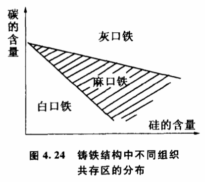

# 4.10 极端共存

另一种与质变有关的重要现象是极端共存,它也是第一次在突变理论中得到了比较透彻的研究的。

这类现象一般发生在由众多相同的子系统组成的大系统中。在一定的条件下,大系统的各个子系统可能同时处于各种完全不同的质态之中。用通常的话来说,就是一个事物的某些部分以一种质态存在,同时,事物的其他部分则以另一种质态存在。例如水是由许多水分子组成的,在一般的情况下,水要么全部以固态方式存在,要么全部以液态或气态方式存在。但在一定的条件下,会出现两态共存区,例如气液共存区内,一部分水以气态方式而另一部分水以液态方式同时共存。对于水来说,还有一个三态共存区,即水的固、液、气三态可以同时共存,著名的水的三相点就是三态共存区。又如在激光器的谐振腔内,只要控制一定的条件,一部分气体分子处于高能态,而另一部分气体分子处于低能态中。高能态分子可以通过发光突变为低能态,低能态分子也可以被激发到高能态,两者的数目达成一定的平衡而共存。

人们之所以把这种现象称为极端共存现象,是因为在共存区给出的条件下,共存的不同质态之间是不连续的。例如水在气、液共存区内只能处于气、液两种不同的质态,不能处于气、液两相中间的那些过渡态。达尔文最早发现生物界的极端共存现象。他在环球旅行时,发现太平洋一些群岛上的昆虫很特别。这些昆虫要么几乎没有翅膀,要么有极强的翅膀,而没有大陆上那种具有不强不弱中等翅膀的昆虫。达尔文经过研究发现,这是因为海岛上狂风暴雨的环境选择的结果。在狂风暴雨的条件下,昆虫要生存下去只有两种办法:要么翅膀退化,干脆不飞,躲进草里避风；要么具有强大的翅膀,能与狂风暴雨顽强地搏斗。而像大陆上那些中间性状的昆虫会飞又不是飞得极强就会被吹入海里,被淘汰掉。也就是说,在这样的条件下,两种极端的质态都是稳定的,而中间状态却是不稳定的。

突变理论认为,极端共存有严格的条件。和矫枉过正现象一样,极端共存现象也只有在关节点分布区域内才可能发生。实际上,突变模型所表示的关节点分布区域,就是由两态共存区、三态共存区等等组成的。只有在这些共存区内,极端才有可能共存。而在共存区之外,要么只能存在单一的质态,要么只能存在那些极端之间的中间状态。例如铸铁中碳和硅的含量都很高时,形成石墨比较好的灰口铁。碳和娃含量都很低时,出现大量Fe3C,形成白口铁。如果灰口铁和白口铁同时存在,则形成两种组织混合的麻口铁。根据突变理论,这两种质混合出现的共存区在控制平面中的分布应当呈尖角形。大量实验证明,理论的结果是一致的（图4.24）。我们可以在自然界找到大量事物的两种极端状态共存的现象,突变理论为探讨这些现象的规律性提供了有力的工具。
