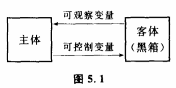
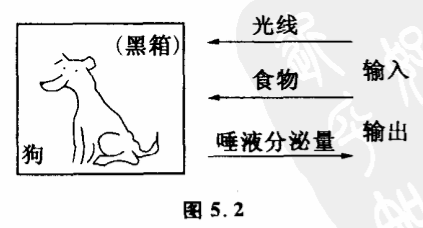

# 5.1 认识对象和黑箱

控制论把人们认识和改造的对象看作黑箱。

任何一个客体事物,它和我们人的关系总可以归结为两个部分。一部分是客体对主体的作用,包括主体所接收到的客体的信息及客体对主体的各种作用、影响。它们反映在客体的输中,可以用一组变量来表示,被称为这个客体的可观察变量。另一部分是主体对客体的主制作用,包括主体传递给客体的信息及主体对客体的各种作用、影响。它们反映在客体的输入中,也可以用一组变量来表示,被称为这个客体的可控制变量（图5.1）。通过可观察变量,人们对客体进行观察,了解客体的存在及其变化,认识客体。通过可控制变量,人们对客体实行控制,创造使客体变化的条件,改造客体。此外,通过主体和客体的反馈耦合,在客体被认识和改造的同时,主体的精神活动也被认识和改造着。因此,人们的实践活动,从根本上来说都可以表示为主体和客体之间的反馈耦合,都可以用可观察变量和可控制变量来描述。

对于一个客体,我们用一组可观察变量和可控制变量构成的系统来描述它。这个客体系统也就是一个黑箱。在这里,系统和黑箱是两个等价的概念。那么为什么要叫黑箱呢?黑,意味着一些未知的东西。关键也就在这个问题上。我们知道,客体事物是复杂的,在人们认识的一定阶段,任何客体总有许多情况是我们还不了解的,任何客体也总有许多变化是我们还不能控制的。也就是说,任何客体除了可观察变量和可控制变量之外,还有一大批尚不可观察和尚不可控制的变量。正是从这个意义上,控制论把一个客体称为黑箱。

控制论认为,认识客体黑箱有两种不同的方法。一种叫不打开黑箱的方法,一种叫打开黑箱的方法。

不打开黑箱的方法就是不影响原有客体黑箱结构,通过黑箱外部的输入输出变量的研究得出关于黑箱内部情况的推理,探求黑箱的内部结拘。而打开黑箱的方法则要通过一定的手段来影响原有客体黑箱直接观察和控制黑箱的内部结构。例如一只手表,它的分针和时针的运动有着某种联系。所谓不打开黑箱,就是从外部观察长针和短针的运动,寻找它们运动的规律。或者去拨动柄轴,施加一定的输入,观察长针和短针运动的关系。通过这些观察,来寻找变量之间的约束,构想它们之间的联系机制。而打开黑箱呢?干脆把表壳打开,直接观察手表内部的齿轮转动,研究长针和短针之间的联系。显然,这是两种完全不同的方法。我们打开表壳,原来一些不可观察和不可控制的变量成为可观察和可控制的了。由于增加了新的可观察和可控制变量,原有黑箱就发生了变化。原有的系统增加了新的变量,就形成一个新的系统,也就是构成了一个新的黑箱。

不打开黑箱和打开黑箱这两种方法都是人们经常要用到的方法。不但对于研究表针运动这样简单的问题,对于一些更复杂的问题也是如此。我们来分析一个遗传学方面的例子。

19世纪60年代,奥地利神父孟德尔用豌豆做了一些实验。他把具有不同性状的豌豆进行杂交,然后观察杂交豌豆下一代的性状。孟德尔把他的实验结果仔细地统计记录后,提出了一种假说。他认为,豌豆的性状是由某些"因子"控制着的。例如,关于种子颜色的一种因子将使种子成为绿色,另一种因子则使种子成为黄色。这些"因子",也就是后来生物学家所称呼的基因。孟德尔发现,每一棵豌豆植株的每一个特征都由一对因子来控制,其中从父本和母本各传来一个。基因有显性和隐性的区别,由基因控制着植株的性状。尽管孟德尔假设了关于基因的种种性质,但基因究竟是什么东西,孟德尔并不清楚。他一辈子也没见过基因,他所观察到的只是豌豆的性状,诸如种子和花的颜色、茎的高矮等等。显然,孟德尔所使用的是一种典型的不打开黑箱的方法。豌豆的遗传机制对孟德尔来说就是一个黑箱,这个黑箱的输入是父本和母本的性状,这些性状是可以控制的,也就是说可以由实验者选择的。这个黑箱的输出则是杂交后子代的性状,这些性状是可以观察到的。由输人输出性状变量就组成了一个系统。而基因对孟德尔来说是尚未观察到也尚未能加以控制的变量,它在遗传黑箱的内部。孟德尔只是通过对黑箱外部输入输出的分析研究假定了它的存在。这种根据黑箱外部的输入输出而提出的关于黑箱内部的情况的假定,在控制中称为模型。

通过建立模型,人们解释了黑箱的输入和输出之间为什么会具有这种或那种联系。模型只是一种假设,它不一定表示黑箱内部的实际结构。人们利用模型来研究黑箱,总结黑箱的变化规律,控制黑箱。这只是认识的一个阶段。

随着人们观察手段和控制手段的进步,一个黑箱原来未能观察到的变量可能成为可观察变量了,原来不能控制的变量也可能可以被控制了,我们预先提出的模型被证实或部分证实了,这时候我们说原来的那个黑箱被我们打开了或部分打开了。例如关于遗传机制的研究,20世纪初,不少生物学家发现孟德尔的基因跟在显微镜下看到细胞的染色体有联系。生物细胞中的染色体和基因一样,是成对存在的,一个来自父本,一个来自母本。美国生物学家摩尔根和他的同事通过果蝇连锁的遗传性状的研究,成功地推断出控制遗传性状的基因在染色体上的相对位置,从而作出了果蝇的基因"坐落图"。一对果蝇染色体里至少有一万个基因,而一对人的染色体里可能含有2—9万个基因。正是由这些染色体上的"等位基因"决定了生物的性状。摩尔根由于对果蝇的遗传所进行的工作而获得了1933年的诺贝尔医学与生理学奖。如果我们把摩尔根的工作与孟德尔做一个对比,可以发现,孟德尔的黑箱被摩尔根打开了,摩尔根所观察和控制的不仅是生物的性状,他还观察了生物染色体上基因的位点。

从认识的角度来看,一方面打开黑箱标志着人们认识的深化。人们在打开黑箱后,发现了新的变量。使不打开黑箱时所发现的变量之间的联系从黑箱内部得到了解释。新变量提供了原有变量之间联系的联系,使人们能够更精确地更本质地探讨黑箱的变化规律性。另一方面,打开黑箱增强了人对黑箱的控制能力。人们获得了新的控制手段,能够从原有黑箱的内部来控制黑箱的变化。

但是,打开黑箱是相对于原来那个黑箱而言的。一旦我们打开了一个黑箱,发现了一批新的变量,同时一个新的黑箱也就形成了。打开黑箱只意味着我们对黑箱的性质有了新的了解,我们认识和改造事物的能力增强了一些。但在我们人类认识的任何一个阶段,我们不可能通晓事物的一切内在联系。必定还有其他的许多变量是我们依然无法观察和控制的。更精确地说,打开黑箱在任何场合只是打开了黑箱的某一个层次。客观事物的黑箱总是一层套一层的,永远不会完结。摩尔根发现了性状和染色体上基因位点的联系,我们说打开了黑箱。但染色体又是一个黑箱。染色体的物质基础是什么?为什么染色体能够控制性状?这些问题摩尔根也不清楚。摩尔根以后的生物学家对此继续深入研究,发现了基因通过酶起作用,发现染色体中决定遗传的物质是脱氧核糖核酸（DNA）,又发现DNA的分结构和遗传密码。这样,黑箱一层又一层地被打开了。

人们打开了一层黑箱,又得跟新的黑箱打交道。在人类认识的任何阶段,人们总得研究一些未被打开的黑箱。因此在任何时候,人们总得采用一些不打开黑箱的方法来研究问题,解决问题。

有些人认为,研究问题只有打开了黑箱才算真正认识了黑箱,在打开黑箱之前,仅仅从黑箱的输入与输出来研究黑箱并根据输入输出之间的关系来建立黑箱内部结构的模型都不算对黑箱的认识。持这种观点的人没有看到,我们的主体认识与客体之间归根结底是通过输入输出相互联系的。从本质上来说,我们只能通过对黑箱的输入输出变量来认识黑箱、改造黑箱。因此,采用不打开黑箱的方法在人类认识的任何阶段都不失为一种重要的实践手段。

与打开黑箱的方法相比,不打开黑箱的方法具有简单易行,不破坏黑箱原有结构等优点。因此,在以下几类系统的研究中这种方法就显得特别重要:

（1）某些内部结构非常复杂的系统。这类系统被人们称为特大系统,又叫特大黑箱。它们的内部不但变量数目众多,而且相互关系也错综复杂,我们即使打开了黑箱,也往往只能从某一个局部来观察它们。采用不打开黑箱的方法反而有利于人们从整体的角度、从综合全局的角度来考察问题。

（2）至今为止人们所拥有的手段尚不能打开的黑箱。例如我们要研究地球内部的构造,但迄今我们还不能直接观察地心深部的情况,我们用钻机打洞的办法,充其量只能取到几十公里处的岩层样品,这对于半径六千多公里的地球只不过触及了一点皮毛,地球是一个还未被打开的黑箱。那么人们是怎么知道地球深部有地幔地核等构造的呢?原来人们是通过地球表面的一些输入输出的变量来研究地球的,如地磁、地电、地变形、地球化学、超声波等方法。人们通过这些变量数据的观察和分析,而建立了关于地球深部情况的模型。这是一种典型的不打开黑箱的方法。

（3）人类在某一阶段掌握的某一类打开黑箱会严重干扰本身结构的系统。例如生物体就是这样的系统,生物体是活生生的有机体,它的内部各部分有严密而复杂的组织。目前为止,我们打开这类黑箱的办法主要还是解剖。一旦我们采用解剖的方法把黑箱打开了,这个黑箱的结构就会受到严重的破坏,我们所观察到的内部结构与黑箱未被打开时可能大不相同。

当然,我们不否认随着科学的进步。人类总有一天会找到打开生命系统、大脑等黑箱的新手段。但在没有新的打开手段之前,采用不打开黑箱的方法来研究显然会有它独特的长处。

科学史上有一个非常生动的例子可以说明黑箱方法的意义。巴甫洛夫是怎样研究大脑的?比如研究狗的视觉问题,狗是通过区分不同的颜色（不同波长的光）还是通过区分光的亮度来辨别周围事物的呢?显然,到目前为止我们只能用不打开黑箱的办法对其进行研究,因为我们采用现有的打开手段就是打开了狗的大脑,也无法了解狗是怎样看见的。

巴甫洛夫想了一个办法。他把给狗看不同颜色或同一颜色不同亮度的东西看作对狗大脑的输入,把狗的唾液分泌情况看作它大脑的输出,并通过一定的给食训练,用条件反射原理建立了输入与输出的联系。结果他发现,在不给狗食物的情况下,给它看不同颜色的东西时,它的唾液分泌紊乱,不能按照原先建立的条件反射来分泌一定量的唾液。这说明,狗不能区别不同的颜色。而给它看同一颜色不同亮度的东西时,唾液分泌量是有规则的,可以按原先建立的条件反射来分泌唾液,而且这种区分能力比人敏感得多,达到0.001烛光的精确度。可见狗是色盲的,它是通过区別外界事物的发光亮度来"看见"的。在狗的眼里外界事物只是一幅黑白相片,而在我们人的眼里外界事物是一幅五彩缤纷的图画。很明显,这里巴甫洛夫采用了不打开黑箱的研究方法（图5.2）。
