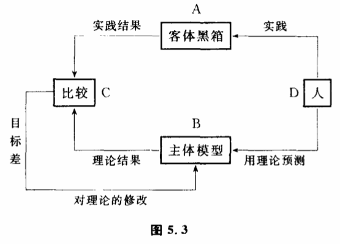

# 5.2 认识论模式

无论是不打开黑箱的方法,还是打开黑箱的方法,它们都是主客体耦合并互相作用的一种方式。它们互相依存,是人类认识自然黑箱中的不同环节,都是不可缺少的。一般说来,运用不打开黑箱的方法大致相应着人们根据黑箱已知的输入和输出建立模型,提出假设的阶段。而打开黑箱则更多地相应着证实模型、验证假设的阶段。这两个阶段是交替进行,缺一不可的。因此,我们可以用模型的提出,模型的检验,模型的修改、再检验等循环过程来概括人类认识黑箱时交替运用打开黑箱和不打开黑箱的方法,使主观认识不断逼近真理过程。如果我们把自然界整体地看作一个大黑箱,那么,广义来说,黑箱模型包括了我们人对客观事物的到目前为止的一切认识、一切理论、定律、假设、计划、方案、思想……

那么,模型是如何建立起来的呢?它又是怎样深化、改变的呢?这个问题实际上与人们如何认识客观事物,如何认识客观真理这个问题完全等价,回答它也就等于回答了认识过程是如何进行的这个认识论的根本问题。本章,我们将运用控制论的一些基本概念来研究主体和客体耦合过程,来揭示人类认识黑箱的一般运动规律。

关于认识过程,人们曾经提出过许多模式。20世纪30年代,毛泽东在《实践论》中提出了一个著名的认识过程模式,这就是实践——理论——实践"的反复循环。他认为,人不可能一下子认识客观规律,只能通过不断实践来修改我们的主观认识,使我们的认识不断逼近真理。如果从主客体之间反馈耦合角度来分析一下毛泽东提出的认识模式,可以发现实践——理论——实践"的反复循环正好相当于控制论的负反馈调节原理。这一认识结构模式我们可以表示为图5.3。

图中A表示客观存在,即黑箱。B表示人的主观认识,即模型。一开始,人们的主观认识不一定符合客观实际,甚至可能相差很远。人们不断地去实践,不断地把从理论得出的预期结果（B的输出）跟人们实践的结果（A的输出）加以比较。如果理论结果和实践结果有差距,那么就需要我们修改自己的主观认识,使理论结果和实践结果之间的差距变小。这样只要我们不断实践,不断地比较,不断地修改主观认识,不断地使理论结果和实践结果之间的差距缩小,我们就能保证自己的主观认识不断地逼近客观真理。显然,"实践——理论——实践"的循环模式反映了人们用负反馈调节原理认识真理的过程。只要有这种调节机制存在,无论一开始理论是多么粗糙,和实际相差多么远,它都可以通过不断修正自己而逼近真理。读者可以发现图5.3实际上是图5.1的精确表达。图5.3中D、B、C都是属于图5.1的主体部分。图5.3相当于把认识主体分解成为能动精神、知识系统和鉴别系统三个子部分。

从20世纪40年代开始、反馈调节的一般性原理被科学家逐步揭示出来。今天,科学家对反馈调节的研究已经很透彻了。因此,运用控制论的成果,为我们进一步深入揭示认识过程的规律提供了工具。

我们在第一、第三章已谈到过反馈调节规律。其中最重要的成果之一,是指出任何反馈调节系统要顺利地逼近目标都是有条件的。如果反馈结构中存在着某些问题,可能出现两种新的情况。一种是系统长期停留在远离目标的错误稳态中,不论怎样调节,系统离不开稳态,不能逼近目标。另一种可能是,系统不但不能逼近目标,而且还可能在目标值附近左右摇摆,形成振荡。这一成果对认识论极为重要,因为它指出只有具备了一定条件,人们的认识才能通过"实践——理论——实践"的过程逼近真理。这也是为什么在实际工作中,有时候看起来我们在不断地实践,并且不断地修改我们的主观认识,但结果还是停留在一个错误的圈子里,或者忽左忽右,从一种错误跳向另一种错误,不能正确地认识客观对象。

我们试图从5个方面来分析"实践——理论——实践"模式成立的具体条件:可观察变量和可控制变量的限制；理论缺乏清晰性；认识速度跟不上客体变化速度；反馈过度；可判定条件不成立。下面我们来分别讨论。
