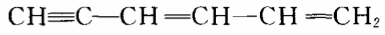
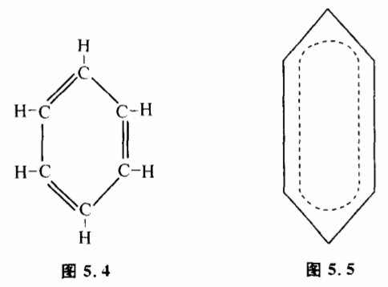

# 5.7 可判定条件

在运用"实践——认识——实践"这一模式时,我们是根据实践结果和理论结果之间的误差来修改理论,使理论不断完善而逼近客观真理的。显然,这里有一个大前提:实践结果和理论结果之间的误差必须要能够反映理论跟客观真理的接近程度。也就是说误差越大,反映理论越不正确,误差变小,反映理论在逼近真理。这个大前提我们称之为"可判定条件"。

在一般情况下,认识过程中可判定条件是成立的。我们举一个人们认识苯的分子结构的例子来说明可判定条件。早在1825年法拉第就发现苯了,化学分析表明苯有6个碳原子和6个氧原子。那么这些原子组成的苯分子结构是怎样的呢?19世纪的化学家凯库勒曾经设想苯的结构是,根据这一结拘,苯应当具备与三键有关的化学性质,而实际上苯的性质并不活泼,理论结果与实践结果差距较大。于是凯库勒修改了他的理论,又提出了一个新的结构（图5.4）:

这个环状结构没有三键,跟实验比较符合。凯库勒就得到了初步正确的模型。但是这个模型也不是一点问题没有。模型中有了个双键,但是实际上苯并不具备双键的活泼性质。理论结果与实践结果仍然有些误差,模型必须进一步修改。今天,人们认为苯的结构应是:苯分子的6个碳原子不仅形成环,而旦形成大丌键,6个碳原子都是等价的（图5.5）。这更符合实验结果。对比这三种苯结构的模型,人们的认识过程是朝着实践结果与理论结果的误差逐步减小的方向发展的。误差最小的理论被认为是最正确的理论。

那么可判定条件是不是永远成立呢?不一定。在某些情况下,人们的某一具体认识过程或认识过程的某些阶段也会出现可判定条件不成立的现象。也就是虽想有时候实践证明某一理论有误差,但它可能是正确的。有时候实践证明某一理论误差很小,但它可能是错误的。原因很简单,人们认识自然规律都是在一定生产力、一定科学技术条件下进行的,可判定条件也只能根据当时人们所掌握的可观察量和可控制量完全可能有不同的判定结果,因此认识过程的某些阶段出现可判定条件不成立的现象是完全可能的。我们举一个例子,20世纪20年代,薛定锷试图用波动方程来建立氢原子中电子运动的模型。他先考虑了相对论效应,得出一个方程。经过实验验证,这一方程跟实验结果误差很大,这使他很失望。过了一个多月,他修改了模型,不考虑相对论效应,得到一个新的方程。这就是今天著名的薛定锷方程。根据这一方程算出的结果与实验符合得很好。但是,后来人们才发现,并不是薛定锷的前一个方程不对,而是电子的自旋当时没有被发现,所以实验结果和第一个方程有较大的差距。以后这个方程由别人重新发现,它就是克莱因一高登方程。描述基本粒子的行为,它比薛定锷方程更正确。这个例子说明,在一个具体的认识过程中,跟实验不符合的模型并不一定不正确。科学史上有不少这种令人遗憾的例子。科学家常常因为理论与实验结果暂时不符而放弃了许多先进的思想。地球自转的观点之所以长期不能被人接受,因为在惯性定律和万有引力发现之前,人们怎么也无法解释地球运动不构成地球上人运动障碍的问题。牛顿发现的万有引力定律,也差一点被他放弃掉。因为根据当时测量的子午线算出的引力大小跟他的理论不符合。以后有了更精确的数据,他才开始坚定起来。

可判定条件不成立给认识过程带来了极大的难题。因为任何科学家在建立理论的时候,都不可能一下子就提出正确的模型。他要经历一个艰难的摸索过程,要先提出许多假说,将这些假说跟实验结果相比较来修改假说。可判定条件不成立,那就等于使科学家失去了修改的标准,他将不知道模型应当朝什么方向修改。这种困难在科学研究中,尤其在那些艰苦的开创性工作中大量存在。科学家经常像瞎子摸象一样来寻找真理。这在反馈调节中等于把鹰的眼睛蒙起来去抓兔子,反馈调节变成了一个随机控制,只有抓到兔子,才能停止探索。科学史上,不少有远见卓识的大科学家能甩开可判定条件不成立设下的障碍,即使实验结果并不支持他的新理论,他也不会鼠目寸光地轻易拋弃自己的观点,这往往使他们能远远地超越他们同时代的科学家,取得突破性的进展。19世纪罗巴切夫斯基和黎曼的非欧几何建立的时候,在现实世界找不到一点它们的物理意义。直到20世纪相对论建立的时候,非欧儿何才找到了用武之地。

那么究竟是什么力量在发生作用,是什么标准指导着这些科学家统过层层暗礁而不迷失方向呢?在以实践作为检验真理的最终标准的同时,人们还运用着一些中间标准。这些中间标准和"范式"有关,科学的范式思想由美国科学家库恩提出后,近年来受到国际学术界的广泛重视。

为了说明中间标准怎样在可判定条件不成立时帮助科学家找到使自己理论逼近真理的方向,我们举几个例子。爱因斯坦为了解释光的二重性,曾提出了"导场"的理论。这种理论和现在的量子场论图像有很大的类似性,成功地解释了光行为的波粒两重性。但是,这种理论:和能量守恒原理矛盾,它导出动量与能量仅仅在统计上成立。而爱因斯坦是相信能量守恒定理是自然界普遍适用的真理,是真理统一性的表现,因此,爱因斯坦虽然很喜欢自己的"导场"理论,但从未发表它,并且没有认真地把"导场"理论当作一回事。后来这个问题被薛定锷理论解决。在这里,爱因斯坦对真理统一性和能量守恒定律的信仰,就是一种中间标准,它帮助爱因斯坦在认识真理过程中少走弯路。20世纪20年代,物理学家在研究衰变时发现,原子核放出电子的能量不等于原子核失去的能量。为了解释这一实验事实,科学家提出三种可能的假说:（1）能量守恒定律在这里不成立；（2）能量守恒定律仅仅在统计意义下成立；（3）有一种尚未发现的新粒子,带走了一部分能量,这种新粒子不带电荷,穿透力极强,不易发现。这三个假说在当时实验条件下均不能被检验。当时著名物理学家泡利提出并支持第三个假说,这就是中微子假说。结果30年代中微子发现了,泡利的预见是对的。泡利之所以敢作这种预见,也是因为他掌握正确的中间标准。

这类事在科学史上很多,大家知道,1900年普朗克提出了能量子学说,认为能量是不连续的。现在我们知道,这是物理学上一个意义重大的革命。但在当时,能量子学说是与经典力学根本对立的,这种对立使新的理论看起来与许多经典的事实不符合,从而显得错误百出。因此新理论并没有给普朗克带来信心。到了1911年普朗克终于顶不住内心的压力而部分修改了他1900年的理论。到1914年,他又进一步修改了能量子理论,认为不论能量发射还是吸收都是连续的。普朗克的倒退说明了什么?说明一个科学家如果只根据眼前的实验事实来修改自己的理论,就可能放弃许多超越同时代人的先进思想。

从哥白尼日心说的确立过程更可以说明正确的中间标准对认识论的意义。前几年,一位科学家用一台大型电子计算机对托勒密的本轮说进行研究,得出一个惊人的结论。他发现,运用本轮体系来预测星的方位,只要运用为数不多的本轮,计算并不像人们传说那样错误百出。哥白尼日心说算出的结果本质上并不比托勒密学说来得准确。日心说的算法反而更复杂一些。如果从和实验观察符合程度来讲,两个模型是一样的。那么为什么哥白尼的日心说会引起近代自然科学的一场革命呢?有很多人曾坚持说,这是因为哥白尼的日心说解释了地心说无法解释的现象,如行星的逆行等。当然,用哥白尼学说可解释的自然现象比用托勒密学说解释的现象来得多,所以哥白尼学说比托勒密学说更接近真理。但这只是历史的结论,在哥白尼时代,甚至直到牛顿力学奠定之前,是不能这样讲的。当时,由于惯性定律和万有引力均没有发现,哥白尼学说甚至和人们的常识矛盾。实际上,托勒密在提出地心说时,是知道日心说的,但他因觉得如果地球在转动,那么人由东向西行走都不可能,因此地球动是不可思议的。在哥白尼时代,托勒密对日心说提出的问题仍然存在,因为惯性定律和万有引力均没有发现。所以,哥白尼时代先进的科学家是很难从哪一种学说和实验更符合事实来判定谁是真理的。也就是说可判定条件不成立。那么是什么因素促使在哥白尼及其以后的时代日心学说被越来越多的科学家接受呢?国外很多科学史家认为,这和范式转变有关。哥白尼学说对托勒密学说在科学上是进步,是代表思想解放潮流的。而托勒密学说当时却为愚昧反动的教会所拥护。

现代科学史家把范式看作一个时代一群科学家所共同遵守的一些准则。认为范式对科学理论影响极大。我们认为,所谓范式,实际上就是当在鉴别真理时,由于可判定条件不成立,人们在运用实践是鉴别真理最终标准时,同时使用的一些中间标准。它们不是鉴别真理的最终标准,但是一些中间路标,对把认识过程引向正确的道路,减少错误是有意义的。也必须指出,目前科学哲学界关于范式的研究是很不成熟的。我们认为,通过科学家和哲学家的共同努力搞清楚范式究竟是什么以及它在认识论中的意义是很重要的。
